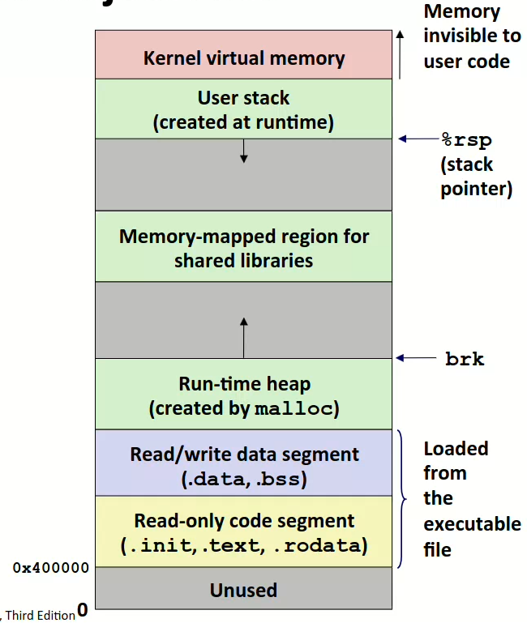
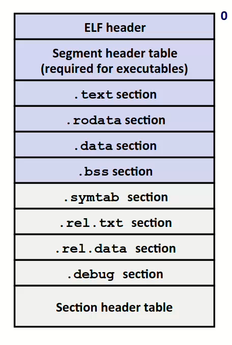
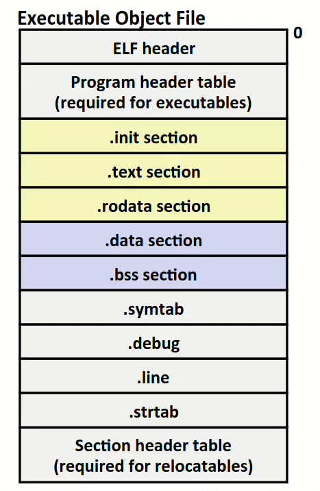
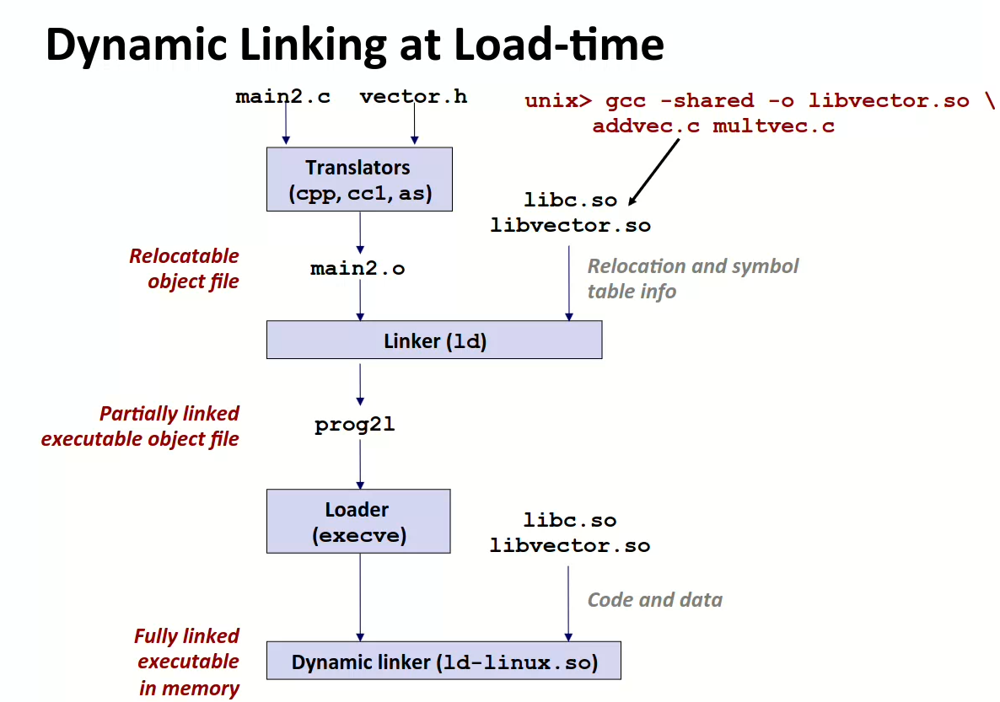

# 链接笔记

## 0 屁话

> 该部分属于屁话，可以不看。

认识我的人都知道，我是一名ACMer，喜欢参加的比赛叫做ICPC，在一般人眼里就是“写代码”的比赛（然而事实上是坐牢的比赛）。

假设你是一名高手ACMer，参加了今年的ICPC World Final。今年WF的压轴题如下：
>
> 输入两个整数 $a$ 和 $b$ ，输出 $a+b$ .

这么难的题，难倒了除了你之外的所有来自世界各地的顶尖选手。稍作思索过后，你写出了如下AC代码：

```c
// add.c
#include<stdio.h>
int add(int a, int b){
    return a + b;
}
int main(){
    int a, b;
    scanf("%d%d", &a, &b);
    int c = add(a, b);
    printf("%d\n", c);
    return 0;
}
```

一行绿色的Accepted飘过，你AK了WF，然后从梦中醒来。

> 开个玩笑hh

不过醒来的你突发奇想。作为ACMer的我们，对于每个问题，写的程序一直都在一个文件之下。

但用屁股想都知道，正常的C语言的工程，肯定是由多个源文件组成的。比如上面的 `add.c` 程序，你可以分成两份源代码：

```c
// add.c
int add(int a, int b){
    return a + b;
}

// main.c
#include<stdio.h>
int main(){
    int a, b;
    scanf("%d%d", &a, &b);
    int c = add(a, b);
    printf("%d\n", c);
    return 0;
}
```

不过问题来了，作为一个ACMer，习惯使用VScode Code Runner的你，执行 `main.c` 后却遇到了以下错误：

```shell
main.c: In function ‘main’:
main.c:6:13: warning: implicit declaration of function ‘add’ [-Wimplicit-function-declaration]
    6 |     int c = add(a, b);
      |             ^~~
/usr/bin/ld: /tmp/cckuC0BG.o: in function `main':
add.c:(.text+0x4a): undefined reference to `add'
collect2: error: ld returned 1 exit status
```

这里是ld返回了一个异常信号1，说明是ld程序出现了错误，也就是链接器错误。具体错误是ld找不到`add`函数。

聪明的你仔细一想，觉得这也正常。毕竟你只是“执行”了一个文件，似乎另一个文件还不知道如何让它加入到执行过程中。

而将多个文件加入到一个程序的过程，其实就是链接的过程。

## 1. 程序生成流程

一个使用C语言编写的程序，需要通过四个步骤来生成最终的**可执行文件**：预处理、编译、汇编、链接。

以下描述以GNU编译系统为基础，在Linux平台(x64架构)运行测试。GNU提供了我们最熟悉的编译套件`gcc`。

### 1.1 预处理

首先，我们的C语言源文件是不能直接被执行的。你双击一个.c文件，出来的只会是IDE或者文本编辑器，因为.c文件实质上就是一个文本文件。

但是在预处理这个步骤，我们输出的仍然是一个文本文件。

预处理的目的，是为了便于接下来的**编译**步骤，它大致有以下几个作用：

1、删掉注释。如果你特别喜欢printf调试，那么在最后提交程序的时候需要将其注释掉。注释的内容不可能在最终的目标文件里，它在预处理阶段就消失了。

2、处理除了 `#progma` 外的所有以`#`开头的代码。例如 `#define` 定义宏，`#ifdef` 、`#endif`等预编译指令，以及头文件 `#include`，在预处理阶段会将头文件插入到原有地方。（当然头文件包含可能是递归的，因此需要递归处理）

3、还会添加一些标识信息。

例如以下文件：

```c
// add.c
#define int long long
int add(int a, int b){
    // add two integers
    int sum = a + b;
    // then return the sum
    return sum;
}
```

可以通过以下两个命令生成预处理文件 `add.i`：

```bash
linux> cpp add.c add.i
linux> gcc -E add.c -o add.i
```

`cpp` 是C预处理器，通过预处理可以得到以下文本文件 `add.i`：

```c
# 0 "add.c"
# 0 "<built-in>"
# 0 "<command-line>"
# 1 "/usr/include/stdc-predef.h" 1 3 4
# 0 "<command-line>" 2
# 1 "add.c"


long long add(long long a, long long b){

    long long sum = a + b;

    return sum;
}
```

可以发现头部给了一些标识信息。其次所有注释也被删去，而我们的int也因为宏定义被改成了long long类型。

当然 `#define int long long` 这种代码千万不要写（除了ACM赛场上最后一分钟发现程序爆int），这里只是为了展示~

### 1.2 编译

得到了我们的预处理文本文件，我们就可以正式开始编译了。通过编译程序，我们最终会得到一个汇编文本文件。它是一个由汇编语言所描述的**文本**文件，仍然可以被文本编辑器所查看。

可以通过以下命令生成汇编文件 `add.s`：

```shell
linux> /usr/lib/gcc/x86_64-linux-gnu/11/cc1 add.i
linux> gcc -S add.i -o add.s
linux> gcc -S add.c -o add.s
```

这里的cc1便是正式的编译器。由于它不在我的环境变量上面，因此这里需要列出它的地址。当然你也可以直接用gcc -S命令进行编译。

```assembly
	.file	"add.i"
	.text
	.globl	add
	.type	add, @function
add:
.LFB0:
	.cfi_startproc
	pushq	%rbp
	.cfi_def_cfa_offset 16
	.cfi_offset 6, -16
	movq	%rsp, %rbp
	.cfi_def_cfa_register 6
	movq	%rdi, -24(%rbp)
	movq	%rsi, -32(%rbp)
	movq	-24(%rbp), %rdx
	movq	-32(%rbp), %rax
	addq	%rdx, %rax
	movq	%rax, -8(%rbp)
	movq	-8(%rbp), %rax
	popq	%rbp
	.cfi_def_cfa 7, 8
	ret
	.cfi_endproc
.LFE0:
	.size	add, .-add
	.ident	"GCC: (Ubuntu 11.2.0-19ubuntu1) 11.2.0"
	.section	.note.GNU-stack,"",@progbits

```

这个便是得到的汇编文件。熟悉x86汇编的可以发现这里的寄存器以 r 开头，代表我们操作的是8个字节的long long类型整数。

需要注意的是，汇编的每一行指令都与机器指令**一对一相关**。

### 1.3 汇编

为了生成可执行文件的那种二进制格式文件，在得到汇编文件之后，我们需要将其转化为机器代码。这便是汇编器所做的工作，可以通过以下指令执行：

```shell
linux> as add.s -o add.o
linux> gcc -c add.s -o add.o
linux> gcc -c add.c -o add.o
```

这里的as便是汇编器，通过它可以生成一个称之为**可重定位目标文件**的文件。在编辑器是不能正确显示这个文件的，因为它是一种二进制格式文件。

可重定位目标文件是我们在这里所关注的重点。在Linux操作系统下，目标文件（例如这里的可重定位目标文件，以及后续链接生成的可执行目标文件等）遵从的格式称为**ELF**格式，在这篇文章会大致介绍这类格式，它是我们理解链接的基础。

### 1.4 链接

得到了 `add.o`之后，我们还需要进行进一步的链接操作。

所谓链接，就是将多个目标文件进行**组合**，得到最后的可执行程序。它是将各种代码和数据片段合并成单一文件的过程，我们称之为**可执行目标文件**。作为目标文件的一种，在Linux环境下它也遵从ELF的格式。

目前我们得到的只有一个 `add.o` 的可重定位目标文件。因此我们还需要一个 main主函数来调用 add 函数：

```c
// main.c
#include<stdio.h>
int main(){
    int a = 1, b = 2;
    printf("%d", add(a, b));
    return 0;
}
```

通过以下命令生成 `main.c`对应的`main.o`：

```shell
linux> gcc -S main.c -o main.o
```

这时候得到了一个warning：

```shell
main.c: In function ‘main’:
main.c:4:18: warning: implicit declaration of function ‘add’ [-Wimplicit-function-declaration]
    4 |     printf("%d", add(a, b));
```

warning的内容是警告我们找不到add的函数定义。事实上我们应该在文件中提前定义好add函数格式：

```c
#include<stdio.h>
int add(int, int);
int main(){
    int a = 1, b = 2;
    printf("%d", add(a, b));
    return 0;
}
```

便可以消除这个警告。不过这个add函数内部是空的啊，它的内部实现在 `add.c` 文件里，我们如何将这个文件的函数和`main.c`结合呢？答案就是使用最终的链接操作。可以通过以下命令执行：

```shell
linux> ld -o add main.o add.o 
linux> gcc -o add main.o add.o
linux> gcc -o add main.c add.c
```

最终我们得到可执行目标文件 `add`。通过执行该目标文件，可以在命令行得到期望的输出： `3`。

## 2. 静态链接

透过上面对 `add.c` `main.c`的编译执行流程，我们了解了两种目标文件：可重定位目标文件（`add.o` `main.o`）以及可执行目标文件 （`add`）。

这两种目标文件都遵从**ELF**格式。为了方便研究这种格式，我们考虑以下实现交换数组数据的代码（其实是CSAPP的课后习题，摘自https://www.icourse163.org/course/NJU-1001625001?tid=1470930500，该课程主要针对32位系统架构IA32，这里我们换成x64架构进行学习）：

```c
// main.c
int buf[2] = {1, 2};
void swap();

int main(){
    swap();
    return 0;    
}

// swap.c
extern int buf[];

int *bufp0 = &buf[0];
static int *bufp1;

void swap(){
    int tmp;
    bufp1 = &buf[1];
    tmp = *bufp0;
    *bufp0 = *bufp1;
    *bufp1 = tmp;
}
```

首先我们研究 `main.c`：

1、定义了全局变量数组`buf[]`；

2、声明了一个 `void`类型的函数`swap()`，但是没有具体实现；

3、定义了一个 `int`类型的函数 `main()`。

其次研究 `swap.c`：

1、定义了一个外部数组`buf[]`；

2、定义了一个全局变量指针 `bufp0`，并赋初值 `&buf[0]`；

3、定义了一个静态变量指针 `bufp1`，并且没有初始化（未初始化的全局变量或者静态变量默认为0或NULL）；

4、定义了一个 `void` 类型函数 `swap()`。

5、在 `swap()`函数内部，定义了一个局部变量 `tmp`。

### 2.1 符号

**符号**是链接过程中最基本的概念。每个符号对应于一个函数、一个全局变量或一个静态变量。例如上述 `main.c`中的 `buf`、`swap`、以及主函数 `main`，和 `swap.c `中的 `buf`、`bufp0`、`bufp1`、`swap`。可以观察到两个文件之间的符号有所重合，链接器可以通过不同符号的**绑定属性**来统一考虑这些可能重合的符号（例如extern声明的 `buf`，它所代表的其实就是 `main.c`定义的`buf`，通过`extern`声明的符号的**绑定属性**其实是弱符号，与之对应的有强符号，后面会详细探讨）。其次局部变量 `tmp` 不属于符号，链接器不考虑局部变量。局部变量一般存储在用户栈空间或者寄存器内部。

那么全局变量和静态变量存储在哪呢？以下是计算机虚拟存储器的一个视图（摘自CSAPP）：



最上面是操作系统内核区，其次便是用户栈。而我们的代码以及全局、静态变量存储在下面的`load from the exec file` 区域。代码作为只读数据，存储在只读代码段，而数据变存储在其上面的读写数据段。它们是通过**可执行目标文件**（即链接后的目标文件）加载到主存的。

一般为了构造可执行目标文件，链接器需要完成两个任务：

1、**符号解析**。对于不同文件的不同符号，可能存在符号定义（即新定义一个符号）和符号引用（即使用一个符号，这个符号需要定义过，但不一定要在本文件（或者本**模块**）定义）。符号解析所要干的事情就是将所有各自的模块中的符号引用与所有模块的一个**大集合**中的符号定义相**关联**。例如 `main.c`中main函数内部使用了 `swap`函数，即引用了 `swap` 符号，链接器需要确定它和 `main.c`中声明的 `swap` 函数（函数无内容，为弱符号，后续会提及强弱符号）关联还是和 `swap.c` 中定义的 `swap` 函数（有内容，为强符号）关联。事实上用屁股想都知道是和后者关联。

2、**重定位**。重定位就是对所有的符号引用的地方，把合并后的可执行目标文件装入存储器后内存里各个符号的位置写入到原有的位置。例如我们反编译一下 `main` 模块：

```shell
linux> objdump -d main.o > main.txt
```

得到以下反汇编信息：

```assembly

main.o:     file format elf64-x86-64


Disassembly of section .text:

0000000000000000 <main>:
   0:	f3 0f 1e fa          	endbr64 
   4:	55                   	push   %rbp
   5:	48 89 e5             	mov    %rsp,%rbp
   8:	b8 00 00 00 00       	mov    $0x0,%eax
   d:	e8 00 00 00 00       	call   12 <main+0x12>
  12:	b8 00 00 00 00       	mov    $0x0,%eax
  17:	5d                   	pop    %rbp
  18:	c3                   	ret    

```

可以发现，在call命令这里，没法通过反汇编信息看出我们call的是哪个函数。我们知道call的应该是 `swap` 模块的 `swap` 过程，但是由于这里我们还没有进行链接，因此 call 这里的偏移量设置成为了0。后续链接之后，这里的偏移量会被重新覆盖：

```assembly
000000000000116c <main>:
    116c:	f3 0f 1e fa          	endbr64 
    1170:	55                   	push   %rbp
    1171:	48 89 e5             	mov    %rsp,%rbp
    1174:	b8 00 00 00 00       	mov    $0x0,%eax
    1179:	e8 ab ff ff ff       	call   1129 <swap>
    117e:	b8 00 00 00 00       	mov    $0x0,%eax
    1183:	5d                   	pop    %rbp
    1184:	c3                   	ret   
```

进行链接后的main方法中的call内部偏移量不为0，它被覆盖成了 `ab ff ff ff`。这种地址偏移量（或者绝对地址）值的覆盖就是重定位，而这个值是需要通过前面的符号解析和最终文件的合并来得出的。本文章不会介绍这些模块（可重定位目标文件）具体是如何合并的，只会说个大概。

你可能会有疑问， `main` 模块声明的 `swap` 怎么消失了呢？这是因为 `swap` 只是个声明，不包含实际代码，因此它不在反汇编 `Disassembly of section .text:` 下面显示。

### 2.2 可重定位目标文件

可重定位目标文件遵从ELF文件格式。ELF文件格式大致如下（摘自CSAPP）：



在可重定位目标文件当中，第二部分（段头表）是没有的，我们这里主要来看看其它部分。

1、ELF头：即ELF的头部部分。首先它拥有16个字节的魔数序列，这个序列包含了文件的类型和格式信息。其次剩余部分则包含了机器类型、节头表（最下面的部分）的位置偏移等帮助链接器进行语法分析和解释的信息。

可以通过以下命令解析ELF头：

```shell
linux> readelf -h main.o
```

得到：

```
ELF Header:
  Magic:   7f 45 4c 46 02 01 01 00 00 00 00 00 00 00 00 00 
  Class:                             ELF64   # ELF文件格式为ELF64，这是通过解析Magic Number得出的
  Data:                              2's complement, little endian   # 使用二进制补码，小端方式存储
  Version:                           1 (current)
  OS/ABI:                            UNIX - System V
  ABI Version:                       0
  Type:                              REL (Relocatable file)   # 可重定位目标文件
  Machine:                           Advanced Micro Devices X86-64
  Version:                           0x1
  Entry point address:               0x0
  Start of program headers:          0 (bytes into file)   # 没有程序头表，因为是可重定位目标文件
  Start of section headers:          560 (bytes into file)   # 段头表位置
  Flags:                             0x0
  Size of this header:               64 (bytes)   # ELF头占64Bytes
  Size of program headers:           0 (bytes)
  Number of program headers:         0
  Size of section headers:           64 (bytes)   # 节头表表项占64Bytes
  Number of section headers:         13   # 节头表有13个表项
  Section header string table index: 12
```

2、节头表：即ELF的尾部部分。在可重定位目标文件中，节是一个单位，以.为开头（如.text）表示的都是一个一个节。节中都是字节序列，但是同一个节中的内容的性质相同。而节头表则存储了这些节的一些信息。例如每个节的节名、在ELF文件中的位置、节的大小等等。节头表本身是一个表，也就是一个结构体数组，每个结构体定义如下：

```c
typedef struct
{
  Elf32_Word    sh_name;        /* Section name (string tbl index) */
  Elf32_Word    sh_type;        /* Section type */
  Elf32_Word    sh_flags;       /* Section flags */
  Elf32_Addr    sh_addr;        /* Section virtual addr at execution */
  Elf32_Off sh_offset;      /* Section file offset */
  Elf32_Word    sh_size;        /* Section size in bytes */
  Elf32_Word    sh_link;        /* Link to another section */
  Elf32_Word    sh_info;        /* Additional section information */
  Elf32_Word    sh_addralign;       /* Section alignment */
  Elf32_Word    sh_entsize;     /* Entry size if section holds table */
} Elf32_Shdr;
```

可以通过以下命令解析节头表：

```shell
linux> readelf -S main.o
```

得到：

```shell
There are 13 section headers, starting at offset 0x230:

Section Headers:
  [Nr] Name              Type             Address           Offset
       Size              EntSize          Flags  Link  Info  Align
  [ 0]                   NULL             0000000000000000  00000000
       0000000000000000  0000000000000000           0     0     0
  [ 1] .text             PROGBITS         0000000000000000  00000040
       0000000000000019  0000000000000000  AX       0     0     1
  [ 2] .rela.text        RELA             0000000000000000  00000190
       0000000000000018  0000000000000018   I      10     1     8
  [ 3] .data             PROGBITS         0000000000000000  00000060
       0000000000000008  0000000000000000  WA       0     0     8
  [ 4] .bss              NOBITS           0000000000000000  00000068
       0000000000000000  0000000000000000  WA       0     0     1
  [ 5] .comment          PROGBITS         0000000000000000  00000068
       0000000000000027  0000000000000001  MS       0     0     1
  [ 6] .note.GNU-stack   PROGBITS         0000000000000000  0000008f
       0000000000000000  0000000000000000           0     0     1
  [ 7] .note.gnu.pr[...] NOTE             0000000000000000  00000090
       0000000000000020  0000000000000000   A       0     0     8
  [ 8] .eh_frame         PROGBITS         0000000000000000  000000b0
       0000000000000038  0000000000000000   A       0     0     8
  [ 9] .rela.eh_frame    RELA             0000000000000000  000001a8
       0000000000000018  0000000000000018   I      10     8     8
  [10] .symtab           SYMTAB           0000000000000000  000000e8
       0000000000000090  0000000000000018          11     3     8
  [11] .strtab           STRTAB           0000000000000000  00000178
       0000000000000016  0000000000000000           0     0     1
  [12] .shstrtab         STRTAB           0000000000000000  000001c0
       000000000000006c  0000000000000000           0     0     1
Key to Flags:
  W (write), A (alloc), X (execute), M (merge), S (strings), I (info),
  L (link order), O (extra OS processing required), G (group), T (TLS),
  C (compressed), x (unknown), o (OS specific), E (exclude),
  D (mbind), l (large), p (processor specific)
```

第一行说明节头表在位置 0x230 处，这和ELF头中给出的560一致。

然后节头表描述了13个节各自的信息，例如名字（.text，.data等等），大小等等。

3、.text：是一个节。节中包含着该可重定位目标文件的代码段。我们知道汇编之后的代码段是二进制形式，因此这里是无法查看的。

4、.rodata：是一个节。节中包含着只读数据。例如switch语句中可能生成的跳转表。

5、.data：是一个节。节中包含着**已经**初始化的全局和静态变量。关于这些值对应的哪些变量的信息在后续的.symtab（符号表节）给出。

6、.bss：是一个节。节中包含着**未**初始化的全局和静态变量与初始化为0的变量。这个节其实只是意义上的一个节，它在ELF文件中只是个占位符，不占据硬盘空间。因为.data包含的是值，所以.bss包含的理论上也应该是值，然而未初始化的变量默认为0，因此可以考虑优化掉这些空间。

7、.symtab：是一个节。节中存着一个符号表，它存放的是符号相关信息。符号表和节头表一样是个结构体数组，结构体定义如下：

```c
typedef struct
{
  Elf64_Word    st_name;        /* Symbol name (string tbl index) */
  unsigned char st_info;        /* Symbol type and binding */
  unsigned char st_other;       /* Symbol visibility */
  Elf64_Section st_shndx;       /* Section index */
  Elf64_Addr    st_value;       /* Symbol value */
  Elf64_Xword   st_size;        /* Symbol size */
} Elf64_Sym;
```

每一个表项（结构体）定义了符号的名字、在对应节中的偏移量位置、符号占用字节数（变量为变量大小，函数为函数内部机器指令共占用字节大小）、符号对应的节、符号的类型（数据还是函数，或者未定义）以及符号的绑定属性（强弱全局符号或者局部符号即static）

可以通过以下命令来解析符号表：

```shell
linux> readelf -s main.o
```

得到：

```shell
Symbol table '.symtab' contains 6 entries:
   Num:    Value          Size Type    Bind   Vis      Ndx Name
     0: 0000000000000000     0 NOTYPE  LOCAL  DEFAULT  UND 
     1: 0000000000000000     0 FILE    LOCAL  DEFAULT  ABS main.c
     2: 0000000000000000     0 SECTION LOCAL  DEFAULT    1 .text
     3: 0000000000000000     8 OBJECT  GLOBAL DEFAULT    3 buf
     4: 0000000000000000    25 FUNC    GLOBAL DEFAULT    1 main
     5: 0000000000000000     0 NOTYPE  GLOBAL DEFAULT  UND swap
```

符号表第3个表项显示buf符号的信息。它在第3个节（即.data节），占用8个字节，为OBJECT(数据)，为全局符号。

符号表第4个表项显示main符号的信息。它在第1个节（即.text节），占用25个字节（和前面对应上了），为FUNC(函数)，为全局符号。

符号表第5个表项显示swap符号的信息。它所在的节是个**伪节** UNDEF，代表未定义的符号。`main` 模块只是声明了这个符号，但并没有给出完整的定义，完整的定义在 `swap` 模块。

同样，解析 `swap.o` 的符号表：

```shell
     4: 0000000000000000     8 OBJECT  LOCAL  DEFAULT    4 bufp1
     5: 0000000000000000     8 OBJECT  GLOBAL DEFAULT    5 bufp0
     6: 0000000000000000     0 NOTYPE  GLOBAL DEFAULT  UND buf
     7: 0000000000000000    67 FUNC    GLOBAL DEFAULT    1 swap
```

由于 `bufp1` 是静态变量，它的使用被限制在了这个模块，因此它是一种**局部符号**。 而其余符号则是**全局符号**。

8、.rel.text与.rel.data：是节，都存储着关于该模块的**重定位条目**表。当汇编器遇到对一个未知位置的引用（例如上述 `main.o` 的反汇编信息

 `   d:	e8 00 00 00 00       	call   12 <main+0x12>`），就会生成对应的重定位条目。如果是命令遇到的引用，生成的重定位条目存储在.rel.text中；如果是数据遇到的引用（例如给全局变量定义时用另一个全局变量进行初始化），生成的重定位条目存储在.rel.data中。重定位条目内部包含：需要修改的地址引用相对于其所在节的偏移（即哪里引用的）、应该指向的符号以及重定位类型。ELF定义了很多重定位类型，比如：

- R_X86_64_PC32：所覆盖的地址使用PC相对寻址，即引用位置的**下一条命令**的位置和符号位置之间的差值；
- R_X86_64_32：绝对寻址。

可以通过以下命令解析重定位条目：

```shell
linux> readelf --relocs swap.o
```

得到以下内容：

```shell
Relocation section '.rela.text' at offset 0x1f0 contains 6 entries:
  Offset          Info           Type           Sym. Value    Sym. Name + Addend
00000000000b  000600000002 R_X86_64_PC32     0000000000000000 buf + 0
000000000012  000300000002 R_X86_64_PC32     0000000000000000 .bss - 4
000000000019  000500000002 R_X86_64_PC32     0000000000000000 bufp0 - 4
000000000025  000300000002 R_X86_64_PC32     0000000000000000 .bss - 4
00000000002c  000500000002 R_X86_64_PC32     0000000000000000 bufp0 - 4
000000000037  000300000002 R_X86_64_PC32     0000000000000000 .bss - 4

Relocation section '.rela.data.rel' at offset 0x280 contains 1 entry:
  Offset          Info           Type           Sym. Value    Sym. Name + Addend
000000000000  000600000001 R_X86_64_64       0000000000000000 buf + 0

Relocation section '.rela.eh_frame' at offset 0x298 contains 1 entry:
  Offset          Info           Type           Sym. Value    Sym. Name + Addend
000000000020  000200000002 R_X86_64_PC32     0000000000000000 .text + 0
```

可以发现，对于.rel.text中所有的重定位条目，所有的重定位类型都是R_X86_64_PC32。

9、.strtab：是一个节。节存储着一张字符串表。例如.symtab内部的符号名字（`Elf64_Word` 格式定义的 `Name`）以及节头表内部存储着各个节的名字，都是一种整数格式，它代表着在字符串表当中相对于节头的偏移。

### 2.3 静态库文件(.a)

作为程序员，我们对库这个概念并不陌生。在ISO C99标准内定义了一个标准库 `libc.a` ，它是系统自带的静态库。在老版本系统上作为一个默认被链接的对象和目标文件进行链接（当然现在一般采用**动态**链接技术，这里我们所接触的都是静态链接）。

静态库是一系列可重定位目标文件的集合，可以使用 `ar` 工具进行创建。例如我们想将 `main` 模块和 `swap` 模块进行打包，可以输入以下命令：

```shell
linux> ar rcs mylib.a swap.o main.o
```

这样就在本地生成了 `mylib.a` 静态库。

需要记住的是，静态库可以认为是一系列可重定位目标文件 `.o` 的集合。在链接过程中，通过在静态库当中寻找当前还未被解析的符号，来从中**抽取**一些 `.o` 文件来进行链接。所以就算标准静态库 `libc.a` 有5MB那么大，生成的可执行目标文件的大小也只是以KB为单位。（本例的 `main` 可执行目标文件只有十几KB）

### 2.4 符号解析过程

符号解析如我们之前所说，是将符号的引用与符号的定义之间进行关联。在符号解析这个过程，便是链接错误产生的过程（

根据符号的绑定属性，分为以下几种：

1、局部符号。这种符号只在某个模块内部生效。

2、全局符号的强符号。它代表函数与初始化的全局变量。

3、全局符号的弱符号。它代表未初始化的全局变量。

在符号解析的过程中，可能存在同一个符号被定义多次（即多重定义）。因此Linux链接器使用以下规则来从多重符号中进行选择：

1、同名强符号只允许存在一个。

2、如果一个强符号和多个弱符号重名，选择强符号。

3、如果多个弱符号重名，则**随机选择**一个。

因此，我们不能在多个模块同时定义同一个初始化的全局变量，或者定义同名函数。

然而我们却可以同时定义多个同名的未初始化的全局变量，这个是不会报错的，但是**极不推荐**！具体相关例子可以参考南大ICS课程：https://www.icourse163.org/learn/NJU-1001625001?tid=1470930500#/learn/content?type=detail&id=1255034632&cid=1286661897

在链接过程中，链接器是根据你输入到命令行的文件（包括可重定位目标文件与静态库文件）的**顺序**来顺序地进行解析。

具体地，链接器会维护以下三个集合：

E：可重定位目标文件的集合。这包括命令行输入的可重定位目标文件以及静态库内部被**抽取**的可重定位目标文件；

U：在目前已经遍历到的文件中，解析过程所没能解析出的符号；

D：已定义的符号。

链接过程如下：

1、对于命令行输入的文件，如果是可重定位目标文件，则加入集合E，同时根据可重定位目标文件中定义和引用的符号来修改集合U和D。然后进行下一个文件读入；

2、如果是静态库文件，则尝试对目前集合U中的符号进行匹配。若在静态库中的某个文件成员.o内部匹配成功，则将该文件成员加入到E中，同时与第一步一样进行集合U和D的修改。然后反复进行U中的符号匹配，直到U和D集合不再变化，则进行下一个文件读入。

为了解释清楚，我们稍微修改一下 `swap` 模块：

```C
// swap.c
#include<stdio.h>
extern int buf[];

int *bufp0 = &buf[0];
static int *bufp1;

void swap(){
    int tmp;
    bufp1 = &buf[1];
    tmp = *bufp0;
    *bufp0 = *bufp1;
    *bufp1 = tmp;

    printf("swap complete!"); // 加入输出函数
}

// main.c
int buf[2] = {1, 2};
void swap();

int main(){
    swap();
    return 0;    
}
```

然后我们使用以下命令进行链接：

```shell
linux> gcc -o main main.o swap.o
```

考虑符号解析过程：

1、E集合加入目标文件 `main.o` 。此时D中已解析符号有：`buf` 和 `main` ，而U中存在未解析符号 `swap`（因为main函数内部对该符号进行了引用）；

2、E集合加入目标文件 `swap.o` 。此时D中加入新的已解析符号：`bufp0`。然后该模块内部引用了符号 `buf`、`bufp0` 、`printf` 和局部符号 `bufp1` 。对于 U 中未解析符号 `swap` ，在本模块给出了定义，因此将其转入集合D。同时由于 `printf` 尚未解析，将其加入集合 U；

3、链接器默认链接静态库文件 `libc.a` 。此时在静态库内部寻找U中 `printf` 符号的定义，发现在 `printf.o` 内部存在定义，因此将 `printf` 符号转入集合D。同时也将 `printf.o` 内部的定义符号加入集合D，新的未解析符号加入集合U；

4、继续在 `libc.a` 中往复上述过程，直至U集合为空。

### 2.5 重定位

确定好了集合E中需要使用的**可重定位目标文件**以及**符号引用与符号定义之间的关联**，接下来就需要将引用处的地址进行覆盖了，也就是重定位。重定位过程大致分为以下三个步骤（摘自南大ICS）：

1、合并相同的节。将所有可重定位目标文件中相同的节进行合并，例如.text节内部的代码进行合并，方便将来统一装入内存运行。

2、对定义符号进行重定位。其实就是将节合并后的文件中每个定义的符号的地址进行确定，对于函数即其首条指令的首地址，对于数据即其在合并后的.data中的地址。

3、对引用符号进行重定位。每一个引用符号都对应于上述我们讲过的**重定位条目**，它们是存在.rel开头的节中的。在这步需要通过遍历这些条目，一步一步用上面得到的定义符号的地址进行覆盖。当然不完全是覆盖，例如PC相对地址的重定位方式，它所要覆盖的运行时地址是需要进行相关计算的。有时候在可重定位目标文件中上面给出的地址（例如上面`   d:	e8 00 00 00 00       	call   12 <main+0x12>` 中的机器数0，有时候不一定是0）是需要参与计算的，这与重定位类型有关，每个重定位类型都对应着一个覆盖地址计算公式。

重定位过后，每个符号的引用都填入了正确的实际地址，于是生成了最后的可执行目标文件。

### 2.6 可执行目标文件

可执行目标文件作为一种目标文件，同样在Linux环境下遵循ELF文件格式。

我们可以使用以下命令读取 `main` 文件的ELF头：

```shell
linux> readelf -h main
```

得到结果如下：

```shell
ELF Header:
  Magic:   7f 45 4c 46 02 01 01 00 00 00 00 00 00 00 00 00 
  Class:                             ELF64   # ELF文件格式为ELF64，这是通过解析Magic Number得出的
  Data:                              2's complement, little endian	 # 使用二进制补码，小端方式存储
  Version:                           1 (current)
  OS/ABI:                            UNIX - System V
  ABI Version:                       0
  Type:                              DYN (Position-Independent Executable file)   # 位置无关可执行文件
  Machine:                           Advanced Micro Devices X86-64
  Version:                           0x1
  Entry point address:               0x1060   # 程序入口地址
  Start of program headers:          64 (bytes into file)   # 程序头表
  Start of section headers:          14136 (bytes into file)
  Flags:                             0x0
  Size of this header:               64 (bytes)
  Size of program headers:           56 (bytes)   # 程序头表表项占用56Bytes
  Number of program headers:         13   # 有13个表项
  Size of section headers:           64 (bytes)
  Number of section headers:         31   
  Section header string table index: 30
```

可以和上面可重定位目标文件的ELF头进行对比：

```shell
ELF Header:
  Magic:   7f 45 4c 46 02 01 01 00 00 00 00 00 00 00 00 00 
  Class:                             ELF64   # ELF文件格式为ELF64，这是通过解析Magic Number得出的
  Data:                              2's complement, little endian   # 使用二进制补码，小端方式存储
  Version:                           1 (current)
  OS/ABI:                            UNIX - System V
  ABI Version:                       0
  Type:                              REL (Relocatable file)   # 可重定位目标文件
  Machine:                           Advanced Micro Devices X86-64
  Version:                           0x1
  Entry point address:               0x0
  Start of program headers:          0 (bytes into file)   # 没有程序头表，因为是可重定位目标文件
  Start of section headers:          560 (bytes into file)   # 段头表位置
  Flags:                             0x0
  Size of this header:               64 (bytes)   # ELF头占64Bytes
  Size of program headers:           0 (bytes)
  Number of program headers:         0
  Size of section headers:           64 (bytes)   # 节头表表项占64Bytes
  Number of section headers:         13   # 节头表有13个表项
  Section header string table index: 12
```

可以发现，首先是我们ELF文件类型变成了位置无关的可执行文件，其次ELF文件内部新增了程序头表。

在可执行目标文件中，ELF文件被分成一个一个段，每个段内又分成一个一个节。例如（摘自CSAPP）：



开头是ELF头，其次是可执行目标文件中特有的程序头表（段头表），然后接下来黄色的三个节属于一个段，我们称之为只读内存段，它包含着.text、.rodata只读数据节和新的.init节，它们都是只读的数据或者代码，独属于一个段。.init节内部定义了一个_init函数，在程序通过ELF头中规定的入口地址进行执行的时候，会在初始化过程中调用这个函数，只需了解即可。接下来两个蓝色的节属于另一个段，我们称之为读/写内存段，它包含.data和.bss节。另外ELF文件还包含着其它段，这些段的信息在程序头表内部有所定义。程序头表本身是个结构体数组，其结构体定义如下：

```C
typedef struct {
    Elf64_Half    p_type;        /* entry type */
    Elf64_Half    p_flags;    /* flags */
    Elf64_Off    p_offset;    /* offset */
    Elf64_Addr    p_vaddr;    /* virtual address */
    Elf64_Addr    p_paddr;    /* physical address */
    Elf64_Xword    p_filesz;    /* file size */
    Elf64_Xword    p_memsz;    /* memory size */
    Elf64_Xword    p_align;    /* memory & file alignment */
} Elf64_Phdr;
```

通过以下命令解析程序头表：

```shell
linux> readelf -l main
```

可得：

```shell
Elf file type is DYN (Position-Independent Executable file)
Entry point 0x1060
There are 13 program headers, starting at offset 64

Program Headers:
  Type           Offset             VirtAddr           PhysAddr
                 FileSiz            MemSiz              Flags  Align
  PHDR           0x0000000000000040 0x0000000000000040 0x0000000000000040
                 0x00000000000002d8 0x00000000000002d8  R      0x8
  INTERP         0x0000000000000318 0x0000000000000318 0x0000000000000318
                 0x000000000000001c 0x000000000000001c  R      0x1
      [Requesting program interpreter: /lib64/ld-linux-x86-64.so.2]
  LOAD           0x0000000000000000 0x0000000000000000 0x0000000000000000
                 0x0000000000000640 0x0000000000000640  R      0x1000
  LOAD           0x0000000000001000 0x0000000000001000 0x0000000000001000
                 0x00000000000001cd 0x00000000000001cd  R E    0x1000
  LOAD           0x0000000000002000 0x0000000000002000 0x0000000000002000
                 0x000000000000011c 0x000000000000011c  R      0x1000
  LOAD           0x0000000000002db8 0x0000000000003db8 0x0000000000003db8
                 0x0000000000000268 0x0000000000000278  RW     0x1000
  DYNAMIC        0x0000000000002dc8 0x0000000000003dc8 0x0000000000003dc8
                 0x00000000000001f0 0x00000000000001f0  RW     0x8
  NOTE           0x0000000000000338 0x0000000000000338 0x0000000000000338
                 0x0000000000000030 0x0000000000000030  R      0x8
  NOTE           0x0000000000000368 0x0000000000000368 0x0000000000000368
                 0x0000000000000044 0x0000000000000044  R      0x4
  GNU_PROPERTY   0x0000000000000338 0x0000000000000338 0x0000000000000338
                 0x0000000000000030 0x0000000000000030  R      0x8
  GNU_EH_FRAME   0x0000000000002014 0x0000000000002014 0x0000000000002014
                 0x000000000000003c 0x000000000000003c  R      0x4
  GNU_STACK      0x0000000000000000 0x0000000000000000 0x0000000000000000
                 0x0000000000000000 0x0000000000000000  RW     0x10
  GNU_RELRO      0x0000000000002db8 0x0000000000003db8 0x0000000000003db8
                 0x0000000000000248 0x0000000000000248  R      0x1

 Section to Segment mapping:
  Segment Sections...
   00     
   01     .interp 
   02     .interp .note.gnu.property .note.gnu.build-id .note.ABI-tag .gnu.hash .dynsym .dynstr .gnu.version .gnu.version_r .rela.dyn .rela.plt 
   03     .init .plt .plt.got .plt.sec .text .fini 
   04     .rodata .eh_frame_hdr .eh_frame 
   05     .init_array .fini_array .dynamic .got .data .bss 
   06     .dynamic 
   07     .note.gnu.property 
   08     .note.gnu.build-id .note.ABI-tag 
   09     .note.gnu.property 
   10     .eh_frame_hdr 
   11     
   12     .init_array .fini_array .dynamic .got 
```

第3个段包含了.init，.text等代码信息，可以发现它的类型是LOAD，即该段是可装入段。后面也给出了它装入内存的虚拟地址和物理地址（二者是相等的），以及执行权限（R E，即可读，不可写，可执行）。

第5个段包含了.data，.bss等数据信息，它的类型也是LOAD。同时它拥有RW权限，即可读可写不可执行。

需要注意的是，可执行目标文件中没有.rel开头的段，因为它已经不需要被重定位了。

另外这里每一个段都有个Align，代表对齐要求。对于任何段s，链接器必须选择一个该段的起始地址 $\mathrm{vaddr}$，满足：
$$
\mathrm{vaddr} \bmod \mathrm{align} = \mathrm{off} \bmod \mathrm{align}.
$$
这是为了将可执行目标文件装入内存的效率提高，具体原理在于虚拟内存的组织方式。

### 2.7 加载

在shell内部通过输入以下命令进行程序加载：

```shell
linux> ./main
```

shell加载一个程序时，会通过调用 `execve` 函数来启动操作系统的加载器，从而在shell的上下文中创建一个 `main` 的进程，它是shell的子进程，将 `main` 可执行目标文件装入内存后将跳转到程序的入口点（在ELF文件头中有给出，其实是 `_start` 函数的地址）进行初始化，然后调用用户层的 `main` 函数，处理返回值后将控制返回给内核。

## 3. 动态链接

事实上上述我们讨论的部分都属于静态链接。但是我们所运行的结果都是建立在现在大规模普及的动态链接的基础上（即，上述有个例子讲述了我们是怎么链接 `libc.a` 的。事实上根本没有 `libc.a` ，取而代之的是对应的共享库 `libc.so` ，它是通过动态链接而链接到程序内部的）

我们稍微讨论一下动态链接。由于笔者也没有多么深入，因此以下内容仅供参考，建议可以系统学习后参考本文进行总结。

### 3.1 共享库

共享库是一种目标文件，本身在Linux平台也遵从ELF文件格式。与静态库文件不同的是，共享库可以在程序进行静态链接后生成可执行目标文件且被装入内存后，将其内部的代码和数据**动态**地装入主存并供调用。

共享库相比静态库，有着省空间、可灵活更改的优点。想象一下，每一个可执行目标文件都包含着 `libc.a` 静态库内部的符号，它们之间会有很大的重复，这会造成很大的硬盘空间浪费。

由于共享库是动态被装载到内存中的，因此需要确保装载的代码是**位置无关代码**，接下来我们介绍一下位置无关代码。

### 3.2 位置无关代码

位置无关代码具有以下两个特征（摘自南大ICS）：

1、保证共享库的代码在主存中的位置是不确定的；

2、即使代码长度发生变化，也不影响调用它的程序。

可以通过以下命令生成位置无关代码对应的可重定位目标文件：

```shell
linux> gcc -c -fPIC main.o swap.o
```

所谓的位置无关，就是在代码内部进行符号引用的时候，可以不通过自己本身代码的位置来获得相关符号的信息。我们前面了解过的一个重定位类型：R_X86_64_PC32，即PC相对寻址，它是一种需要当前代码地址（即位置相关）的重定位方式。因此之前生成的可重定位目标文件不是位置无关代码。

通过指定 -fPIC 选项可以生成位置无关代码。生成后可以通过 `readelf --relocs swap.o` 命令来查看重定位条目：

```shell
Relocation section '.rela.text' at offset 0x228 contains 6 entries:
  Offset          Info           Type           Sym. Value    Sym. Name + Addend
00000000000b  00060000002a R_X86_64_REX_GOTP 0000000000000000 buf - 4
000000000016  000300000002 R_X86_64_PC32     0000000000000000 .bss - 4
00000000001d  00050000002a R_X86_64_REX_GOTP 0000000000000000 bufp0 - 4
00000000002c  000300000002 R_X86_64_PC32     0000000000000000 .bss - 4
000000000033  00050000002a R_X86_64_REX_GOTP 0000000000000000 bufp0 - 4
000000000041  000300000002 R_X86_64_PC32     0000000000000000 .bss - 4

Relocation section '.rela.data.rel' at offset 0x2b8 contains 1 entry:
  Offset          Info           Type           Sym. Value    Sym. Name + Addend
000000000000  000600000001 R_X86_64_64       0000000000000000 buf + 0

Relocation section '.rela.eh_frame' at offset 0x2d0 contains 1 entry:
  Offset          Info           Type           Sym. Value    Sym. Name + Addend
000000000020  000200000002 R_X86_64_PC32     0000000000000000 .text + 0
```

可以发现，除去.bss这种特殊的符号，其余我们需要的重定位条目的重定位类型都改成了R_X86_64_REX_GOTP。这种方式可以消除代码对PC位置的依赖，从而达到位置无关。

有了位置无关的可重定位目标文件，我们就可以生成我们自己的共享库 `mylib.so`：

```shell
linux> gcc -shared -fPIC -o mylib.so main.o swap.o
```

### 3.3 动态链接过程

**加载时**动态链接过程大致如下（摘自CSAPP）：



首先，共享库 `libc.so`、`libvector.so` 都作为静态链接对象和可重定位目标文件进行链接。这里链接的目的是为了完成相关的符号解析，而没有进行重定位。真正的重定位在后续可执行目标文件装入内存后动态链接器执行的。

这种可执行目标文件内部有一个特殊的段.interp，它包含动态链接器（`ld-linux.so` ，本身就是个共享库）的路径，让shell调用execve后将控制传递给这个加载进内存的动态链接器。接着动态链接器会根据与共享库静态链接的信息来加载`libc.so`、`libvector.so`，并完成重定位。

除去加载时动态链接，Linux系统为动态链接器提供了一系列运行时动态链接的接口，允许应用在运行时加载和链接共享库。这叫做运行时动态链接。

Linux定义了一系列接口，如 `dlopen`、`dlsym` 等，头文件为 `dlfcn.h` ，我们可以直接使用这些接口。

### 3.4 重定位

由于共享库文件是位置无关的，因此它们和外部程序引用它们的时候需要采取一些特殊的重定位策略。

对于某个共享库文件的模块内部之间函数互相调用，由于它们同在一个固定模块中，即便它们在内存中的位置不确定，但相对位置之差是固定的，因此可以使用相对寻址。

而对于模块内部的数据调用，调用的命令在.text区域，数据加载在.data区域。同一个模块在加载的时候是可以知道它们之间的相对位置的，因此可以通过某些指令获得当前的PC值，采用PC相对寻址方式来访问数据。

因此难点在于模块之间的数据、函数调用。

### 3.5 GOT

引用不同模块的数据，可以基于以下事实：代码段中任何指令和数据段中任何变量之间的距离都是一个**运行时常量**。

因此编译器在数据段开始的地方创建了一个表，叫做全局偏移量表（GOT）。GOT可以看做是一个指针数组，编译器会在编译的时候对每一个GOT项确定一个重定位项，在后续动态链接装载的时候会实时对对应的GOT项进行重定位，填入不同模块数据的地址。

例如某个程序内部需要引用一个数据 `addcnt`，而它的定义在共享库 `libvector.so` 中。编译器会在数据段.data头部创建一个指针数组GOT，并将符号 `addcnt` 与GOT的一项对应并生成对应的重定位条目。在程序执行的时候，`libvector.so` 装入主存时会将数据 `addcnt` 的地址填入对应的GOT表。

事实上对于同一个模块内部的数据调用，也使用GOT方案。

### 3.6 PLT

模块间的函数调用，主要使用的是一个称之为**延迟绑定**的技术。它的主要动机是想让函数的重定位延迟到调用其的第一次才发生。这需要代码段中的**过程链接表**（PLT）支持。PLT是一个数组，每个条目都是16字节的可运行代码。简单来讲，一个模块调用另一个模块的函数，会先进入该函数对应的PLT条目开始运行代码，代码的主要功能是跳转到动态链接器中并由动态链接器将PLT中的代码改成直接跳到函数地址的代码。以后每次都可以通过进入对应的PLT条目来调用对应的函数。

## 4. 总结

CSAPP的链接这一章写的着实抽象，无论是看视频还是看书都搞不懂。因此我花了几天时间专门试图去弄懂关于链接的概念，也因此作了本篇笔记。笔记内部包含了不少个人对链接的理解，可能有所谬误，望谅解。

链接是个很大的话题，感觉和编译原理一样，需要真正弄懂的话要花很大力气。关于动态链接的详细部分，以后有时间再作功课！
