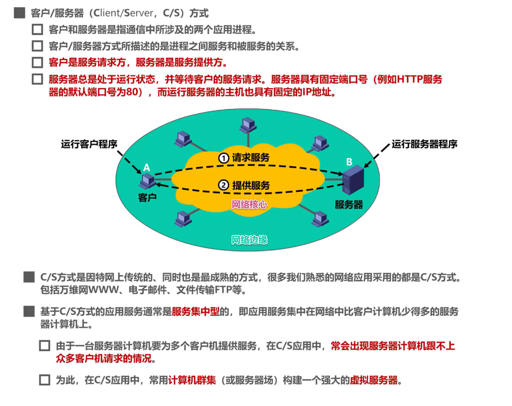
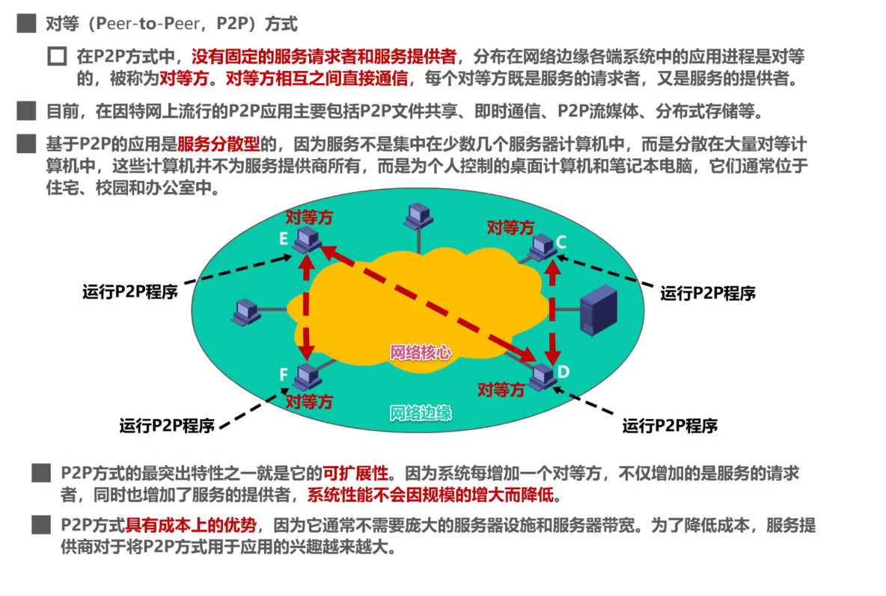
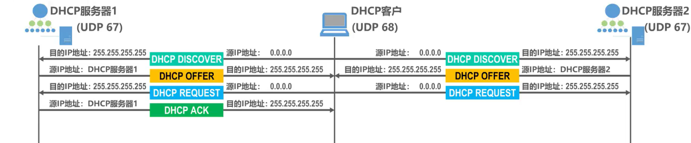
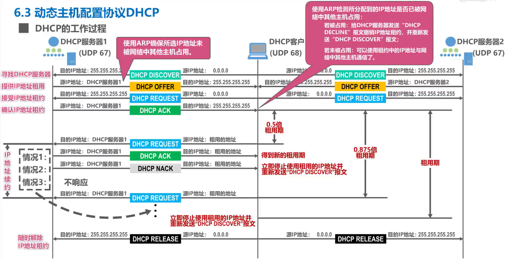
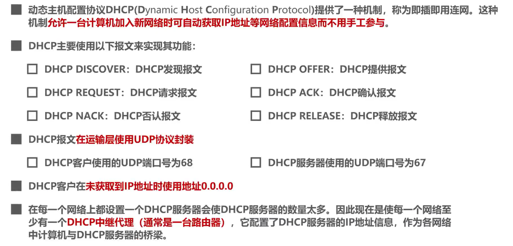
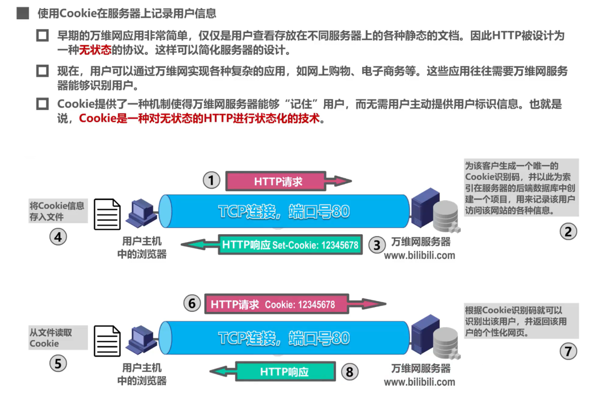

# 计网——应用层复习

应用层是计算机网络体系结构的最顶层，是设计和建立计算机网络的最终目的。

## 客户/服务器方式（C/S方式）和对等方式（P2P方式）

网络应用程序运行在处于网络边缘的不同的端系统上，通过彼此的通信来共同完成某些任务。

开发一种新的网络应用首先要考虑的问题就是网络应用程序在**各种端系统上的组织方式和它们之间的关系**。

### 客户/服务器方式

### 对等方式

## 动态主机配置协议DHCP

- 互联网广泛使用的DHCP提供了即插即用联网机制
- 这种机制允许一台计算机加入新的网络和获取IP地址，而不用手工配置

### DHCP工作过程

DHCP使用客户-服务器方式

- 需要IP地址的主机在启动时就向DHCP服务器广播发送发现报文（DHCP DISCOVER），这时该主机就成为DHCP客户。
- 本地网络上所有主机都能收到此广播报文，但只有DHCP服务器才回答此广播报文
- DHCP服务器先在其数据库查找该计算机的配置信息。若找到，则返回找到的信息。否则从服务器的IP地址池（address pool）中取一个地址给该计算机。DHCP服务器的回答报文叫做提供报文（DHCP OFFER）

DHCP工作方式

- DHCP使用客户-服务器方式，采用请求/应答方式工作。
- DHCP基于UDP工作（因为TCP不支持广播？？？），服务器运行在67号端口，DHCP客户运行在68号端口。

DHCP交互过程

首先，DHCP客户广播发送DHCP发现报文，包含

- 事务ID
- DHCP客户端的MAC地址

封装该报文的IP数据报的IP地址位0.0.0.0，目的地址为广播地址255.255.255.255

DHCP服务器收到DHCP发现报文后，根据其中封装的DHCP客户端的MAC地址来查找自己的数据库，如果查到匹配信息，则使用这些配置信息来构建并发送DHCP提供报文，如果没有则采用默认配置信息来构建报文并发送。

DHCP服务端将广播发送DHCP提供报文（DHCP OFFER）

- 事务ID：DHCP客户端会与之前DHCP发送报文的事务ID进行对比，来判断该DHCP报文是否是自己的
- 源IP地址：服务器的IP 目的IP地址：广播地址

这里DHCP客户可能会收到不止一个DHCP提供报文，会从中选择一个，一般选择先到的，并向所选择的DHCP服务器发送DHCP请求报文。

源地址：0.0.0.0，因为此时DHCP客户需要征求服务器同意，才可使用获得的IP

目的地址：广播地址，这样可以一次性通知所有DHCP服务器，告知它们是否把它们作为自己的DHCP服务器

所选择的DHCP服务器接收该请求，向DHCP客户发送DHCP确认报文

DHCP客户收到该报文后，就可以使用租用的IP地址。在使用前还会进行ARP检测。

### DHCP中继代理

idea：给路由器配置DHCP服务器的IP地址，使之成为中继代理，这样就不用在每一个网络上都设置DHCP服务器。

### 总结

## 域名系统DNS

> DNS是一个分布式系统，使大多数域名都能在本地解析。

因特网采用层次树状结构的域名结构。域名的结构由若干的分量构成，各分量之间用“点”隔开，分别代表不同级别的域名：

> 可以看见，名称相同的域名，其等级未必相同。

DNS使用分布在各地的域名服务器来实现域名到IP地址的转换。

域名服务器可以划分为以下4个不同的类型：

域名解析分为递归查询和迭代查询。

DNS报文使用运输层的UDP协议进行封装，运输层端口号53.

## 文件传送协议FTP

- FTP是因特网上使用得最广泛的文件传送协议
  - FTP提供交互式的访问，允许客户指明文件的类型和格式，并允许文件具有存取权限
  - FTP屏蔽各计算机系统的细节，因而适合于在异构网络中任意计算机之间传送文件

FTP采用C/S方式

FTP客户计算机可将各种类型的文件上传到FTP服务器计算机，也可以从FTP服务器计算机下载文件。

### FTP基本工作原理

FTP服务器监听熟知端口（端口号21），使客户进程能够连接上。

FTP客户随机选择一个临时端口号与其建立TCP连接，这条TCP连接用于FTP客户和服务器之间传送FTP相关**控制命令**。

FTP服务器使用自己的熟知端口号20与客户建立TCP连接，用于**传送文件**。

> 这是主动模式：建立数据通道时，FTP服务器主动连接客户。

> 对比，被动模式的端口号由协商决定

## 电子邮件

### 邮件发送和接收过程

### 简单邮件传送协议（SMTP）

> 可以发现，非常麻烦，根本记不住

### 电子邮件的信息格式

### 邮件读取

### 基于万维网的电子邮件

## 万维网WWW

- 万维网是一个大规模的、联机式的信息储藏所
- 万维网用链接的方法可以非常方便地从互联网的一个站点访问另一个站点，这种访问方式称为“链接”

- 万维网以C/S方式工作，浏览器是客户程序，万维网文档所在计算机运行服务器程序

### URL

### 超文本传输协议HTTP

#### 传输过程

- 在万维网客户程序与万维网服务器程序之间进行交互的协议
- 使用TCP连接
- 每个万维网网点都有一个服务器进程，它不断地监听TCP的端口80，以便发现是否有浏览器向它发出连接建立请求
- 一旦监听到连接建立请求并建立了TCP连接后，浏览器就向万维网服务器发出浏览某个页面的请求

#### HTTP报文格式

请求报文：

响应报文：

### Cookie

> 在原有的无状态的http协议上增添了功能

### 万维网cache和代理服务器

- 在万维网中还可以使用缓存机制以提高万维网的效率
- 万维网缓存也称为Web缓存，可位于客户机，亦可位于中间系统上（代理服务器）
- Web缓存把最近的一些请求和响应暂存在本地磁盘中。当新请求到达时，若发现这个请求与暂时存放的请求相同，就返回暂存的响应，而不需要按照URL的地址去访问因特网的资源。

假设原始服务器的文档被修改，这时候代理服务器的文档就过期了。因此原始服务器通常会为每个响应的对象设置一个**修改时间字段**和**有效日期字段**。

若过期，但代理服务器的文档与原始服务器的文档一致，则原始服务器发送不带主体的响应：

若不一致，则需要发送封装有最新文档的报文：

> 完结撒花
