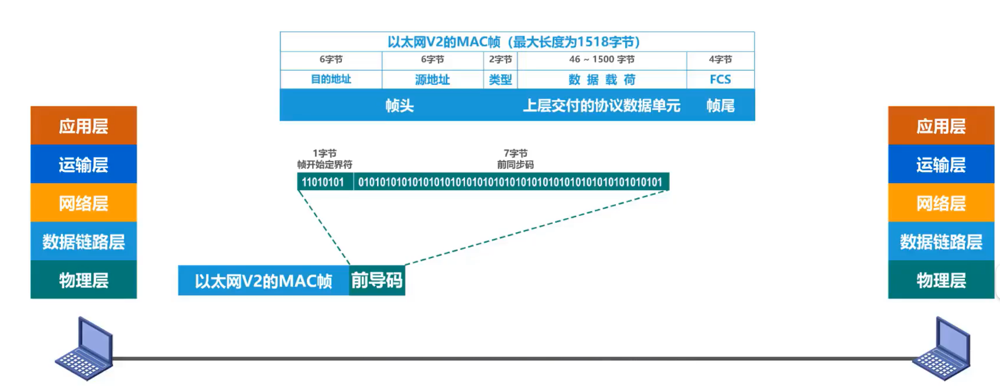
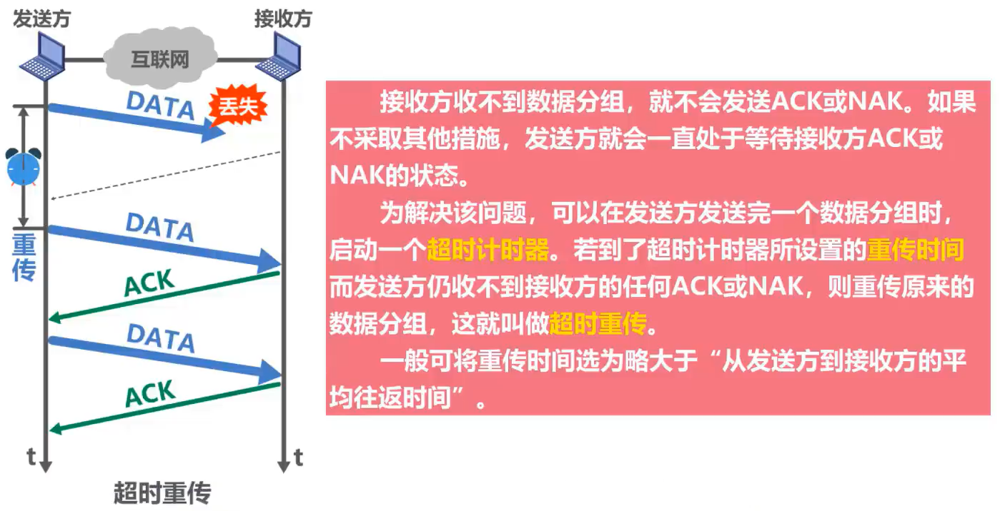
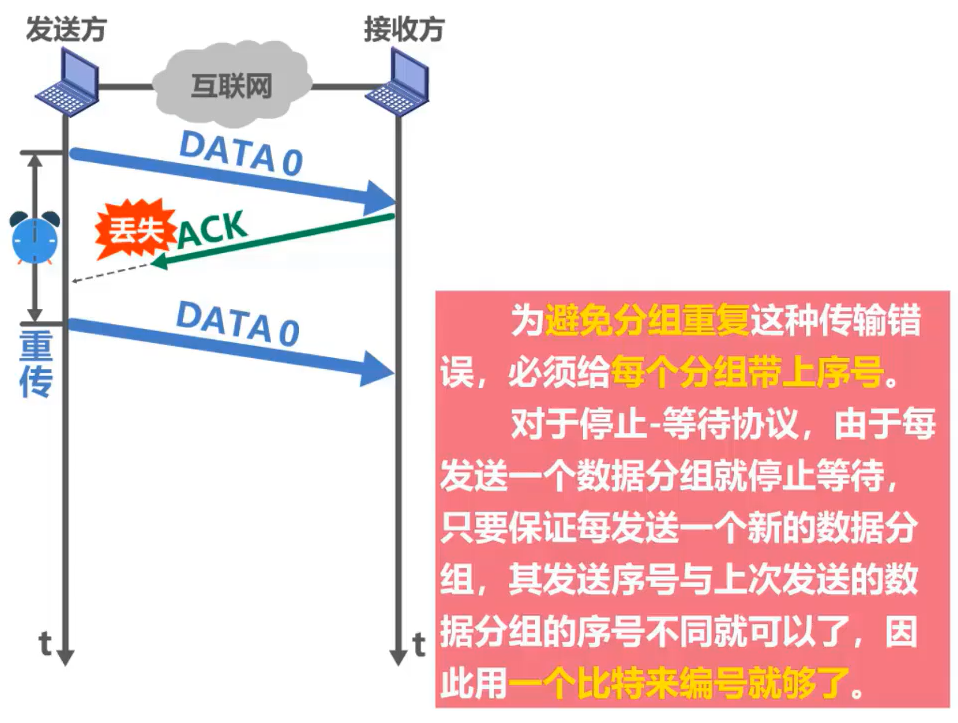
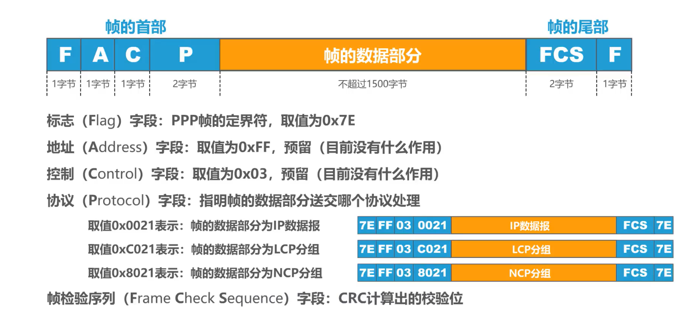
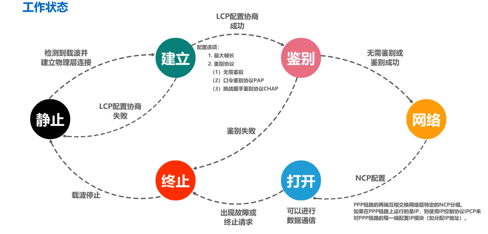
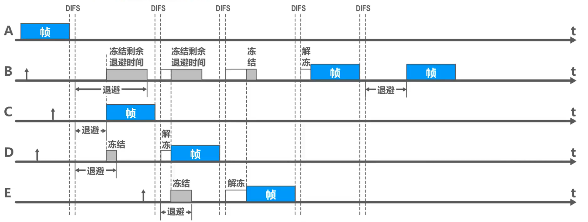
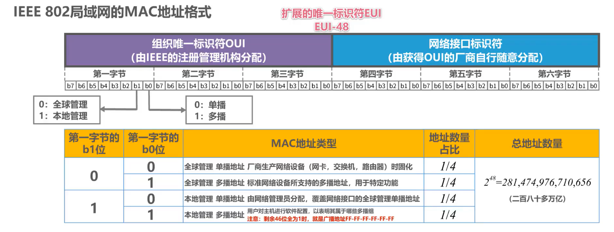
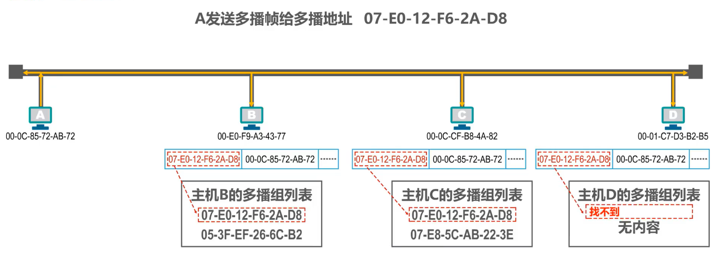
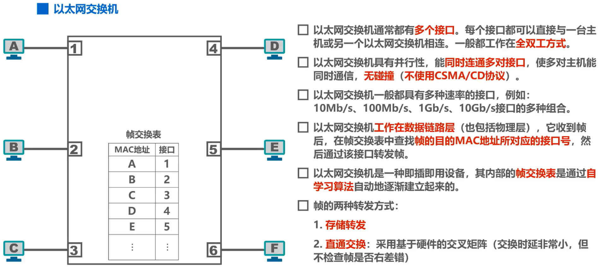
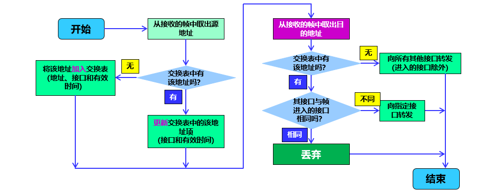

# 计网——数据链路层复习

**链路：**从一个结点到相邻结点的一段物理链路

**数据链路**：在链路的基础上增加了一些硬件（如网卡）和软件（如协议）

实现数据链路层：主机（五层）、路由器（三层）、交换机（两层）

> 参考的不是OSI模型，那个七层的模型一点不熟

数据链路层使用两种**信道**：点对点信道、广播信道（总线型？hh

> 局域网这个概念实际上属于数据链路层的范畴。它虽然听起来是个网络，但是网络层要解决的是如何协调多个网络之间联系的问题。而在单个局域网内部是不需要使用路由器来转发的。从整个互联网体系来看，局域网属于数据链路层的范畴。

数据链路层的**协议数据单元**：帧

这引起对数据链路层主要的三个功能的讨论：

- 封装成帧

在网络层往下发放的数据单元的前后分别添加首部和尾部，形成一个帧。

首部和尾部的一个重要作用就是**帧定界**，当然也有其它重要的控制信息。

例如点对点协议的PPP帧：

它的帧定界标志为一个字节，8个bit：01111110

但是以太网V2的MAC帧不需要帧定界，它采用的是前导码机制：

外加以太网规定帧之间留有96比特时间的间隔，因此不需要帧结束定界符。

**透明传输**解决的问题是帧定界标志与数据部分内容的冲突问题。

对于**面向字节**的物理链路，采用**字节填充**解决，具体是在数据部分的冲突字节（包括ESC）之前填充一个转义字符ESC来加以区分

举例（王道p58）：帧的数据段中出现EOT（结束）和SOH（开始）控制字符，然后有以下数据：

SOH | A EOT ESC B | EOT

透明传输解决后的方案：

SOH| A **ESC** EOT **ESC** ESC B | EOT

对于**面向比特**的物理链路，采用零比特填充法。拿PPP帧举例，它的具体操作是在数据字段中每遇到连续5个1，就自动插入一个0.

同时，在封装成帧这一部分，为了提高帧的传输效率，应当使帧的数据部分的长度尽可能大。但也不能太大，因此每一种链路层协议都规定了帧的**数据部分**的长度上限，即 **MTU**。

> 不同协议的MTU的长度会影响到网络层中ip数据报的分片。具体内容见网络层ipv4数据报头部结构。需要注意MTU的长度不包括帧头和帧尾。

- 差错检测

一种方式是奇偶校验，在待发送的数据后面添加一位奇偶校验位，使整个数据中1的个数为奇数（奇校验）或偶数（偶校验）。

另一种方式是**循环冗余校验CRC**，具体步骤如下：

1. 收发双方约定一个**生成多项式**，例如 $G(x)=x^4+x^2+x+1$，对应的比特串为10111。
2. 在待发送数据后面添加**生成多项式最高次数个0**，例如101001对应上述情况，需添加4个0：1010010000.
3. 做**除法**
4. 将**余数拼接**到待传输数据后
5. 接收方将收到的数据+冗余码对生成多项式做除法，如果**余数为0**，则传输过程**无误码**。

- 可靠传输

数据链路层可以向上层提供可靠或不可靠的传输服务。一般来讲，有线链路误码率较低，无需实现可靠传输协议。而无线链路易受干扰，误码率较高，因此要求必须向上层提供可靠传输服务。

可靠传输通常采用**确认**和**超时重传**两种机制来实现，这种可靠传输协议称为**自动重传请求（ARQ）**，其数据帧和ACK帧都需要编号。

关于数据链路层的可靠传输协议，有以下三种：

### 1. 停止-等待协议 SW

发送方每次只能发送一个帧，当发送方收到确认帧ACK时，才可以发送下一个帧。

可能的故障：

1. 到达接收方的数据帧遭破坏，接收方使用例如CRC校验技术，简单地将其丢弃。为了解决该问题，发送方需设置一个计时器，实现**超时重传**：

2. 到达发送方的确认帧遭破坏，这样接收方收不到ACK确认帧，会通过超时重传发送同样的帧。解决方式是给每一个帧**用1个比特**来标识：

需要注意的是，**ACK也需要标识**，这样可以防止确认帧确认了和它不对应的数据帧：

SW的**信道利用率**：

假设 TD 是发送方发送数据分组所耗费的发送时延， RTT 是收发双方的往返时间， TA是收方发送确认分组所耗费的发送时延（一般远小于TD，可以忽略）

信道利用率 $U = \dfrac{T_D}{T_D+RTT+T_A}$

### 2. 回退N帧协议GBN

发送方维护一个发送窗口，大小为 $W_T$。发送方可在未收到确认帧的情况下，将序号在发送窗口内的多个数据帧全部发送出去。

**回退N帧**：发送N个数据帧后，若发现这N个帧的前一个数据帧在计时器超时的时候未收到ACK，则该帧被判为丢失或出错，此时发送方需重传该帧及随后的N个帧。**事实上就是滑动窗口没办法往前移动**。

**累计确认**：接收方可在连续收到多个正确的数据帧后，对**最后一个数据帧**发回ACK。对某个数据帧的确认就代表该数据帧和之前所有的帧均正确接收。

发送窗口 $W_T$ 应满足 $1 < W_T \le 2^n-1$，其中 $n$ 为帧编号所用比特数。接受窗口 $W_R=1$。

### 3. 选择重传协议SR

设法只重传差错和超时的数据帧，但此时必须**加大接收窗口**，以先收下失序但正确到达且序号落在接受窗口内的数据帧，等到补齐时一并上传。

此时无法使用累积确认。

若采用n比特对帧编号，需首先满足：$W_R+W_T \le 2^n$ （否则接收方可能会出现无法辨认新数据帧和旧的重传数据帧的情况，这个和GBN是一样的问题）

其次需要满足 $W_R \le W_T$ ，接收窗口大于发送窗口是没有意义的。

因此可以将条件转化为上面图片（湖科大计网）的形式。

GBN和SR皆为连续ARQ协议，它们的信道利用率 $U = \min(\dfrac{nT_D}{T_D+RTT+T_A}, 1)$

与这三个ARQ协议，对应的是提供不可靠传输服务的**点对点协议PPP**。

### PPP协议

PPP协议在点对点链路传输各种协议数据报提供了一个标准方法，主要由以下三部分构成：

1. 链路控制协议LCP。用于建立、配置以及测试数据链路的连接。
2. 一套网络控制协议NCPs。PPP允许链路上层采用多种网络层协议，每种不同的网络层协议要用一个相应的NCP来配置，为网络层协议建立和配置逻辑连接。
3. 对各种协议数据报的封装方法（封装成帧）

PPP帧的格式如下图所示：

PPP的工作状态可由一个状态机来表示，这个有点抽象。（也可见王道p117）

PPP因为不使用重传和帧编号机制，因此提供不可靠传输服务。

## 介质访问控制 MAC

**媒体接入控制（介质访问控制）使用一对多的广播通信方式**

这种共享信道的方式可能会造成多个数据流彼此干扰，造成发送失败。

对于MAC，有两种方式：静态划分信道和动态接入控制。

先来复习一下静态划分信道：

### 1. 频分复用FDM 

> 王道p81

将信道的总频带划分为多个子频带，每个子频带作为一个子信道

### 2. 时分复用TDM

TDM将时间划分为一段段等长的TDM帧，每个用户在每个TDM帧中占用固定序号的时隙，每个用户所占用的时隙周期性的出现。

### 3. 波分复用WDM

> 波分复用就是光的频分复用，使用一根光纤来同时传输多个光载波信号
>
> 光信号传输一段距离后悔衰减，所以要用 掺铒光纤放大器 放大光信号
>
> 太抽象了

### 4. 码分复用CDM

> 或者是CDMA，即码分多址

CDM将每一个比特时间再划分为m个短的间隔，称为**码片**。使用CDMA的每一个站点被指派一个唯一的m bit**码片序列**。

若站点要发送bit 1，则发送该序列。否则发送该序列的**二进制反码**。

为了方便计算，将码片中的0写为-1，1写为+1。例如00011011 -> (-1 -1 -1 +1 +1 -1 +1 +1)，这样可以得到一个向量形式。

码片序列需要满足以下约束条件：

1. 不同站的码片序列相互正交，即向量 S 和 T的规格化内积为0：$S \cdot T = \frac{1}{m}\sum_{i=1}^m S_iT_i=0$
2. 自身向量的规格化内积为1，$S \cdot S = 1$
3. $S \cdot \overline S = -1$

总线上得到的数据是不同码片序列的叠加，例如 $S + \overline T$。若要分离，则接收站需知道各发送站的码片序列，然后将该序列与数据进行规格化内积，例如 $S \cdot (S + \overline T) = 1$，得知 S 站发送比特1.

除去上述四种静态划分信道的方式，我们应该重点掌握动态接入控制中的**随机接入**。

### 1. CSMA/CD

多址接入MA：表示许多主机以多点接入的方式连接在一根主线上

载波监听CS：发送前和发送过程中都需要监听信道

碰撞检测CD：一旦检测到总线上出现了碰撞，就立即停止发送，然后等待一段**随机**时间后重新尝试发送数据

主机最多经过 $2\tau$ （两倍的端到端传播时延）的时长就知道有没有发送冲突，因此 $2\tau$ 称为**争用期**或**碰撞窗口**。

**最短帧长=总线传播时延 * 数据传输速率 *2**

截断二进制指数退避算法：

1. 确定基本退避时间，一般取争用期 $2\tau$
2. 从离散的整数集合 $[0, 1, \cdots, 2^k-1]$ 中随机取一个数 $r$ ，设置重传所需推迟时间为 $2r\tau$ 。其中 $k = \min(10, 重传次数)$ 。
3. 重传达16次仍不成功时，**抛弃该帧**并向高层报告出错。

### 2. CSMA/CA

在CSMA的基础上增加**碰撞避免**CA功能，并采用确认机制（停止-等待协议SW）。

**帧间间隔IFS**：站点必须在持续监测到信道空闲一段指定时间后才能发送帧，这段时间间隔称为IFS

短帧间间隔SIFS：最短的IFS，用来分隔开属于一次对话的各帧。

DCF帧间间隔DIFS：比SIFS长的多，在DCF方式中用来发送数据帧和管理帧

当站点检测到信道空闲，并且所发送的数据帧不是成功发送完上一个数据帧之后立即连续发送的数据帧，则不使用退避算法。

使用退避算法的时机：

1. 发送数据帧之前检测信道忙
2. 每一次重传一个数据帧时
3. 连续发送下一个帧（避免一个站点长时间占用信道）

退避算法：

当退避时间还未减少到0而信道又变为忙状态的时候，需要**冻结**退避计时器，等检测到空闲，**再经过时间DIFS后**，继续启动计时器。

进行第 $i$ 次退避时，退避时间在时隙编号 $\{0, 1, \cdots, 2^{2+i}-1\}$ 中随机选择一个，然后乘以基本退避时间（一个时隙的长度）就可以得到退避时间。当时隙编号达到255（对应第6次退避）的时候就不再增加。

CSMA/CA的信道预约机制：

**虚拟载波监听**：站点不需要真正监听信号，只需要监听到帧里关于占用的时间的信息，即可进行等待。

## MAC地址

使用广播信道的数据链路层需要使用MAC地址来区分各主机。

一般情况下，用户主机有两个网络适配器（网卡）：有线网卡和无线网卡。每个网络适配器都要一个全球唯一的MAC地址。而交换机和路由器有更多的网络接口，所以会有更多的MAC地址。

严格来说，MAC地址是对**网络上各接口的唯一标识**。

IEEE 802局域网的MAC地址格式：

标准表示法：XX-XX-XX-XX-XX-XX

发送顺序：第一字节->第六字节，b0->b7

**广播帧**：在帧首部的目的地址字段填入**广播地址FF-FF-FF-FF-FF-FF**

多播帧：帧首部的目的地址的**第一字节为奇数**

> 湖科大这里还介绍了IP地址以及IP和MAC映射的ARP协议，这部分我们放网络层那里复习

## 集线器

集线器在**物理层**上扩展以太网。逻辑上仍是一个总线网。

集线器扩大了以太网覆盖的范围，但是也增大了**碰撞域**。

## 以太网交换机

在**数据链路层**扩展以太网。

和集线器的区别在于：某单播帧进入交换机后，交换机会将该单播帧转发给目的主机，而非各个主机。（忽略ARP过程）

相对于集线器的优点：扩大了广播域，但**隔离了冲突域**。

交换机**自学习**+**转发帧**的步骤归纳：

注意帧交换表中每条记录都有自己的**有效时间**，到期删除。

## 虚拟局域网VLAN

VLAN技术是在交换机上实现的

> 王道这里只是大致过了一遍，但是湖科大这里把原理讲的很清楚。这里我打算摆了

802.3ac标准定义支持了VLAN的以太网帧格式扩展，在原有以太网MAC帧插入了4字节的VLAN标签，用于指明虚拟局域网。

交换机可以通过识别这个VLAN标签**并取走**该标签，将帧传送给同属于该VLAN标签所属虚拟局域网的主机。
