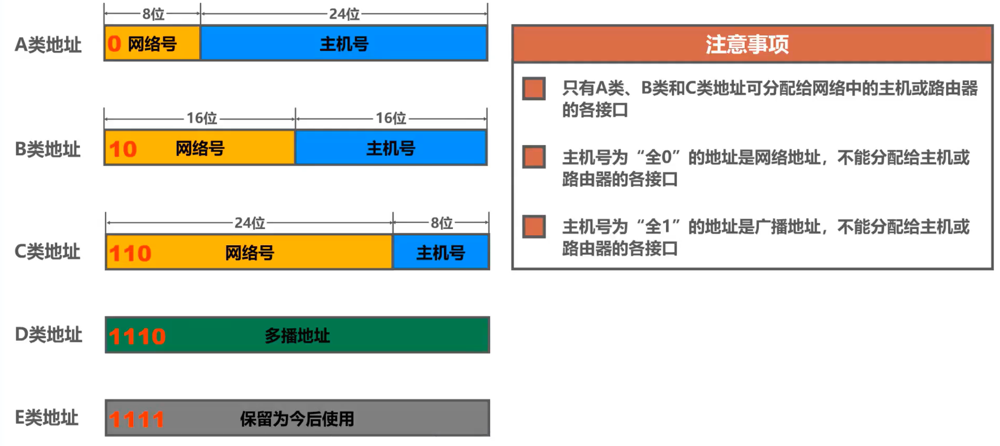
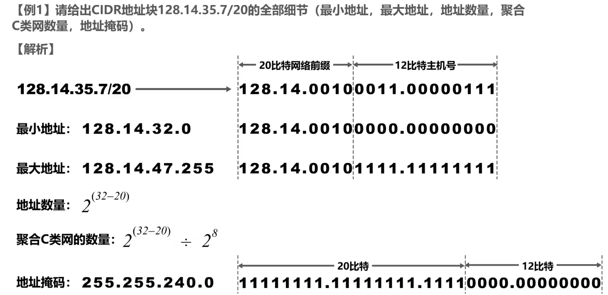
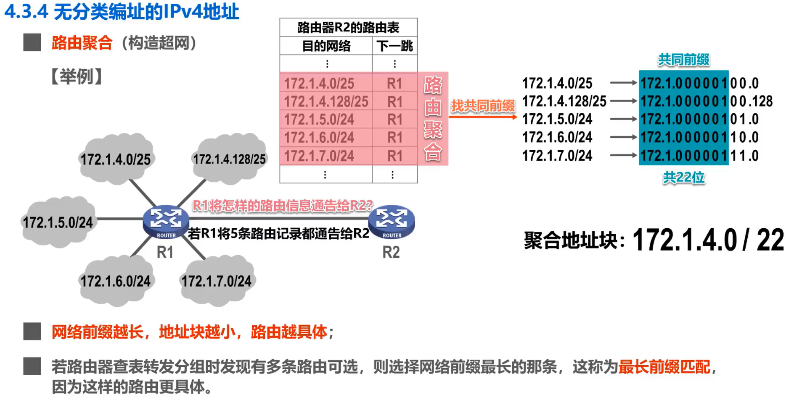
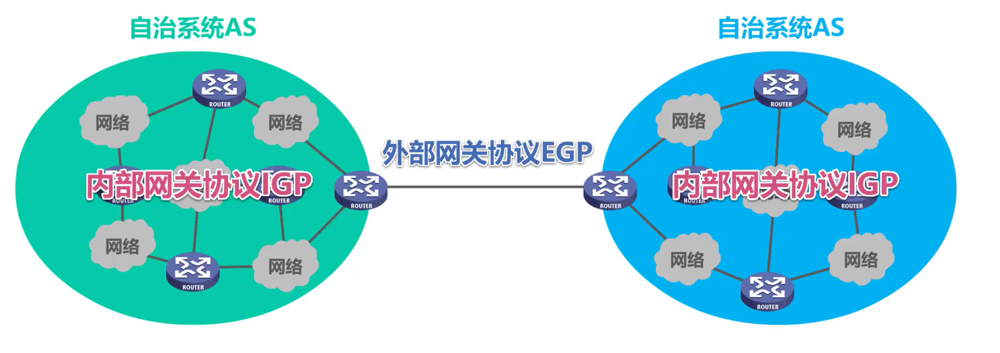
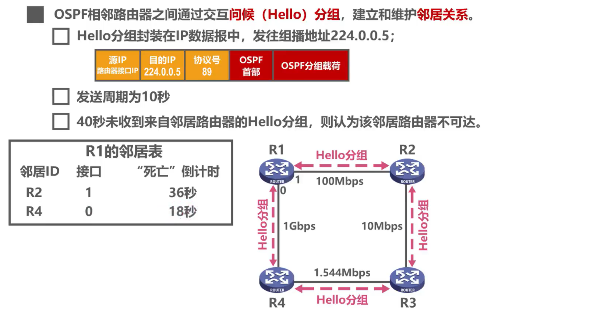
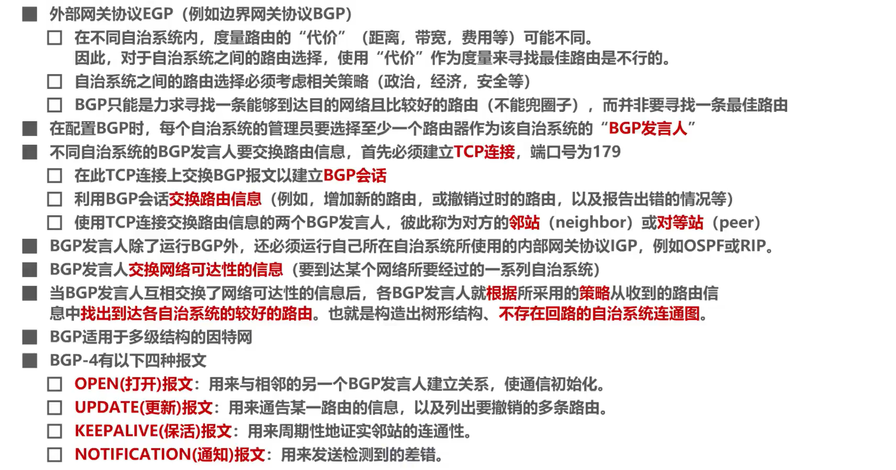
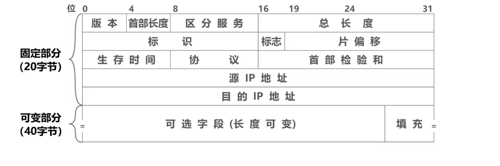

# 计网——网络层复习

网络层的主要任务是实现**网络互联**，进而实现数据报在**各**网络之间的传输。

网络层需要解决以下三个问题：

1. 网络层向运输层提供怎样的服务（“可靠传输”还是“不可靠传输”）
2. 网络层寻址问题
3. 路由选择问题

因特网使用TCP/IP协议栈，使用网际协议IP

## 两种服务

### 面向连接的虚电路服务

通信之前先建立虚电路，以保证通信双方所需的一切网络资源。虚电路只是一条**逻辑**上的连接

发送方发送给接收方的所有分组都沿着同一条虚电路传送

### 无连接的数据报服务

只向上层提供**无连接的、尽最大努力交付**的数据报服务

发送前无需建立连接。每一个分组（即ip数据报）独立发送

## IPv4

IPv4地址是给因特网（Internet）上的**每一台主机（或路由器）的每一个接口**分配一个在全世界范围内是**唯一的32比特的标识符**。

IPv4编址方法的三个历史阶段：分类编址->划分子网->无分类编址

IPv4：**点分十进制**表示方法

### 1. 分类编址

A类地址，最小网络号为0，但是保留，**不指派**。

第一个可指派的网络号是1，**网络地址**是1.0.0.0。

最大网络号127，但是作为**本地环回测试地址**，**不指派**。

最后一个可指派的网络号是126，**网络地址**是126.0.0.0。

可指派的网络数量为126。

每个网络中可分配的IP地址数量为 $2^{24}-2=16777214$ （除去**主机号全0的网络地址**和**全1的广播地址**）

------

B类地址，最小网络号也是第一个可指派的网络号是128.0，网络地址是128.0.0.0。

最大网络号也是最后一个可指派的网络号是191.255，网络地址是191.255.0.0。

可指派的网络数量为 $2^{16-2}=16384$

每个网络中可分配的IP地址数量为 $2^{16}-2=65534$。

------

C类地址，最小网络号也是第一个可指派的网络号是192.0.0，网络地址是192.0.0.0。

最大网络号也是最后一个可指派的网络号是223.255.255，网络地址是223.255.255.0。

可指派的网络数量为 $2^{24-3}=2097152$

每个网络中可分配的IP地址数量为 $2^{8}-2=254$。

------

### 2. 划分子网

> 将原有的两级IP地址变为三级的IP地址

划分子网**纯属是一个单位内部的事情**，对外仍然表现为没有划分子网的网络。它的idea是从主机号中借用若干个bit作为**子网号**（subnet-id）。

子网掩码：连续的1对应网络号和子网号，0对应主机号。即（IP地址）AND（子网掩码）= 网络地址

### 3. 无分类编址

无分类域间路由选择CIDR：消除了传统的A、B、C类地址以及划分子网的概念，使用**各种长度的网络前缀**来代替网络号和子网号。

CIDR使用斜线记法，即在IPv4地址后面加上斜线“/”，写上网络前缀所占比特数量。例如 128.14.25.7/20

CIDR实际上是将网络前缀都相同的连续IP地址组成一个“**CIDR地址块**”。我们只要知道一个CIDR地址块中的任何一个地址，就可以知道该地址块的全部细节：

- 地址块的最小、最大地址
- 地址块的地址数量
- 地址块聚合某类网络（A、B、C类）的数量
- 地址掩码（也可继续称为子网掩码）

> 有点抽象，这里偷个例子看看

**路由聚合**：将路由器中路由表的多个CIDR记录找**最大公共前缀**（~~这不是Trie吗，ACMer特有的感知~~），合并成一个记录

## IPv4地址的应用规划

> 王道p146

给定一个IPv4地址块，将其划分成几个更小的地址块，分配给不同的网络

### 定长的子网掩码FLSM

就是划分子网的方式，从主机号部分借用 $n$ 位作为子网号，可以划分出大小相等的 $2^n$ 个不同的网络。

### 变长的子网掩码VLSM

就是无分类编址的方式。这里给出一个例子

> 划分方案不唯一，建议从大的子网（主机号多的）开始划分。

## 地址解析协议ARP

> 从IP地址找出其对应的MAC地址

每台主机都设有一个ARP高速缓存，用于存放**本局域网**上各主机和路由器的IP地址到MAC地址的映射表，即ARP表。

若未查到目的主机的MAC地址，则通过使用目的MAC地址为FF-FF-FF-FF-FF-FF的帧来**封装并广播ARP请求分组**。目的主机收到ARP请求后，向源主机发送**ARP响应**（单播MAC帧，包含目的主机的IP地址和MAC地址）。源主机收到ARP相应后，记录到ARP表中。

> ARP表中的IP地址与MAC地址的对应关系记录，是**会定期自动删除的**，**因为IP地址与MAC地址的对应关系不是永久性的**

## IP数据报的发送和转发

> 忽略ARP过程和交换机自学习流程

获取目的网络地址：将目的地址IP和**源地址**的子网掩码进行逻辑与运算

- 如果目的网络地址和源网络地址相同，则属于同一个网络，**直接交付**
- 否则属于**间接交付**，需要将IP数据报传输给主机所在网络的**默认网关**（路由器）

默认网关：为了让本网络中的主机能和其它网络中的主机进行通信，就必须指定本网络的一个路由器的接口，由该路由器帮忙转发

路由器收到IP数据报后如何转发？

- 检查IP数据报首部是否出错：
  - 若出错，则直接丢弃该IP数据报并通告源主机
  - 若没有出错，则进行转发
- 根据IP数据报的目的地址在路由表中查找匹配的条目：
  - 若找到匹配的条目，则转发给条目中指示的下一跳
  - 若找不到，则**丢弃该数据报**并通告源主机

> 检查路由条目：将目的地址与**路由条目**中的地址掩码进行逻辑与运算得到目的网络地址，并和路由条目中的目的网络进行比较，如果相同，则该条目就是匹配的条目。根据该条目的下一跳指示，进行转发。（补充，按前缀长度的顺序进行检查）
>
> 路由器是**隔离广播域**的。

## 路由算法与路由协议

### 静态路由配置

由网络管理员手工配置每一条路由。

> 默认路由0.0.0.0/0，与所有IP匹配，但是优先级也是最低的。
>
> 特定主机路由，例如192.168.2.1/32，优先级是最高的。
>
> 黑洞路由，匹配后分组就没了

### 路由选择协议

因特网采用**分层次**的路由选择协议

- 自治系统AS：在单一的技术管理下的一组路由器，这些路由器使用一种**AS内部**的**路由选择协议**和**共同的度量**以确定分组在该AS中的路由，同时还使用一种**AS之间**的路由选择协议来确定AS之间的路由。
- 

#### 路由信息协议RIP

> 这个玩意运行在传输层的UDP协议之上。疑问：路由器不是只实现了网络层吗？

RIP要求自治系统AS内的每一个路由器都要维护它自己到AS内其它每一个网络的距离记录。这是一组距离，称为“距离向量D-V”

RIP使用**跳数**作为距离的度量。

- 路由器到直连网络的距离定义为1
- 到非直连网络的距离定义为经过的路由器数加1
- **允许一条路径最多只能包含15个路由器。“距离”为16时相当于不可达。**

RIP认为距离短的路由就是好的路由。当到达同一网络有多条距离相等的路由时，可以进行“等价负载均衡”。

RIP包含以下三个要点：

- 仅和**相邻**路由器交换信息
- 交换信息为自己的路由表
- 周期性交换信息

RIP工作举例：

- 相同下一跳，更新
- 新网络，添加
- 不同下一跳但是有路由优势（距离短），更新
- 不同下一跳且距离相同，等价负载均衡，添加
- 不同下一跳且劣势，不更新

RIP存在“坏消息传播慢”的问题，又称路由环路或距离无穷问题，这是距离向量算法的一个固有问题。假设某网络N1故障，其直连路由器开始传播N1不可达的RIP更新信息，但是发的慢了，会被其余认为N1可达的信息误导，这会导致路由环路，使路由收敛减慢：

### 开放最短路径优先OSPF

OSPF是基于链路状态的路由算法协议，采用SPF最短路算法计算路由，因此在算法上保证了不会产生路由环路。

**链路状态**：指本路由器都和哪些路由器**相邻**，以及相应链路的“**代价**”

> ~~嗯？这不是每个点的邻接表吗（雾~~

**问候分组Hello**：OSPF相邻路由器通过交互问候分组，建立和维护**邻居关系**。

> 在IP数据报的首部字段的协议号中标注为89，表明数据载荷为OSPF分组

**链路状态通告LSA**：包含以下内容

- 直连网络的链路状态信息
- 邻居路由器的链路状态信息

LSA被封装在**链路状态更新分组LSU**中，用洪泛法发送

**链路状态数据库LSDB**：存储各路由器的LSA

通过LSDB构造带权有向图，就可以使用SPF算法计算各自路由器到达其它路由器的最短路径：

OSPF共有以下五种分组类型：

1. 问候分组，Hello
2. 数据库描述分组，向邻站给出自己的LSDB中所有链路状态项目的摘要信息
3. 链路状态请求分组，向对方请求发送某些链路状态项目的详细信息
4. 链路状态更新分组，LSU，**它是OSPF最核心的部分**
5. 链路状态确认分组

为了使OSPF能够用于规模很大的网络，OSPF将一个自治系统AS再划分为若干更小的范围，称为**区域**。这样做的目的是将LSU的广播仅限于每一个区域内，减少网络上的通信量。

### 边界网关协议BGP

BGP是不同AS的路由器之间交换路由信息的协议。

> 不同AS之间必然没有统一的路由评价标准。因此BGP只能是寻求一条能够到达目的网络且比较好的路由，而非找到最佳路由。
>
> BGP运行在传输层的TCP之上

BGP的主要idea是，每个AS的管理员需要在配置BGP的时候选择至少一个路由器，作为该AS的“**BGP发言人**”（往往就是边界路由器）

一个BGP代言人要和其它AS的代言人交换信息，需要先建立TCP连接，然后在此基础上交换BGP报文以建立BGP会话，来交换路由信息。当BGP各代言人互相交换网络可达性的信息后，就根据各自所用的策略，各自找出到达各AS的较好的路由。

> 这会形成一个树形结构

BGP-4共使用4种报文：

1. 打开（Open）报文。用来和相邻的另一个BGP代言人建立关系，使通信初始化
2. 更新（Update）报文。用来通知某一路由的信息，以及列出要撤销的多条路由
3. 保活（Keepalive）报文。用来周期性地证实邻站的连通性
4. 通知（Notification）报文。用来发送检测到的差错。

## IPv4数据报格式

直接上图

- 一个IP数据报由**首部**和**数据**两部分组成
- 首部的前一部分是**固定长度，为20字节**
- 首部后面部分是可选字段，其长度可变
- 首部长度一定是**4字节的整数倍**，填充部分用于确保这一条件

每一行由32个比特组成，每个小格子称为字段或者域，用来表达IP协议的相关功能：

- 版本：4比特，表示ip协议的版本
- 首部长度：4比特，表示ip数据报首部的长度，**以4字节为单位**
- 可选字段：1字节到40字节不等，用来支持其它功能
- 填充字段：确保首部长度为4字节的整数倍，用全0填充
- 区分服务：利用该字段的数值可提供不同等级的服务质量，不过一般情况不使用该字段
- 总长度：16比特，以**字节**为单位
- 标识：占16比特，属于同一个数据报的**各分片数据报**应该具有**相同的标识**
- 标志：3比特，DF位（1表示不允许分片，0表示允许分片），MF位（1表示后面还有分片，0表示这是最后一个分片），保留位（必须为0）
- 片偏移：13比特，以8个字节为单位，指出分片数据报的**数据载荷部分**偏移其原数据报的数据载荷位置多少个单位

> 这要求分片的数据载荷部分，除了最后一个分片，都要保证其大小为8个字节的整数倍？

- 生存时间TTL：占8比特，现在以**跳数**为单位，路由器转发IP数据报时，将IP数据报首部中的**该字段的值减1**，若不为0则转发，否则丢弃

- 协议：占8比特，指明IP数据报部分是何种协议数据单元：

|  协议名称  | ICMP | IGMP | TCP  | UDP  | IPv6 | OSPF |
| :--------: | :--: | :--: | :--: | :--: | :--: | :--: |
| 协议字段值 |  1   |  2   |  6   |  17  |  41  |  89  |

> 这里不仅有网络层协议，还有传输层协议捏。咦，传输层和网络层之间是有关联的吗，为什么要把传输层的信息封装在IP首部中？这不是违背了分层的idea了吗？

- 首部检验和：占16比特，用来检测首部在传输过程中**是否存在差错**。比CRC简单。IP数据报每经过一个路由器，都要重新计算该字段，因为某些字段（TTL、标志、片偏移等）可能发生变化
- 源/目的IP地址：各占32比特

## 网际控制报文协议ICMP

> ICMP的作用是让主机或者路由器报告**差错和异常**情况，提高IP数据报交付的机会。

ICMP报文有两种：ICMP**差错报告报文**和ICMP**询问报文**。

ICMP**差错报告报文**用于目标主机或目标路径上的路由器，向源主机报告差错和异常情况。共5种常用类型：

1. 终点不可达。当路由器或主机不能交付数据报时，发送该报文
2. 源点抑制。当路由器或主机**由于拥塞**，而丢弃数据报时，发送该报文，使源点知道应该把数据报的**发送速率降低**
3. 时间超过。当路由器收到TTL为零的数据报时，除丢弃数据报外，还需要向源点发送时间超过报文。另外一种情况是终点在**规定时间**内不能收到一个数据报的全部数据报片时，就把已有数据报丢弃，也会向源点发送该报文。
4. 参数问题。当路由器或目标主机收到的数据报的首部中，有的字段值不正确时，丢弃该数据报，发送参数问题报文
5. 改变路由（重定向）。路由器把该报文发送给主机，让主机知道下次应将数据报发送另外的路由器。

以下情况不应发送ICMP差错报告报文：

- 对ICMP差错报告报文，不发送ICMP差错报告报文（不然就套娃了不是吗
- 对第一个分片的数据报片的所有后续数据报片，不发送ICMP差错报告报文（不然就太多了？
- 对具有多播地址的数据报，不发送
- 对具有特殊地址（如环回地址127.0.0.0或者0.0.0.0），不发送

ICMP询问报文，常见的有2种：

1. 回送请求和回答。向特定的目的主机发出询问，目的主机收到该报文后必须给源主机或发送ICMP回送回答报文。一般用于测试目的站是否可达。
2. 时间戳请求或回答。请求某个主机或路由器当前的日期和时间，通常用于进行时钟同步和测量时间。

> ICMP应用：
>
> 1. PING，用来测试主机或路由器间的连通性。应用层直接使用网际层的ICMP回送请求和回答报文，来检测目的主机是否可达。
> 2. traceroute，用来测试ip数据报从源主机到达目的主机要经过哪些路由器。原理是发送TTL设定值的ICMP回送请求报文，这样TTL为0时，路由器会返回时间超过的ICMP差错报告报文。

## 虚拟专用网VPN

> 由于IP地址紧缺，一个机构能申请到的ip地址数往往远小于本机构所拥有的主机数。VPN的idea是在同一个机构中，分配本机构可自由分配的**专用地址**。

专用（私有）地址是规定的：

- 10.0.0.0 - 10.255.255.255（10/8地址块）
- 172.16.0.0 - 172.31.255.255 （172.16/12地址块）
- 192.168.0.0 - 192.168.255.255（192.168/16地址块，是不是很熟悉？）

> 私有地址只能用于同一机构内的通信，不能和因特网上其它主机通信。因此路由器对所有目的地址是专用地址的ip数据报一律不转发。

各部门都至少需要一个路由器具有全球合法的ip地址，这样各自的专用网才能利用公用的因特网进行通信。

> 有两个首部：内部IP数据报首部，和真正的IP数据报首部。

## 网络地址转换NAT

> NAT的主要思想是将大量使用内部专用地址的用户共享少量的全球合法地址。

假设，使用私有地址的主机要给因特网上使用全球ip地址的另一台主机发送数据报，这时候需要用安装了NAT软件的专用网的路由器进行ip地址转换：

若多台主机同时采用NAT，路由器内部需要维护一个私有地址到全球IP地址的映射关系：

如果NAT路由器具有n个全球ip地址，这样的话只能有n个内网主机能够同时和因特网上的主机通信。

解决方法是使用传输层中TCP和UDP协议的**端口号**，利用运输层的端口号和IP地址一起转换，这种技术叫做NAPT：

> NAPT路由器就是我们常用的家用路由器

如果外网需要主动与内网某主机进行通信，这会有问题（根本就不知道ip地址呀），这需要网络应用自己使用一些特殊的NAT穿越技术来解决问题。
