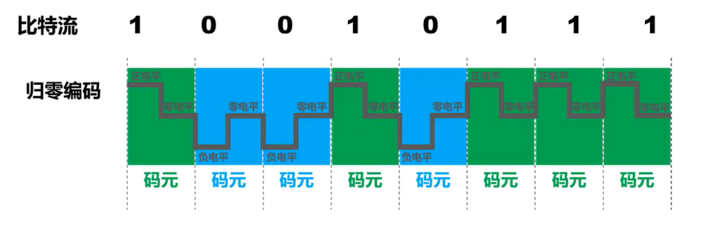
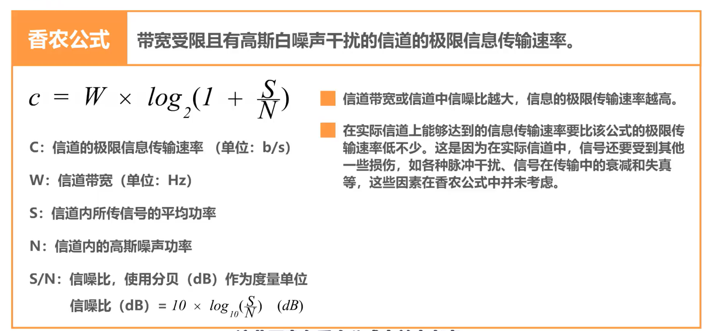

# 计网——物理层复习

> 物理层考虑的是怎样才能在连接各种计算机的媒体上传输数据比特流。它为数据链路层屏蔽了传输媒体的差异。
>
> ~~最ex的一层，我的评价是看了就忘~~

## 物理层的主要任务

- 机械特性：指明接口所用接线器的形状和尺寸、引脚数目和排列、固定和锁定装置
- 电气特性：指明在接口电缆的各条线上出现的电压的范围
- 功能特性：指明某条线上出现的某一电平的电压表示何种意义
- 过程特性：指明对于不同功能的各种可能事件的出现顺序

## 传输媒体

分为导引型传输媒体和非导引型传输媒体。

导引型：

- 同轴电缆
- 双绞线
- 光纤
- 电力线

非导引型传输媒体是指自由空间：

- 无线电波
- 微波
- 红外线
- 可见光，LIFI

## 传输方式

串行传输：数据是一个比特一个比特发送的，因此在发送端和接收端之间，只需要一条传输线路即可。

并行传输：一次发送n个比特，需要有n条传输线路。然而在计网上一般采用串行传输。

同步传输：

- 数据块以稳定的比特流的形式传输。字节之间没有间隔。
- 接收端在每个比特信号的中间时刻进行检测，来判断是比特0还是比特1。
- 由于不同设备的时钟频率存在一定差异，因此需要使收发双方的时钟同步。

异步传输：

- 以字节为独立的传输单位，字节之间的时间间隔不是固定的。
- 接收端仅在每个字节的起始处对字节内的比特实现同步。
- 通常在每个字节前后分别加上起始位和结束位。

## 通信方式

> 在许多情况下，我们要使用"信道"这一名词。信道和电路不等同，它一般用来表示向某一个方向发送信息的媒体。因此，一条传输电路往往包含一条发送信道和一条接收信道。

### 单向通信（单工通信）

只能有一个方向的通信，而没有反方向的交互。例：无线电广播

### 双向交替通信（半双工通信）

通信的双方可以发送信息，但是不能双方同时发送（同时接收）信息。

### 双向同时通信（全双工通信）

通信的双方可以同时发送和接收信息。

## 编码与调制

> 重点。
>
> 常用术语：
>
> - 数据——运送消息的实体
> - 信号——数据的电气或电磁的表现
> - 模拟信号——代表消息的参数的取值是连续的（？？？
> - 数字信号——代表消息的参数的取值是离散的
> - 码元——在使用时间域（时域）的波形表示数字信号时，代表不同离散数值的基本波形
> - 基带信号—— 来自信源的信号。像计算机输出的代表各种文字或图像文件的数据信号都属于基带信号。
> - 基带信号往往包含有较多的低频成分，甚至有直流成分，而许多信道并不能传输这种低频分量或直流分量。因此必须对基带信号进行**调制** (modulation)。（？？？

### 不归零编码

> 所谓不归零编码，就是指在整个码元时间内，电平不会出现零电平

- 正电平表示比特1/0
- 负电平表示比特0/1

从上图可以看出，不归零编码存在**同步**问题，因此计算机网络的数据传输不采用这种编码。

### 归零编码

每个码元传输结束后信号都要“归零”，其虽然**自同步**，但**编码效率低**。

### 曼切斯特编码

在每个码元的中间时刻，信号都会发生跳变。

- 负跳变表示比特1/0
- 正跳变表示比特0/1
- 码元中间时刻的跳变**既表示时钟，又表示数据**

> 传统以太网就是使用曼切斯特编码

### 差分曼切斯特编码

在每个码元的中间时刻，信号都会发生跳变，但与曼切斯特编码不同

- 跳变仅表示时钟
- **码元开始处电平表示是否变换**表示数据，变化表示1/0，不变化表示0/1

## 调制

> 调幅AM：所调制的信号由**两种不同振幅**的基本波形构成，每个基本波形只能表示1bit
>
> 调频FM：所调制的信号由**两种不同频率**的基本波形构成，每个基本波形只能表示1bit
>
> 调相PM：所调制的信号由**两种不同初相位**的基本波形构成，每个基本波形只能表示1bit

### 混合调制

> 将上述三种调制方法进行结合

由于频率和相位是相关的（？？？喵），即频率是相位随时间的变化率，所以**一次只能调制频率和相位两个中的一个**。

通常情况下，相位和振幅可以结合起来一起调制，称为**正交振幅调制QAM**。

> 设波特率（即码元传输速率，单位时间内数字通信系统所传输的**码元**数）为B，采用m个相位，每个相位有n种振幅，则该QAM的数据传输速率 $R=B\log_2(mn)$。

## 信道的极限容量

### 奈氏准则

若用V表示每个码元的离散电平数目，则极限数据率为 $2W\log_2V$。

### 香农定理

> 这会考我吃
