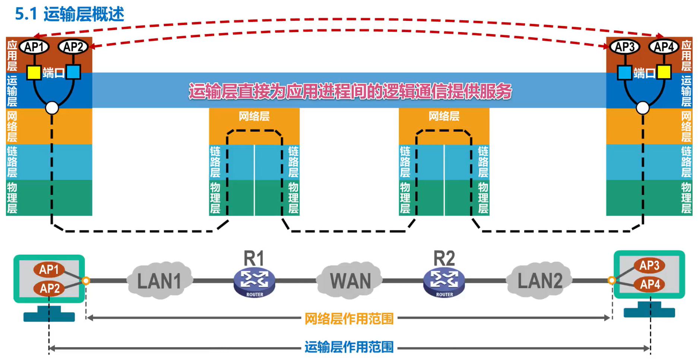
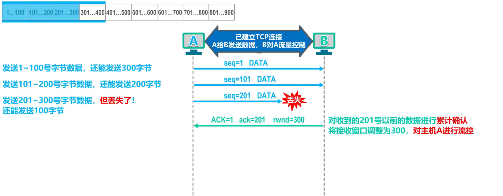
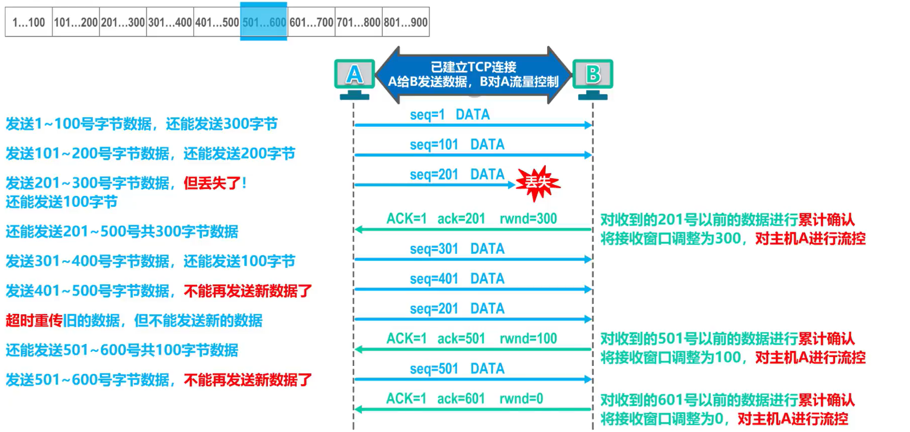
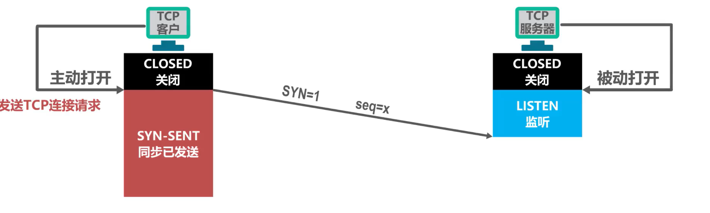
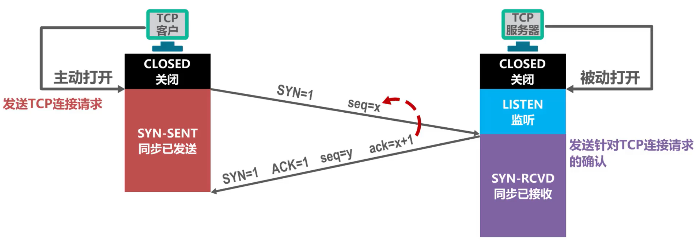
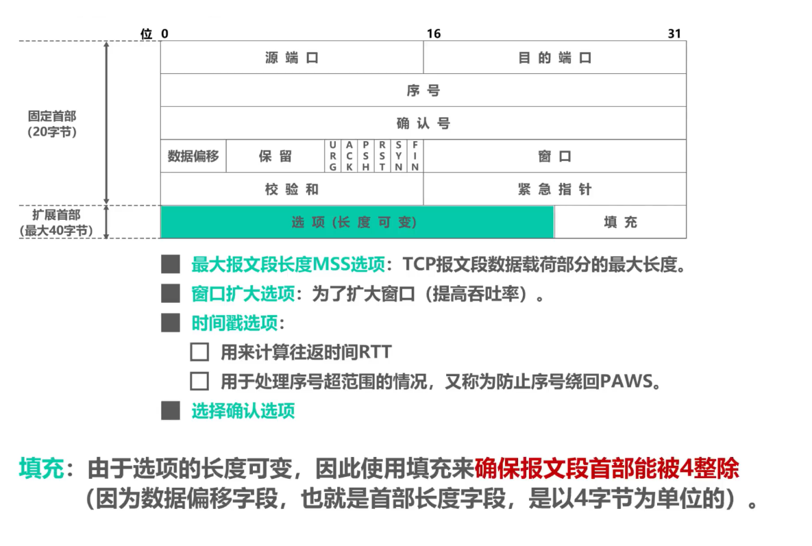

# 计网——运输层复习

> 从通信和信息处理的角度看，运输层向其上面的应用层提供通信服务，**它属于面向通信部分的最高层，同时也是用户功能中的最底层**。
>
> 当网络的边缘部分中的两个主机使用网络的核心部分的功能进行端到端的通信时，只有位于**网络边缘部分的主机的协议栈**才有运输层，而网络核心部分中的路由器在转发分组时都只用到三层（网络层）的功能。

从物理层到网络层，实现了主机到主机的通信。但实际上计网中通信的真正实体是位于通信两端主机中的**进程**。**如何为运行在不同主机上的应用进程提供直接的通信服务是运输层的任务，运输层协议又称为端到端协议**。

> 在运输层使用**不同的端口**，来对应**不同的应用进程**，然后通过网络层及其下层来传输应用层报文。接收方的运输层通过不同的端口，将收到的应用层报文，交付给应用层中相应的进程。这里的端口是指用来区分不同应用进程的标识符。

## 端口号

## 发送方的复用和接收方的分用

> 复用：多个进程利用一个运输层协议发送数据
>
> 分用：多个进程利用一个运输层协议接收数据

## UDP和TCP

- UDP和TCP是TCP/IP体系结构运输层的两个重要协议
- 当运输层采用面向连接的TCP协议时，尽管下面的网络是不可靠的（例如无连接的数据报服务），但这种逻辑通信信道相当于一条**全双工的可靠信道**。TCP传输的数据单元是TCP报文段。
- 但运输层采用无连接的UDP协议时，这种逻辑信道是一条**不可靠信道**。UDP传输的数据单元是UDP报文或用户数据报。

## 用户数据报协议UDP

> UDP支持单播、多播以及广播
>
> UDP对应用进程交下来的报文既不合并也不拆分，而是保留这些报文的边界，即**UDP是面向应用报文的**

UDP向上层提供无连接不可靠传输服务

UDP用户数据报结构如下：

> 是不是很简单？~~但是接下来的TCP会难到吐~~

## 传输控制协议TCP（Transmission Control Protocal）

使用TCP协议的通信双方，在进行数据传输之前，必须使用“三报文握手”建立TCP连接。TCP连接建立成功后，通信双方之间就好像有一条可靠的通信信道，通信双方使用这条基于TCP连接的可靠信道进行通信。

> TCP只支持单播。

> 发送方
>
> - TCP会把应用进程交付下来的数据块看作是一串无结构的字节流，TCP并不知道这些字节流的含义
> - TCP会将字节流进行编号，并存储在自己的缓存中
> - TCP会根据发送策略，提取一定量的字节构建TCP报文并发送
>
> 接收方
>
> - 一方面从所接收到的TCP报文段中，取出数据载荷部分并存储在接收缓存中；另一方面将接收缓存中的一些字节交付给应用进程
> - TCP不保证接收方应用进程所收到的数据块与发送方发送的数据块具有对应大小的关系（例如，发送方应用进程给发送方的TCP共10个数据块，但接收方的TCP可能只用了4个数据块，就把收到的字节流交付给了上层的应用进程，但接收方的字节流必须和发送方的字节流**完全一样**）
> - 接收方的应用进程必须有能力识别收到的字节流，并把它还原成有意义的应用层数据

TCP向上层提供面向连接的可靠传输服务

### TCPの流量控制

> 所谓流量控制，就是让**发送方的发送速率不要太快**，要让接收方来得及接收。

TCP采用**滑动窗口**机制来实现对发送方的流量控制。

> 通过**抄袭**湖科大计网的例子来加深对流量控制的理解

首先，发送方维护一个400字节大小的滑动窗口，并将1-300号字节数据进行发送。但是201-300号字节的数据的TCP报文段丢失了。

此时，接收方对201号之前的数据进行**累计确认**，并将接收窗口大小(rwnd)**调整**为300。（报文段中ACK字段为1，代表报文段有意义）

接收方现在可在发送缓存中将前200字节的数据删除，因为已经收到了对应的累计确认。

201-300号字节的TCP报文段的**超时重传计时器到时**，发送方将其重传。

同时将发送窗口的剩余200个字节的数据进行发送。

接收方返回接收报文，对501号字节之前的数据进行累计确认，并将接收窗口大小调整为100。

发送方可将501号字节之前的数据从发送缓存中删除。

发送方将501-600号字节数据发送，接收方对601号以前的数据进行累计确认，并将接收窗口调整为0，让发送方不要再发了。

接收方现在想将接收窗口调整为300，但是该TCP报文丢失了。如果持续下去，将造成**死锁**。

为了应对接收方死了的情况，发送方会同时维护一个**持续计时器**。只要发送方收到接收方的**零窗口**（rwnd=0）通知，就启动该计时器。若计时器超时，则会向接收方发送一个零窗口探测报文，对方收到该报文后会传回**当前的接收窗口大小**。若依然为0，则重新对持续计时器计时。

> 零窗口探测报文本身也有重传计时器，所以不用担心该报文丢失的情况。

### TCPの拥塞控制

> 在某段时间，若对网络中某一资源（如带宽、交换节点的缓存、处理机等）的需求**超过了该资源所能提供的可用部分**，网络性能就会变差，这种情况叫做**拥塞**。
>
> 若出现拥塞而不进行控制，整个网络的吞吐量将随输入负荷的增大而下降。

拥塞控制的一般原理：

- 拥塞控制的前提：网络能够承受现有的网络负荷
- 实践证明，拥塞控制是很难设计的，因为它是个动态问题
- 分组的丢失是网络拥塞的征兆而不是原因
- 在许多情况下，甚至正是拥塞本身成为引起网络性能恶化、甚至发生死锁的原因

#### 拥塞控制的算法

> 真正的发送窗口值=min（接收方窗口值，拥塞窗口值）

传输轮次：

- 发送方给接收方发送数据报文段后，接收方给发送方发回相应的确认报文段
- 一个传输轮次所经历的时间其实就是往返时间，往返时间并非是恒定的数值
- 使用传输轮次是为了强调把拥塞窗口所允许的报文段都连续发送出去，并收到了对已发送的最后一个报文段的确认

拥塞窗口：

- 它会随网络拥塞程度

#### 慢开始和拥塞避免

##### 慢开始

- 目的：用来确定网络的负载能力和拥塞程度
- 算法思路：由小到大逐渐增大拥塞窗口数值
- 两个变量
  - 拥塞窗口（cwnd）
  - 慢开始门限（ssthresh）

> 每经过一个传输轮次，拥塞窗口就加倍
>
> 窗口大小按指数增加

##### 拥塞避免

- 思路：让拥塞窗口cwnd**缓慢**地增大，避免出现拥塞

- 每经过一个传输轮次，拥塞窗口cwnd++
- cwnd按线性规律缓慢增长

如果在发送过程中出现部分报文段丢失，这会引起发送方对这些报文段的**超时重传**。

> 此时会判断网络出现拥塞，将ssthresh减为当前cwnd值的一半，并将cwnd重新设为1，开始慢开始算法。

> 细节，慢开始cwnd *=2 时需要和ssthresh取min。

#### 快重传和快恢复

> 增加的两个新的拥塞控制算法，改进TCP的性能

##### 快重传

> 就是在超时重传的时限前，找机会提前把丢失的报文重传了，如果重传成功的话，说明网络没有出现拥塞，从而防止cwnd降为1并重启慢开始算法.

##### 快恢复

##### 四个拥塞避免算法总览

## TCP超时重传时间选择

> emmm，好像不考欸，至少王道书上没有

## TCP可靠传输的实现

TCP基于**以字节为单位**的滑动窗口来实现可靠传输。

> 使用三指针来维护窗口状态

虽然发送方的发送窗口是根据接收方的接收窗口设置的，但在同一时刻，发送方的发送窗口并不一定总是和接收方的接收窗口一样大。

- 网络传送窗口值需要一段时间的时间滞后
- 发送方可能还需要根据拥塞情况减小自己的发送窗口尺寸

对于不按序到达的数据的处理，TCP并无明确规定。

TCP要求接收方必须要有累计确认和捎带确认机制，这样可以减少传输开销。接收方可以在合适的时候发送确认，也可以在自己有数据要发送时把确认信息顺便捎带上。

- 接收方不应过分推迟发送确认，否则会造成不必要的超时重传。
- 捎带确认很少使用，因为大多数应用程序很少同时在两个方向上发送数据。

TCP的通信是全双工通信。

## TCP的运输连接管理

### TCPの连接建立

- TCP建立连接的过程叫做握手
- 握手需要在客户和服务器之间交换三个TCP报文段。称之为**三报文握手**。
- 采用三次握手主要是为了防止已失效的连接请求报文段突然又传送到了，继而产生错误。

TCP的连接建立要解决以下三个问题：

- 使TCP双方能够确知对方的存在
- 使TCP双方能够协商一些参数（如最大窗口值、是否使用窗口扩大选项和时间戳选项以及服务质量等）
- 使TCP双方能够对运输实体资源（如缓存大小、连接表中的项目）进行分配

TCP使用三报文握手建立连接。

- TCP连接的建立采用客户服务器方式
- 主动发起连接建立的应用进程叫做TCP客户
- 被动等待连接建立的应用进程叫做TCP服务器

过程

最初两端的TCP进程都处于**关闭**状态。

一开始，TCP服务器进程首先创建**传输控制块**，用来存储TCP连接中的一些重要信息，例如TCP连接表、指向发送和接收缓存的指针、指向重传队列的指针，当前的发送和接受序号等

之后，就准备接受TCP客户端进程的连接请求

此时TCP服务器进程就进入**监听**状态，等待TCP客户端进程的连接请求。

> TCP服务器进程是被动等待来自TCP客户端进程的连接请求，因此称为**被动打开**连接。

TCP客户进程也是首先创建传输控制块。

> 由于TCP连接建立是由TCP客户端主动发起的，因此称为**主动打开**连接。

然后，在打算建立TCP连接时，向TCP服务器进程发送**TCP连接请求报文段**，并进入**同步已发送**状态。

在TCP连接请求报文段的首部中

- 同步位SYN被设置为1，表明这是一个TCP连接请求报文段
- 序号字段seq被设置了一个初始值x，作为TCP客户端进程所选择的初始序号

> 请注意：TCP规定SYN被设置为1的报文段**不能携带数据**，但要**消耗掉一个序号**。

TCP服务器进程收到TCP连接请求报文段后，如果同意建立连接，则向TCP客户进程发送**TCP连接请求确认报文段**，并进入**同步已接收**状态。

TCP连接请求确认报文段的首部中

- 同步位SYN和确认位ACK都设置为1，表明这是一个TCP连接请求确认报文段
- 序号字段seq被设置了一个初始值y，作为TCP服务器进程所选择的初始序号
- 确认号字段ack的值被设置为了x+1，这是对TCP客户进程所选择的初始序号（seq）的确认

> 请注意：这个报文段由于SYN被设置为1，因而也不能携带数据，但也要消耗掉一个序号

TCP客户进程收到TCP连接请求确认报文段后，还需要向TCP服务器进程发送一个**普通**的TCP确认报文段，并进入**连接已建立**状态。

普通的TCP确认报文段首部中

- 确认位ACK被设置为1，表明这是一个普通的TCP确认报文段
- 序号字段seq被设置为x+1，这是因为TCP客户进程发送的第一个TCP报文段的序号为x，所以TCP客户进程发送的第二个报文段的序号为x+1
- 确认号ack被设置为y+1，这是对TCP服务器进程所选择的初始序号的确认

> 请注意：TCP规定普通的TCP确认报文段可以携带数据，但如果不携带数据，则不消耗序号

TCP服务器进程收到该确认报文段后也进入**连接已建立**状态。

现在，TCP双方都进入了连接已建立状态，它们可以基于已建立好的TCP连接，进行可靠的数据传输

TCP连接建议需要第三个报文段：普通确认报文段的目的

为了防止这种情况：客户端进程发出去的第一个连接请求报文段并没有丢失，而因为某些原因，在网络上发生滞留。结果在整个TCP连接建立且释放后，该报文段才到达TCP服务器进程，这会导致TCP服务器进程错误地进入了连接已建立状态，造成资源浪费。

本质上是TCP服务器进程收到一次连接请求报文就建立连接而造成的资源浪费建立，而如果使用三报文握手的话，就要求TCP服务器进程需要收到两个请求报文，这能有效地防止上述情况的发生。

### TCPの连接释放

TCP通过四报文挥手来释放连接。

- TCP连接的释放采用客户服务器方式
- 任何一方都可以在数据传送结束后发出连接释放的通知

首先通信双方处于连接已建立状态

TCP客户进程的应用进程通知其主动关闭TCP连接

TCP客户进程会发送**TCP连接释放报文段**，并进入**终止等待1**状态。

TCP连接释放报文段首部中

- 终止位FIN和确认位ACK的值都被设置为1，表明这是一个TCP连接释放报文段，同时也对之前收到的报文段进行确认
- seq字段的值设置为u，它等于TCP客户进程之前已传送过的数据的最后一个**字节**的序号+1
- ack的值被设置为v，它等于TCP客户进程已收到的数据的最后一个字节的序号+1

> 请注意：TCP规定终止位FIN等于1的报文段即使不携带数据，也要消耗掉一个序号

TCP服务器进程收到TCP连接释放报文段后，会发送一个**普通**的TCP确认报文段并进入**关闭等待**状态。

普通的TCP确认报文段首部中

- ACK被设置为1，表明这是一个普通的TCP确认报文段
- seq被设置为v，它等于TCP服务器进程之前已传送的数据的最后一个字节的序号+1，这也与之前收到的TCP连接释放报文段的ack值匹配
- ack的值被设置为u+1，这是对TCP连接释放报文段的确认

此时TCP服务器进程应该通知高层应用进程，TCP客户进程要断开和自己的连接

此时，从TCP客户进程到TCP服务器进程这个方向的连接就释放了

此时TCP连接属于半关闭状态，这是因为TCP服务器进程可能还有数据要发送，也就是说反方向的连接并未关闭

TCP客户进程收到TCP确认报文段后就进入终止等待2状态，等待TCP服务器进程发出的TCP连接释放报文段

若TCP服务器进程没有数据要发送了，TCP服务器进程就会释放连接，这时TCP服务器进程就会发送**TCP连接释放报文段**并进入**最后确认**状态

该报文段首部中

- 终止位FIN和确认位ACK的值都被设置为1，表明这是一个TCP连接释放报文段
- seq的值为w，这是因为半关闭状态下，服务器进程可能继续发送了一些数据
- ack的值为u+1，这是对之前收到的连接释放报文段的重复确认

TCP客户进程收到TCP连接释放报文段后，必须针对该报文段发送**普通**的TCP确认报文段，之后进入**时间等待**状态。

该报文段首部中

- 确认位ACK的值被设置为1，表明这是一个普通的TCP确认报文段
- seq被设置为u+1，这是因为TCP客户进程之前发送的TCP连接释放报文段虽然不携带数据，但是要消耗掉一个序号
- ack被设置为w+1，这是对所收到的TCP连接释放报文段的确认

TCP服务器进程收到该报文段后就进入**关闭**状态，而TCP客户进程还需要经过2MSL后才能进入关闭状态。

时间等待状态可以确保TCP服务器进程可以收到最后一个TCP确认报文段而进入关闭状态，且在该2MSL时长里，可以使本次连接持续时间内所产生的报文段都从网络中消失，这样在新的TCP连接中，不会出现旧连接的报文段。

### TCP保活计时器

TCP双方已建立连接，然而TCP客户进程所在主机出现了故障

TCP服务器进程以后不能再收到TCP客户端进程发来的数据

因此，需要有措施让服务器不白白等下去

## TCP报文段首部格式

> 源、目的端口

> 序号、确认号、确认标志位ACK

> 数据偏移（首部长度）、保留、窗口和校验和

> 同步标志位SYN、终止标志位FIN、复位标志位RST、推送标志位PSH、紧急标志位URG、紧急指针

> 选项和填充

