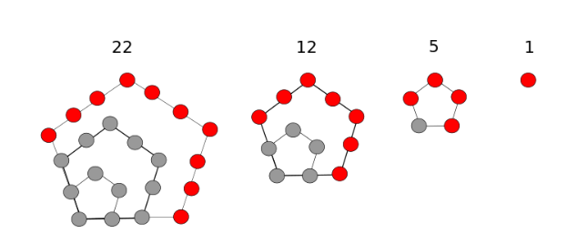

# 一些ACM计数问题——球盒模型等

## 1. 前置知识1

### 1.1 组合数 $C_n^m$

组合数的意义是从 $n$ 个不同的球中取出 $m$ 个球的方案数 （$n \ge m$）。

它的公式是：$C_n^m = \dfrac{n!}{m!(n-m)!}$.

一般很少用它的递推形式：$C_n^m = \begin{cases}C_{n-1}^m + C_{n-1}^{m-1} & (n > m > 0) \\ 1&(n=m \;or \; m=0)\end{cases}$.

### 1.2 隔板法

在一系列的球之间选几个缝隙，插入板，就是隔板问题。

例如 $n$ 个球之间插入 $m$ 块板，可以将其分成 $m+1$ 组球（每组至少有一个球）。

由于 $n$ 个球之间有 $n-1$ 个缝隙，从中选出 $m$ 个缝隙，所对应的方案数是 $C_{n-1}^m$。

### 1.3 生成函数

没学过生成函数的推荐 https://www.bilibili.com/video/BV1E24y1171z?vd_source=a18dbba15826659c13a0c2fac0a3673c

笼统来讲，对于一个有限or无限的数列 $\{a_i\}$，它对应的生成函数为 $\sum_{i} a_ix^i$.

生成函数主要解决以下问题：

> 有 $n$ 种不同的物品，其中第 $i$ 种物品可以取出 $[a_i, b_i]$ 个，问总共取出 $m$ 个物品的方案数。

对于第 $i$ 种物品的生成函数为：$\sum_{k=a_i}^{b_i} x^k$.

我们将 $n$ 个生成函数进行相乘，得到的多项式中项 $x^m$ 所对应的系数就是要求的答案。

具体实现复杂度为 $O(nm^2)$ ，可以使用 FFT 进行进一步优化。（但是我不会FFT

### 1.4 五边形数

五边形数就是如上图所示的点的个数。第 $n$ 个五边形数相比于第 $n-1$ 个五边形数，多出了红色的点，它的个数为 $3n-2$ 。因此有 $f(n)=f(n-1)+3n-2$.

可通过差分前缀和求得通项公式：$f(n)=\dfrac{n(3n-1)}{2}$.

如果将 $n$ 的定义域扩展到负数，则有广义五边形数 $f(-n) = \dfrac{n(3n+1)}{2}.$

关于五边形数，有**五边形数定理**：

> 欧拉函数 $\phi(x) = \prod_{i=1}^{\infty}(1-x^i)=1 + \sum_{i=1}^{\infty} (-1)^i(x^{f(i)} + x^{f(-i)})= \sum_{i=0}^{\infty}(-1)^ix^{\frac{i(3i\pm1)}{2}}.$

这个定理在后续正文讨论中会使用。

## 2. 正文1

球盒模型，是指将 $n$ 个球放到 $m$ 个盒中的方案计数问题。但是根据以下三项不同的要求，有8种变形：

- 球是否相同
- 盒子是否相同
- 盒子是否可以为空

接下来让我们一一进行解决。

### 1. 球相同，盒子不同，盒子不可以为空

等价于将球分为 $m$ 组。根据前置知识的隔板法，相当于在 $n-1$ 个缝隙中插入 $m-1$ 个板，对应的方案数为 $C_{n-1}^{m-1}.$

### 2. 球相同，盒子不同，盒子可以为空

上个问题对于盒子的要求是：至少有一个球。

而本问题对于盒子的要求是：至少有零个球。

我们可以考虑将总球数增加 $m$，然后进行上个问题的求解。

这样所对应的问题是： $n+m$ 个相同球与 $m$ 个不同的盒子，每个盒子至少有一个球。

然后我们可以把每个盒子中的每个球都删去一个，这样每个盒子都至少有零个球。此时总球数减少了 $m$，为 $n$ 个。

因此问题转化为：$n$ 个相同球与 $m$ 个不同的盒子，每个盒子至少有零个球。

可以发现和本问题是一模一样的。答案为 $C_{n+m-1}^{m-1}.$

### 3. 球相同，盒子相同，盒子可以为空

可以使用动态规划解决，个人感觉这个dp的转移算是比较难想的啦。

令 $f_{i,j}$ 表示将 $i$ 个球分到 $j$ 个盒子里的方案数。

关于状态转移，可以分为以下两中情况：

1、$j$ 个盒子内，至少有一个盒子为空。由于盒子相同，所以我们可以将这个盒子去掉，方案数为 $f_{i, j-1}$；

2、$j$ 个盒子内，每个盒子都至少有一个球。这种情况等价于把所有盒子内部去掉一个球的情况，方案数为 $f_{i-j, j}$。

因此可得转移方程：$f_{i,j} = f_{i, j-1} + f_{i-j, j}$.

显然复杂度是 $O(nm)$ 的。

事实上，这个问题的特殊情况等价于**整数划分问题**，这里我们讨论一下：

> 一个整数 $n$ 可以用多少种方式划分为其他整数的和？例如 $n=5$：
>
> 5=1+1+1+1+1
>
> 5=1+1+1+2
>
> 5=1+2+2
>
> 5=1+1+3
>
> 5=2+3
>
> 5=1+4
>
> 5=5

这里我们把每个整数都看作一个物品，盒子有 $n$ 个。朴素dp做法复杂度为 $O(n^2)$。

我们这样考虑，一个整数 $a$ 能够表示 $a, 2a, \cdots$，其对应的生成函数为：$f(a)=1+x^a+x^{2a}+\cdots=\dfrac{1}{1-x^a}$.

我们要求的，是将所有的生成函数进行累乘后得到的多项式中 $x^n$ 所对应的系数 $a_n$：$g(x)=\prod_{k=1}^{\infty}\dfrac{1}{1-x^k}=\sum_{i=0}^\infty a_ix^i$.

在前置知识中，我们提到欧拉函数 $\phi(x) = \prod_{i=1}^{\infty}(1-x^i)=\sum_{i=0}^{\infty}(-1)^ix^{\frac{i(3i\pm1)}{2}}.$

因此，$g(x)\phi(x)=1$，即 $\sum_{i=0}^\infty a_ix^i \sum_{j=0}^{\infty}(-1)^jx^{\frac{j(3j\pm1)}{2}}=1$.

将这个庞大的式子转化成多项式，根据多项式乘法，项 $x^k$ 所对应的系数为：$\sum_i (-1)^ia_{k-\frac{i(3i\pm 1)}{2}} = \sum_{i>0} (-1)^ia_{k-\frac{i(3i- 1)}{2}} + \sum_{i>0} (-1)^ia_{k-\frac{i(3i+ 1)}{2}} + a_k$.

这里的 $i$ 要满足 $k \ge \frac{i(3i\pm 1)}{2}$.

然而，除了常数项为 $1$，其余带 $x$ 项的系数都应该为 $0$。

因此令上式子为 $0$，得到 $a_k=\sum_{i>0} (-1)^{i+1}a_{k-\frac{i(3i- 1)}{2}} + \sum_{i>0} (-1)^{i+1}a_{k-\frac{i(3i+ 1)}{2}}=a_{k-1}+a_{k-2}-a_{k-5}-a_{k-7} + \cdots$.

可以发现这是一个递推的形式。由于广义五边形数的量级为 $O(n^2)$，因此这里递推一次的复杂度为 $O(\sqrt n)$，总复杂度为 $O(n \sqrt n)$.

### 4. 球相同，盒子相同，盒子不可以为空

和第一二种情况类似，该问题对盒子的要求是：至少一个球

而上个问题的要求是：至少零个球

因此我们把每个盒子都减去一个球，事实上求的就是上述dp解法的 $f_{n, n-m}$.

当然，我们可以对这道题单独定义一个dp状态 $f_{n, m}$。

然后根据上问题的转移，我们将状态分为“至少有一个盒子只有一个球”和“所有盒子都至少有大于一个球”的情况，得到转移式子：

$f_{i,j} = f_{i-1,j-1} + f_{i-j, j}$.

原题链接：https://www.luogu.com.cn/problem/P1025

------

到目前为止，我们将所有**球相同**的情况都逐一进行了解读。事实上，正是球相同的这个性质，让我们可以在两种盒子是否为空的情况（如情况一二和情况三四）之间直接通过加球、删球来进行转换。

对于球不同的情况，我们还需要一点前置知识。

## 3. 前置知识2

### 3.1 第二类斯特林数

第二类斯特林数的定义和球盒模型相似：把 $n$ 个不同的数划分为 $m$ 个集合的方案数，要求不能有空集。

设第二类斯特林数为 $S_{n, m}$。对于 $S_{i,j}$，可以通过以下两种情况来递推：

1、前 $i-1$ 个数划分为 $j-1$ 个集合，剩下第 $i$ 个数单独为一个集合，方案数为 $f_{i-1, j-1}$；

2、前 $i-1$ 个数划分为 $j$ 个集合，剩下第 $i$ 个数放到这 $j$ 个集合之中，方案数为 $jf_{i-1, j}$。

因此递推式为 $f_{i,j} = f_{i-1, j-1} + jf_{i-1, j}$。

递推是 $O(nm)$ 的。然而，关于第二类斯特林数，有单独的公式：$S_{n,m} = \frac{1}{m!}\sum_{k=0}^m(-1)^kC_m^k(m-k)^n$.

时间复杂度瓶颈为快速幂的复杂度 $O(m \log n)$。

> 说来惭愧，作为一名ICPC银牌选手，我却从来没有了解过斯特林数。我记得不知道哪里的比赛考的裸的第二类斯特林数，当时我对着这个自己推出来的 $O(nm)$ 的递推式想了半天怎么优化，想了一个小时想不出来，只能眼睁睁看着一堆人把这题过了，然后怀疑人生。赛后才知道有斯特林数这个东西。

## 4. 正文1

### 5. 球不同，盒子相同，盒子不可以为空

这个问题与第二类斯特林数一致。直接根据公式求即可。

### 6. 球不同，盒子相同，盒子可以为空

一种显然的想法：枚举不空盒子的个数，将对应的答案累加即可。

答案为 $\sum_{i=1}^m S_{n, i}$。

特殊地，若 $n=m$ ，那么问题等价于将大小为 $n$ 的**集合**进行划分的所有方案数。

### 7. 球不同，盒子不同，盒子可以为空

这个问题就非常简单了。对于每一个数，你都可以有 $m$ 个盒子选择，答案显然为 $m^n$。

### 8. 球不同，盒子不同，盒子不可以为空

由于球不同，所以没办法通过将每个盒子进行减球来将问题转化为上一个情况。

考虑和第二类斯特林数（第五个情况）之间的差异，可以发现控制变量为：盒子不同了。

也就是说每个盒子都有了标号。所以很简单，我们只需要将第二类斯特林数乘上全排列个数 $m!$ 就可以了，答案为 $\sum_{k=0}^m(-1)^kC_m^k(m-k)^n$。