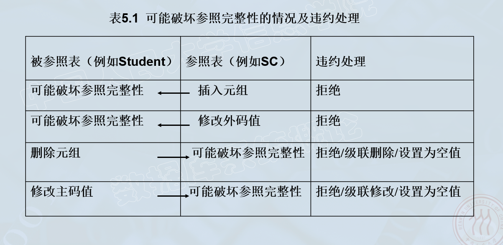
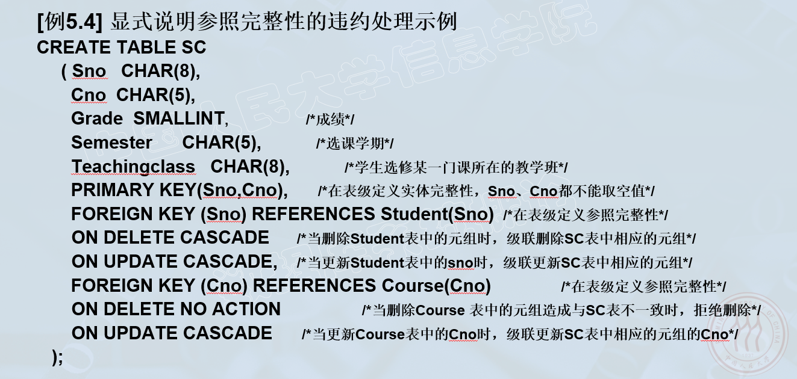
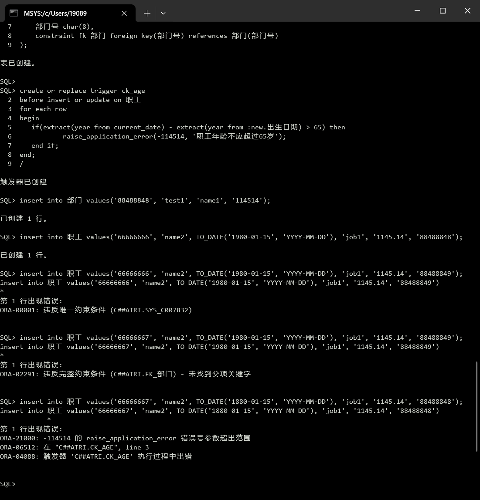

# 数据库完整性

## 实体完整性

create table中用primary key定义

例：创建学生表Student，将Sno属性定义为主码：

```sql
create table student(
	sno char(8),
	sname char(20) unique,
	ssex char(6),
	sbirthdate date,
	smajor varchar(40),
	primary key(sno)
);
```

插入或对主码列进行更新操作时，关系数据库管理系统按照实体完整性规则自动进行检查。

- 检查主码值是否唯一
- 检查主码的各个属性是否为空

> 这种检查操作需要 $O(n)$ 遍历每一条记录，十分耗时。因此关系数据库管理系统一般都在主码上自动建立一个索引。例如B+树索引。

## 参照完整性

在create table中用foreign key短语定义哪些列为外码。

用references短语指明这些外码参照哪些表的主码。

例：关系SC中（Sno, Cno）是主码，Sno、Cno分别参照Student表的主码和Course表的主码。

```sql
create table sc(
	sno char(8),
	cno char(5),
	grade smallint,
	semester char(5),
	teachingclass char(8),
	primary key (sno, cno),
	foreign key (sno) references student(sno),
	foreign key (cno) references course(cno)
);
```

一个参照完整性将两个表中的相应元组联系起来。对被参照表和参照表进行增删改查操作时可能会破坏参照完整性，必须进行检查。

例：

- 向SC表中增加一个元组，该元组的Sno属性值在表Student中找不到一个元组，其Sno属性值与之相等。
- 修改SC表中的一个元组，情况如上
- 从Student表中删除一个元组，造成SC表中某些元组的Sno属性值在Student中找不到一个元组对应
- 修改Student表中的一个元组，情况如上



参照完整性违约处理：

- 拒绝执行：一般为默认策略
- 级联操作：当删除或修改被参照表的一个元组导致与参照表的不一致，则删除或修改参照表中的所有导致不一致的元组
- 设置为空值：当删除或修改被参照表的一个元组导致不一致，则将参照表中所有造成不一致的元组的对应属性设置为空值



## 用户定义的完整性

> 针对某一具体应用的数据必须满足的语义要求。

### 属性上的约束

create table中定义属性约束

- 列值非空 (not null)
- 列值唯一 (unique)
- 检查列值是否满足一个条件表达式 (check短语)

### 元组上的约束

在create table语句中可以用check短语定义元组间不同属性需满足的限制

## 完整性约束命名子句

> constraint <完整性约束名> <完整性约束>

### 修改表中的完整性限制

> 使用alter table语句

例：

```sql
alter table student
add constraint c1 check(sno between '114514' and '1919810');
```

## 触发器

> 挖坑

------

# 作业

假设有下面两个关系模式

> 职工（职工号，姓名，出生日期，职务，工资，部门号），其中职工号为主码
>
> 部门（部门号，名称，经理姓名，电话），其中部门号为主码

用SQL定义这两个关系模式，要去在模式中完成以下完整性约束的定义：

1. 定义每个模式的主码
2. 定义参照完整性约束
3. 定义职工年龄不超过65岁

> oracle不支持constraint带有变量，这里需要使用触发器

```sql
drop table 职工;
drop table 部门;

create table 部门(
    部门号 char(8) primary key,
    名称 varchar(20),
    经理姓名 varchar(20),
    电话 varchar(20)
);

create table 职工(
    职工号 char(8) primary key,
    姓名 varchar(20),
    出生日期 date not null,
    职务 varchar(20),
    工资 decimal(10, 2),
    部门号 char(8),
    constraint fk_部门 foreign key(部门号) references 部门(部门号)
);

create or replace trigger ck_age
before insert or update on 职工
for each row
begin
	if(extract(year from current_date) - extract(year from :new.出生日期) > 65) then
		raise_application_error(-114514, '职工年龄不应超过65岁');
	end if;
end;
/
```

测试：

```sql
insert into 部门 values('88488848', 'test1', 'name1', '114514');
insert into 职工 values('66666666', 'name2', TO_DATE('1980-01-15', 'YYYY-MM-DD'), 'job1', '1145.14', '88488848');
insert into 职工 values('66666666', 'name2', TO_DATE('1980-01-15', 'YYYY-MM-DD'), 'job1', '1145.14', '88488849');
insert into 职工 values('66666667', 'name2', TO_DATE('1980-01-15', 'YYYY-MM-DD'), 'job1', '1145.14', '88488849');
insert into 职工 values('66666667', 'name2', TO_DATE('1880-01-15', 'YYYY-MM-DD'), 'job1', '1145.14', '88488848');
```

前两行正确，后三行应出现错误：


