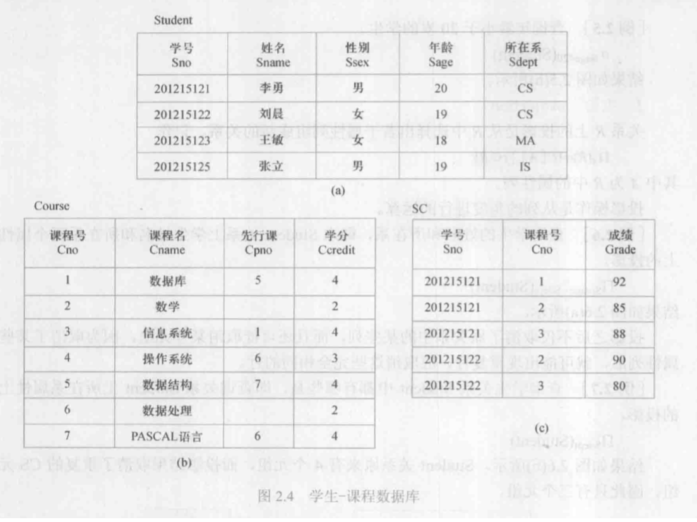

> 来自《数据库系统概论（第6版）》第二章

## 关系代数

> 假设关系 $R$ 和 $S$ 具有相同的目 $n$ ，且相应的属性取自同一个域，$t$ 是元组变量。

- 并

关系 $R$ 和 $S$ 的并记作
$$
R \cup S = \{t|t\in R \lor t \in S\}.
$$
其结果仍是 $n$ 目关系，由属于 $R$ 或 $S$ 的元组组成。

- 差

关系 $R$ 和 $S$ 的差记作
$$
R-S=\{t|t\in R \land t \notin S\}.
$$
其结果仍是 $n$ 目关系，由属于 $R$ 而不属于 $S$ 的元组组成。

- 交

关系 $R$ 和 $S$ 的交记作
$$
R\cap S=\{t|t\in R \land t \in S\}.
$$
它不是基本运算，因为可以转化：$R \cap S = R - (R-S)$。画个van图就知道怎么回事。

- （广义）笛卡尔积

> 加上"广义"的原因是这里笛卡尔积的元素是元组。

两个分别为 $n$ 目和 $m$ 目的关系 $R$ 和关系 $S$ 的笛卡尔积是一个 $n+m$ 列元组的集合：
$$
R \times S = \{\overset{\large\frown}{t_rt_s}|t_r\in R \land t_s \in S\}.
$$
这玩意就是个排列组合。

- 选择

在关系 $R$ 中选择满足给定条件的诸元组（**选行**）：
$$
\sigma_F(R)=\{t|t\in R \land F(t)=\mathrm{true}\}.
$$

- 投影

关系 $R$ 上的投影是从 $R$ 中选择若干属性列组成新的关系（**选列**）：
$$
\Pi_A(R)=\{t[A]| t\in R\}.
$$

- 连接

从**两个关系的笛卡儿积**中选取其**属性间满足一定条件**的元组：
$$
R \underset{A {\theta} B}{\Join} S = \{\overset{\large\frown}{t_rt_s}|t_r\in R \land t_s \in S\ \land t_r[A]\;\theta\; t_s[B]\}
$$
等值连接：从关系 $R$ 和 $S$ 中选取广义笛卡儿积中A、B属性值相等的那些元组。

**自然连接**：特殊的等值连接，要求两个关系中进行比较的分量必须是**同名的属性列**，且在结果中**将重复的属性列去掉**。直接用 $\Join$ 表示。

- 除

设关系 $R$ 除以关系 $S$ 的结果为关系 $T$ ，则 $T$ 包含所有在 $R$ 但不在 $S$ 中的属性及其值，且 $T$ 的元组与 $S$ 的元组的所有组合都在 $R$ 中。
$$
R ÷ S=\{t_r[X]| t_r\in R \land \Pi_Y(S)\subseteq Y_X\}.
$$
其中 $Y_X$ 为 $x$ 在 $R$ 中的象集。

> 象集：给定一个关系 $R(X,Z)$。当 $t[X]=x$ 时，$x$ 在 $R$ 中的象集为：$Z_x=\{t[Z]|t\in R, t[X]=x\}.$
>
> 可以理解为对于一个给定的取值 $x$，其对应的在关系 $R$ 中 $z$ 的取值的集合。
>
> 然后除运算就是指所有满足其在关系 $R$ 中 $z$ 的取值的集合能够包含关系 $S$ 中所有 $z$ 取值集合所对应的关系 $R$ 中的 $x$。

### 一些例题

试用关系代数完成如下查询：

查询李勇同学选修的课程中考试及格的课程名。
$$
\Pi_{\mathrm{Cname}}(\sigma_{\mathrm{Sname}='李勇'}(\mathrm{Student})\Join \sigma_{\mathrm{Grade}\ge60}(\mathrm{SC})\Join \mathrm{Course}).
$$
查询既选修了2号课程又选修了3号课程的学生的学号和姓名。
$$
\Pi_{\mathrm{Sno, Sname}}(\mathrm{Student}\Join \mathrm{SC} ÷ \sigma_{\mathrm{Cno='2' \lor \mathrm{Cno}='3'}}(\mathrm{Course})).
$$
查询只选修了1门课程的学生的学号和姓名。
$$
\Pi_{\mathrm{Sno,Sname}}((\Pi_{\mathrm{Sno}}(\mathrm{SC})-\Pi_{\mathrm{Sno}}(\sigma_{[1]=[4]\land[2]\neq[5]}(\mathrm{SC\times SC})))\Join \mathrm{Student}).
$$

## 关系演算

### 元组关系演算语言ALPHA

- 检索操作

> 最难的操作

语句格式：GET 工作空间名【（定额）】 （表达式1）【：操作条件】【DOWN/UP 表达式2】

> 根本看不懂，这里举几个例子
>
> 还是这三张表

（1）简单检索

查询所有被选修的课程的课程号：
$$
\mathrm{GET \;W(SC.Cno)}
$$
查询所有学生的数据：
$$
\mathrm{GET\;W(Student)}
$$
（2）限定的检索（带条件）

查询信息系（IS）中年龄小于20岁的学生的学号和年龄：
$$
\begin{split}
&\mathrm{GET\;W(Student.Sno, Student.Sage)}:\\
&\mathrm{Student.Sdept='IS'\land Student.Sage<20}
\end{split}
$$
（3）带排序的检索

查询计算机科学系（CS）学生的学号、年龄，结果按年龄降序排序：
$$
\begin{split}
&\mathrm{GET\;W(Student.Sno, Student.Sage)}:\\
&\mathrm{Student.Sdept='CS'\;DOWN\; Student.Sage}
\end{split}
$$
（4）带定额的检索

取出一个信息系学生的学号：
$$
\begin{split}
&\mathrm{GET\; W(1)(Student.Sno)}:\\
&\mathrm{Student.Sdept='IS'}
\end{split}
$$
查询信息系年龄最大的三个学生的学号及其年龄，结果按年龄降序排序：
$$
\begin{split}&\mathrm{GET\;W(3)(Student.Sno, Student.Sage)}:\\
&\mathrm{Student.Sdept='IS'\;DOWN\;Student.Sage}\end{split}
$$
**（5）用元组变量的检索**

> 元组变量：表示可以在某一关系范围内变化
>
> 用途：1、简化关系名；2、**操作条件**中使用**量词**($\forall, \exists$)时必须用元组变量。
>
> 定义元组变量：$\mathrm{RANGE\;}$关系名 变量名
>
> 一个关系可以设多个元组变量

（6）用存在量词的检索

查询选修2号课程的学生名字。
$$
\begin{split}
&\mathrm{RANGE\;SC\;X}\\
&\mathrm{GET\;W(Student.Sname)}:\\
&\mathrm{\exists X(X.Sno=Student.Sno\land X.Cno=2)}
\end{split}
$$
查询选修了这样课程的学生学号，其直接先行课是6号课程。
$$
\begin{split}
&\mathrm{RANGE\;Course\;CX}\\
&\mathrm{GET\;W(SC.Sno)}:\\
&\mathrm{\exists CX(CX.Cno=SC.Cno\land CX.Cpno='6')}
\end{split}
$$
查询至少选修一门其先行课为6号课程的学生名字。
$$
\begin{split}
&\mathrm{RANGE\;Course\;CX}\\
&\mathrm{\;\;\;\;\;\;\;\;\;\;\;\;\;\;\;SC\;SCX}\\
&\mathrm{GET\;W(Student.Sname)}:\\
&\mathrm{\exists SCX\exists CX(SCX.Sno=Student.Sno\land CX.Cno=SCX.Cno\land CX.Cpno='6')}
\end{split}
$$
（前束范式形式）

（7）带有多个关系的表达式的检索

查询成绩为90分以上的学生名字与课程名字。
$$
\begin{split}
&\mathrm{RANGE\;SC\;SCX}\\
&\mathrm{GET\;W(Student.Sname,Course.Cname)}:\\
&\mathrm{\exists SCX(SCX.Grade \ge 90 \land SCX.Sno=Student.Sno \land SCX.Cno=Course.Cno)}
\end{split}
$$
（8）用全称量词的检索

查询不选1号课程的学生名字。
$$
\begin{split}
&\mathrm{RANGE\;SC\;SCX}\\
&\mathrm{GET\;W(Student.Sname)}:\\
&\mathrm{\forall SCX(SCX.Sno\neq Student.Sno\lor SCX.Sno \neq '1')}
\end{split}
$$

> 是不是有点抽象，其实一般人应该会这么写：

$$
\begin{split}
&\mathrm{RANGE\;SC\;SCX}\\
&\mathrm{GET\;W(Student.Sname)}:\\
&\mathrm{\neg\exists SCX(SCX.Sno= Student.Sno\land SCX.Sno = '1')}
\end{split}
$$

可以从下式转换为上式（存在量词转化为全称量词）。但是可以理解上式的含义：选定Student表的一行，对于表SC中的每一个条目，要么学号不为Student表所对应的学号，要么等于对应的学号，但是都满足课程号不为1.

（9）用两种量词的检索

查询选修了全部课程的学生姓名。
$$
\begin{split}
&\mathrm{RANGE\;Course\;CX}\\
&\mathrm{\;\;\;\;\;\;\;\;\;\;\;\;\;\;\;SC\;SCX}\\
&\mathrm{GET\;W(Student.Sname)}:\\
&\mathrm{\forall CX\exists SCX(SCX.Sno=Student.Sno\land SCX.Cno=CX.Cno)}
\end{split}
$$

> 有点抽象，这里我理一下。
>
> 首先，我们固定表Student的一个元组，然后对该元组进行判断：
>
> 1、对于表Course的所有项，都存在表SC的一项，满足二者的Cno相同
>
> 2、然后对于存在的表SC的这一项，都需要满足它和表Student所固定元组的Sno相同
>
> 所有题目的思路都应该是这样的：固定GET W里的变量，然后判断条件是否为真

（10）用蕴含的检索

查询最少选修了201215122学生所选课程的学生学号。
$$
\begin{split}
&\mathrm{RANGE\;Course\;CX}\\
&\mathrm{\;\;\;\;\;\;\;\;\;\;\;\;\;\;\;SC\;SCX}\\
&\mathrm{\;\;\;\;\;\;\;\;\;\;\;\;\;\;\;SC\;SCY}\\
&\mathrm{GET\;W(Student.Sname)}:\\
&\mathrm{\forall CX(\exists SCX(SCX.Sno='201215122'\land SCX.Cno=CX.Cno) \Rightarrow}\\
&\mathrm{\exists SCY(SCY.Sno=Student.Sno \land SCY.Cno=CX.Cno))}
\end{split}
$$

> 求解思路是这样的：首先固定Student.Sname
>
> 然后对Course的每一门课程，看它是否被201215122选，如果选了的话，再判断是否也被Student对应学生选。这是一个蕴含关系。

（11）聚集函数

| 函数名 | 功能       |
| ------ | ---------- |
| COUNT  | 对元组计数 |
| TOTAL  | 求总和     |
| MAX    | 求最大值   |
| MIN    | 求最小值   |
| AVG    | 求平均值   |

查询学生所在系的数目：
$$
\mathrm{GET\;W(COUNT(Student.Sdept))}
$$
查询信息系学生的平均年龄：
$$
\mathrm{GET\;W(AVG(Student.Sage)):Student.Sdept='IS'}
$$

### 一些例题

呃呃呃，还是这三个表：

试用元组关系演算语言ALPHA完成如下查询：

查询李勇同学选修的课程中考试及格的课程名。
$$
\begin{split}
&\mathrm{RANGE\;Student\;X}\\
&\mathrm{\;\;\;\;\;\;\;\;\;\;\;\;\;\;\;SC\;SCX}\\
&\mathrm{GET\;W(Course.Cname)}:\\
&\mathrm{\exists X \exists SCX(X.Sname='李勇'\land X.Sno=SC.Sno \land SC.Cno=Course.Cno\land SCX.Grade \ge 60)}
\end{split}
$$
查询既选修了2号课程又选修了3号课程的学生的学号和姓名。
$$
\begin{split}
&\mathrm{RANGE\;SC\;SCX}\\
&\mathrm{\;\;\;\;\;\;\;\;\;\;\;\;\;\;\;SC\;SCY}\\
&\mathrm{GET\;W(Student.Sno,Student.Sname)}:\\
&\mathrm{\exists SCX\exists SCY(SCX.Cno='2'\land SCX.Sno=Student.Sno \land SCY.Cno='3'\land SCY.Sno=Student.Sno)}
\end{split}
$$
查询所有选修课程均不及格的学生的学号和姓名。
$$
\begin{split}
&\mathrm{RANGE\;SC\;SCX}\\
&\mathrm{\;\;\;\;\;\;\;\;\;\;\;\;\;\;\;SC\;SCY}\\
&\mathrm{GET\;W(Student.Sno,Student.Sname)}:\\
&\mathrm{\forall SCX((SCX.Sno=Student.Sno)\Rightarrow (SCX.Grade<60))} \land \exists \mathrm{SCY(SCY.Sno=Student.Sno)}
\end{split}
$$

> 这里要把一门课都没选的学生给排除掉

- 修改操作

修改操作用UPDATE语句实现，其步骤是：

1. 用HOLD语句将要修改的元组从数据库读到工作空间中
2. 用宿主语言修改工作空间中元组的属性值
3. 用UPDATE语句将修改后的元组送回数据库

把201215121学生从计算机科学系转到信息系。
$$
\begin{split}
&\mathrm{HOLD\;W(Student.Sno, Student.Sdept)}:\\
&\mathrm{Stedent.Sno='201215121'}
\\
\\
&\mathrm{MOVE\;'IS'\;TO\;W.Sdept}\\
\\
&\mathrm{UPDATE\;W}
\end{split}
$$

- 插入操作

插入操作用PUT语句实现，其步骤是：

1. 用宿主语言在工作区间中建立新元组
2. 用PUT语句把该元组插入指定的关系

学校新开设了一门2学分的课程“计算机组织与结构”，其课程号为8，直接先行课为6号课程。插入该课程元组
$$
\begin{split}
&\mathrm{MOVE\;'8'\;TO\;W.Cno}\\
&\mathrm{MOVE\;'计算机组织与结构'\;TO\;W.Cname}\\
&\mathrm{MOVE\;'6'\;TO\;W.Cpno}\\
&\mathrm{MOVE\;'2'\;TO\;W.Ccredit}\\
&\mathrm{PUT\;W(Course)}
\end{split}
$$

- 删除操作

删除操作用DELETE语句实现，其步骤是：

1. 用HOLD语句把要删除的元组从数据库读到工作空间中
2. 用DELETE语句删除该元组

201215125学生因故退学，删除该学生元组
$$
\begin{split}
&\mathrm{HOLD\;W(Student):Student.Sno='201215125'}\\
&\mathrm{DELETE\;W}
\end{split}
$$

------

> 补充一些关于关系数据库的小知识点

关系模型中三类完整性约束：

- 实体完整性
- 参照完整性
- 用户定义的完整性

实体完整性：若属性A是基本关系R的主属性，则属性A**不能取空值**。

> 一个基本表通常对应现实世界的**一个实体集**或**多对多联系**。现实世界的实体和实体间的联系都是可区分的，即它们具有某种唯一的标识，而在关系模型中，这种唯一的标识即主码，它需要保证非空，来确保所对应的实体是完整的，独一无二的。

**外码**：设F是基本关系R的一个或一组属性，但不是关系R的码。$K_s$是基本关系S的主码。如果F与基本关系S的主码 $K_s$ 对应，则称F是基本关系R的外码。并称基本关系R为参照关系，S为被参照关系。（R与S可能是同一个关系）

参照完整性：若属性F是基本关系R的外码，它与基本关系S的主码 $K_s$ 对应，则对于R中的每个元组在F上的取值必须为：

- 空
- S中某个元组的主码值

用户定义的完整性：略

> 下课了喵
