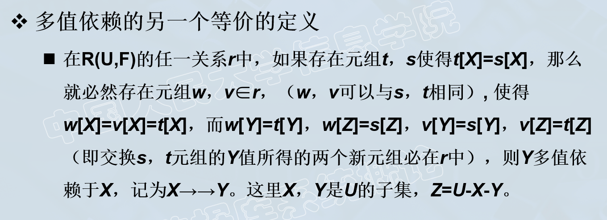
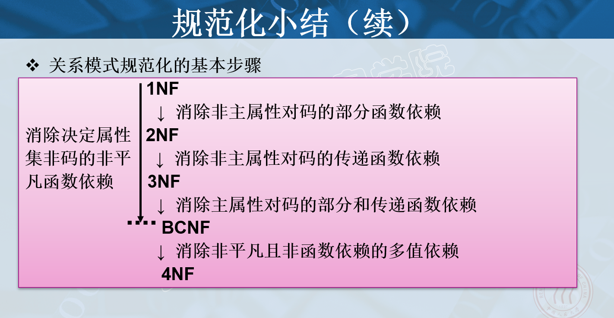

> 摘自《数据库系统概论》第六章

# 关系数据理论

## 1. 问题

针对一个具体问题，如何构造一个适合它的数据模式

即应该构造几个关系，每个关系由哪些属性组成等。

不好的关系模式：

- 数据冗余度太大，浪费存储空间
- 更新异常
- 插入异常
- 删除异常

### 数据依赖

属性值间的相互关联。**是数据内在的性质，是语义的体现**     

主要介绍函数依赖。

不合适的数据依赖，容易造成上述的4个问题。

## 2. 规范化

### 2.1 函数依赖

给定关系模式R(U, F)（本章忽略D域，DOM属性到域的映射），X和Y是U的子集。若对于R(U, F)的任意一个可能的关系r，r中不可能存在两个元组在X上的属性值相等，而在Y上的属性值不等，则称“X函数确定Y”或“Y函数依赖于X”，记作 $X \rightarrow Y$。

X称为这个函数依赖的决定属性组，也称为**决定因素**。

函数依赖是语义范畴的概念，只能根据数据的语义来确定函数依赖。例如“姓名->年龄”这个函数依赖只有在学生不重名的情况下成立。数据库设计者可以对现实世界作强制的规定。

函数依赖是指关系模式R在任何时刻的关系实例均要满足的约束条件。

**非平凡函数依赖**：$X \rightarrow Y,Y \not\subseteq X$

> 只讨论非平凡函数依赖。平凡函数依赖没有意义。

**完全函数依赖**：若 $X \rightarrow Y$，但对于X的任何一个真子集X‘，都有 $X^{'} \not \rightarrow Y$，则称Y对X完全函数依赖，记作 $X \overset{F}{\rightarrow} Y$。否则称为**部分函数依赖**，记作 $X \overset{P}{\rightarrow} Y$

**传递函数依赖**：在R(U, F)中，如果 $X \rightarrow Y(Y\not\subseteq X), Y \not\rightarrow X, Y\rightarrow Z, Z\not\subseteq Y$，则称Z对X传递函数依赖。记作 $X\overset{T}{\rightarrow} Y$。

> 注意这里不能存在 $X \leftarrow \rightarrow Y$，否则X与Y是等价的，Z直接依赖于X。

### 2.2 码

设K为关系模式R(U, F)中的属性或属性组合。若 $K \overset{F}{\rightarrow} U$，则称K为R的一个**候选码**。

> 若$K \overset{P}{\rightarrow} U$，则K称为超码。

若关系模式R有多个候选码，则选定其中的一个作为**主码**。

**主属性**：包含在**任何一个**候选码的属性。

**全码**：整个属性组U是码。

**外码**：关系模式R的属性（组）X并非R的码，但X是**另一个关系模式**的码，则称X是R的外码。

> 主码与外码一起提供了表示关系间**联系**的手段。

### 2.3 范式 （不允许表中有表）

关系数据库的关系必须满足一定的要求。满足不同程度要求的为不同**范式**。

一个低一级范式的关系模式，通过**模式分解**，可以转换为若干个高一级范式的关系**集合**。这种过程叫做**规范化**。

**1NF**：

如果一个关系模式R的所有属性都是不可分的数据项，则 $R \in 1NF$。

> 不允许表中有表。

### 2.4 2NF （非主属性不允许部分依赖）

若 $R \in 1NF$，且每一个**非**主属性**完全**函数依赖于任何一个候选码，则 $R \in 2NF$。

> 采用投影分解法可将一个1NF关系分解为多个2NF关系，可一定程度上减轻原1NF关系存在的插入异常、删除异常、数据冗余度大、修改复杂等问题。但并不能完全消除。
>
> 不是很懂这里非主属性的意义所在。

### 2.5 3NF （非主属性不允许传递依赖）

设关系模式 $R(U,F)\in 1NF$，若R中不存在这样的**码**X、属性组Y及**非主属性**Z $(Z \not\subseteq Y)$，使得 $X \rightarrow Y,Y\rightarrow Z$成立，$Y \not\rightarrow X$，则称 $R(U,F) \in 3NF$。

> 不是很懂这里Z是非主属性的意义所在。
>
> 不允许传递依赖，自然就不允许部分依赖。

### 2.6 BCNF（不依赖于非码）

设关系模式 $R(U,F)\in 1NF$，若 $X \rightarrow Y$ 且 $Y \not\subseteq X$ 时X必含有码，则 $R(U,F) \in BCNF$。 

> BC范式首先解决了3NF中主属性存在的部分依赖问题，例如3NF中可能某候选码中的一个子集可以—>另一个主属性，但是BCNF要求必须是码或码的超集才可以->。其次解决了3NF中主属性存在的传递依赖问题，这个也是类似的情况。

### 2.7 多值依赖

给定关系模式R(U,F)，X,Y,Z是U的子集，且Z=U-X-Y。关系模式R中多值依赖 $X\rightarrow \rightarrow Y$成立当且仅当对R的任意关系r给定的一对(x,z)值，有一组Y的值，这组值仅仅决定于x值而与z值无关。

> 等价定义

非平凡多值依赖：X->->Y，且Z不为空。若Z为空则为平凡多值依赖。

多值依赖的性质：

- 对称性：若X->->Y，则X->->Z。（可以画个二分图？？？）
- 传递性：若XYZ=U，X->->Y，Y->->Z，则X->->Z-Y
- 函数依赖是多值依赖的特殊情况
- 懒得写了

### 2.8 4NF

关系模式 $R(U,F) \in 1NF$，如果对于R的每个非平凡多值依赖 $X\rightarrow \rightarrow Y(Y \not \subseteq X)$，X都含有码，则 $R(U,F)\in 4NF$。

> 4NF允许的非平凡多值依赖实际上是函数依赖。

## 3. 数据依赖的公理系统

> 模式分解算法的理论基础。函数依赖有一个有效且完备的公理系统——Armstrong公理系统

用途：

- 求给定关系模式的码
- 从一组函数依赖求得蕴含的函数依赖

逻辑蕴含：给定关系模式R(U, F)，其任何一个关系r，若函数依赖X->Y都成立，则称F逻辑蕴含X->Y。

### 3.1 Armstrong公理系统

对关系模式 R(U, F) 有以下推理规则：

- 自反律：若 $Y \subseteq X \subseteq U$，则 $X \rightarrow Y$ 为F所蕴含。
- 增广律：若 $X \rightarrow Y$ 为F所蕴含，且 $Z \subseteq U$，则 $XZ \rightarrow YZ$ 为F所蕴含。
- 传递律：若 $X \rightarrow Y$ 和 $Y \rightarrow Z$ 为F所蕴含，则 $X \rightarrow Z$ 为F所蕴含。

### 3.2 导出规则

可通过以上三条推理规则推出以下三条推理规则：

- 合并规则：由 $X \rightarrow Y, X\rightarrow Z$ 得 $X \rightarrow YZ$。
- 伪传递规则：由 $X \rightarrow Y, WY \rightarrow Z$ 得 $XW \rightarrow Z$。
- 分解规则：由 $X \rightarrow Y, Z \subseteq Y$ 得 $X \rightarrow Z$。

根据合并和分解规则，可得引理

> $X \rightarrow A_1A_2\cdots A_k$ 成立的充分必要条件是 $X \rightarrow A_i$ 成立。

### 3.3 函数依赖闭包

闭包：在关系模式R(U, F)中为F所逻辑蕴含的函数依赖的全体叫做F的闭包，记为 $F^+$。

属性集闭包：$X_F^+ = \{A|X\rightarrow A(能由F根据Armstrong公理导出)\}$。

> 判定 $X \rightarrow Y$即判定 $Y \subseteq X_F^+$。

### 3.5 函数依赖集等价

如果 $G^+ = F^+$，就说函数依赖集F覆盖G，或者F与G等价。

引理：F与G等价的充要条件是 $F \subseteq G^+, G \subseteq F^+$。

### 3.6 最小依赖集

如果函数依赖集F满足：

- F中任一函数依赖的右部仅含有一个属性。
- F中不存在这样的函数依赖X->A，使得F与F-{X->A}等价。（即F中的函数依赖均不能由F中其他函数依赖导出）
- F中不存在这样的函数依赖X->A，X有真子集Z使得F-{X->A}U{Z->A}与F等价。（F中各函数依赖左部为最小属性集）

则F为极小函数依赖集。

定理：每一个函数依赖集F均等价于一个极小函数依赖集$F_m$，此 $F_m$ 为F的**最小依赖集**。

> F的最小依赖集不一定是唯一的

求最小依赖集步骤：

- 将F中的所有依赖右边化为单一元素
- 去掉F中的所有依赖左边的冗余元素
- 去掉F中的所有冗余关系

## 4. 保持函数依赖的模式分解

关系模式 $R(U,F)$ 的一个分解是指 $\rho = \{R_1(U_1,F_1), R_2(U_2,F_2), \cdots, R_n(U_n, F_n)\}$，（其中 $U = \cup_{i=1}^n U_i$，并且没有 $U_i \subseteq U_j, i\neq j$），即 $F_i = \{X \rightarrow Y | X \rightarrow Y \in F^+ \and XY \subseteq U_i\}$。

若满足 $F^+ = (\cup_{i=1}^k F_i)^+$，那么该分解是一个保持函数依赖的分解。（可以用上面3.5节中的引理来证明一个分解是否保持函数依赖）

### 4.1 转换为3NF

1、极小化处理

2、按照相同左部进行分组

> 可以证明得到的一定是一系列3NF，具体证明在书P190-191

------

# 作业

1、设有关系模式 $R(U, F)$，其中 $U=ABCDE$，$F=\{AB \rightarrow C, C \rightarrow B, A\rightarrow D, E \rightarrow A\}$。

(1). 计算 $(AB)_F^+$ 和 $(AE)_F^+$。

解：设 $X^{(0)} = AB$。

计算 $X^{(1)}$，逐一扫描 $F$ 中的各个函数依赖，得 $AB\rightarrow C, A \rightarrow D$。因此 $X^{(1)} = ABCD$。

计算 $X^{(2)}$，逐一扫描 $F$ 中的各个函数依赖，发现无额外元素，即 $X^{(2)} = X^{(1)}$。

因此 $(AB)_F^+ = ABCD$。

设 $X^{(0)} = AE$。

计算 $X^{(1)}$，逐一扫描 $F$ 中的各个函数依赖，得 $A \rightarrow D$。因此 $X^{(1)} = ADE$。

计算 $X^{(2)}$，逐一扫描 $F$ 中的各个函数依赖，发现无额外元素，即 $X^{(2)} = X^{(1)}$。

因此 $(AE)_F^+ = ADE$。

(2). 求 $R$ 的所有候选码，并说明理由。

解：求出单个属性所对应的属性闭包：$A_F^+=AD,B_F^+=B,C_F^+=BC,D_F^+=D,E_F^+=ADE$ 

由于只有 $E_F^+$ 包含 $E$，因此候选码内部必有 $E$。

可得$(CE)_F^+=ABCDE=U$ 且 $CE \overset{F}{\rightarrow} U$。

$(BE)_F^+=ABCDE=U$ 且 $BE \overset{F}{\rightarrow} U$。

通过额外枚举，可以发现只有上述 $CE、BE$ 满足候选码性质。

(3). $R$ 最高满足第几范式？为什么？

解：由于 $E \rightarrow A$，因此 $A$ 部分依赖于候选码 $CE$，不满足第二范式条件。

因此 $R$ 最高满足第一范式。

2、设有关系模式 $R(U, F)$，其中：$U=\{A,B,C,D\},F=\{A\rightarrow B, C \rightarrow A, B \rightarrow AD, D \rightarrow AB, BD \rightarrow C\}$，求 $F$ 的最小依赖集。

解：

首先将所有函数依赖的右边转换为单一属性：

$F=\{A\rightarrow B, C \rightarrow A, B \rightarrow A,B \rightarrow D, D \rightarrow A, D \rightarrow B, BD \rightarrow C\}$

然后去除所有函数依赖的左边的冗余属性：

考虑函数依赖 $BD \rightarrow C$，由于 $B \rightarrow D$，因此 $D$ 为冗余属性。故进一步简化：

$F=\{A\rightarrow B, C \rightarrow A, B \rightarrow A,B \rightarrow D, D \rightarrow A, D \rightarrow B, B \rightarrow C\}$

考虑 $A \rightarrow B$ 是否冗余：不冗余

考虑 $C \rightarrow A$ 是否冗余：不冗余

考虑 $B \rightarrow A$ 是否冗余：可从 $B \rightarrow D,D \rightarrow A$ 与Armstrong推出，故冗余

此时 $F=\{A\rightarrow B, C \rightarrow A, B \rightarrow D, D \rightarrow A, D \rightarrow B, B \rightarrow C\}$

考虑 $B \rightarrow D$ 是否冗余：不冗余

考虑 $D \rightarrow A$ 是否冗余：可从 $D \rightarrow B, B \rightarrow C, C \rightarrow A$ 得出，故冗余

此时 $F=\{A\rightarrow B, C \rightarrow A, B \rightarrow D, D \rightarrow B, B \rightarrow C\}$

考虑 $D \rightarrow B$ 是否冗余：不冗余

考虑 $B \rightarrow C$ 是否冗余：不冗余

故得到 $F$ 的最小依赖集：$\{A\rightarrow B, C \rightarrow A, B \rightarrow D, D \rightarrow B, B \rightarrow C\}$

3、设有关系模式 $R(U, F)$，其中：$U = \{A,B,C,D,E,F\},F=\{AB\rightarrow C,BC \rightarrow AD,D \rightarrow E, CF \rightarrow B\}$，试问 $AB \rightarrow D$ 是否成立，若成立请给出证明过程。

解：成立。证明如下：

令 $X^{(0)} = AB$。

计算 $X^{(1)}$，逐一扫描 $F$ 中的各个函数依赖，得 $AB \rightarrow C$，故 $X^{(1)}=ABC$

计算 $X^{(2)}$，逐一扫描 $F$ 中的各个函数依赖，得 $BC \rightarrow AD$。因此可知 $D \in (AB)_F^+$，根据Armstrong公理的性质，可得出 $AB \rightarrow D$。

4、试用Armstrong公理系统推导出下面的推理规则：若 $A \rightarrow B, BC \rightarrow D$，则有 $AC \rightarrow D$。

解：首先根据增广率，可由 $A \rightarrow B$ 知 $AC \rightarrow BC$。

再根据传递率，可由 $AC \rightarrow BC, BC \rightarrow D$ 知 $AC \rightarrow D$。

5、已知学生关系模式 $S(Sno, Sname, SD, Sdname, Course, Grade)$。其中：$Sno$ 学号、$Sname$ 姓名、$SD$ 系名、$Sdname$ 系主任名、$Course$ 课程、$Grade$ 成绩。

（1）写出关系模式 $S$ 的基本函数依赖和主码。

解：$Sno \rightarrow Sname$，$Sno \rightarrow SD$，$SD \rightarrow Sdname$，$(Sno, Course) \rightarrow Grade$。

主码：$(Sno, Course)$。

（2）原关系模式 $S$ 为第几范式？为什么？分解成高一级范式，并说明为什么？

解：为第一范式。首先对于关系模式 $S$，其所有属性都是不可分的属性，满足第一范式定义。

其次在该关系模式中，非主属性 $Sname$ 部分函数依赖于主码 $(Sno, Course)$，不满足第二范式定义。故 $S$ 为1NF。

可以进行模式分解：$S(Sno, Sname, SD, Sdname),\;C(Sno, Course, Grade)$。对于新关系模式 $S$，其主码为 $Sno$，故不存在部分函数依赖（但是存在传递依赖 $Sno \rightarrow SD$，$SD \rightarrow Sdname$），故为第二范式。对于新关系模式 $C$，其主码为 $(Sno, Course)$，不存在部分函数依赖，也为第二范式。

（3）将关系分解成第三范式，并说明为什么？

解：在（2）的基础上进一步分解：$S(Sno, Sname, SD), D(SD, Sdname), C(Sno, Course, Grade)$。

对于 $S$，其只存在函数依赖 $Sno \rightarrow Sname$ 和 $Sno \rightarrow SD$，不存在传递依赖，故为第三范式。

对于 $D$，其只存在函数依赖 $SD \rightarrow Sdname$，不存在传递依赖，故为第三范式。

对于 $C$，其只存在函数依赖 $(Sno, Course) \rightarrow Grade$，不存在传递依赖，故为第三范式。

6、设有关系模式 $STC(SNO,SN,SA,TN,CN,G)$，其中6个属性分别为学生的学号、姓名、年龄、教师的姓名、课程名及课程成绩。假设学生有重名，课程名也可能有重名。又假设教师无重名，且每个教师只教一门课，但一门课可有几个教师同时开设。当某个学生选定某门课后，其上课教师就固定了。

（1）试给出R的所有函数依赖（平凡函数依赖和部分函数依赖可不写）

解：$SNO \rightarrow SN$，$SNO \rightarrow SA$，$TN \rightarrow CN$，$(SNO,CN) \rightarrow TN$，$(SNO,CN) \rightarrow G$。

（2） 试给出R的所有候选码。

解：

不存在除 $SNO$ 外的属性组被 $SNO$ 依赖，故候选码必然包含 $SNO$。也因此可推出候选码不包含 $SN,SA$。

求出单个属性所对应的属性闭包：

$SNO_F^+ = \{SNO,SN,SA\},SN_F^+=SN,SA_F^+=SA,TN_F^+=\{TN,CN\}, CN_F^+=CN, G_F^+=G$。

可知 $(SNO,CN)_F^+=\{SNO,SN,SA,TN,CN,G\}$，且 $(SNO,CN) \overset{F}{\rightarrow}\ U$。

同样  $(SNO,TN)_F^+=\{SNO,SN,SA,TN,CN,G\}$，且 $(SNO,TN) \overset{F}{\rightarrow}\ U$。

除此之外，无其余候选码。

7、试证明任何一个二目关系模式 $R(A,B)$ 都属于 $BCNF$。

证明：

分以下三种情况讨论：

- 关系模式 $R$ 主码为 $(A,B)$，即全码，此时显然为 $BCNF$。
- 主码为 $A$，此时必有 $A \rightarrow B$ ，$B \not \subseteq A$，且 $A$ 包含在码中，故满足 $BCNF$ 的定义。
- 主码为 $B$，理由同上

证毕。

8、若 $R \in BCNF$，试证明 $R \in 3NF$。

证明：利用反证法。

假设关系 $R$ 中存在码 $X$，属性组 $Y$ 和非主属性 $Z$，满足 $X \rightarrow Y, Y \rightarrow Z,Z \not\subseteq Y, Y \not \rightarrow X$，即不满足 $3NF$ 的定义。

由于 $R \in BCNF$，故 $X$ 和 $Y$ 必包含码。

由于 $Y$ 包含码，故 $Y$ 能够决定其余属性组，包括 $X$，即 $Y \rightarrow X$。这与假设中的 $Y \not \rightarrow X$ 矛盾，故假设不成立。（本质上是通过让 $X$ 和 $Y$ 等价来消除传递依赖。）

因此 $R \in 3NF$。

9、设属性 $X,Y,Z$ 两两不相交，且 $X \rightarrow \rightarrow Y, Y \rightarrow \rightarrow Z$。已知：元组 $(x,y,z,w),(x,y{'},z{'},w{'})$ 在数据库中，请给出哪些元组也必然在数据库中。

解：根据 $X \rightarrow \rightarrow Y$ ，可得出新的两个元组：$(x,y,z{'},w{'}),(x,y{'},z,w)$,

根据 $Y \rightarrow \rightarrow Z$， 可得出新的四个元组：$(x,y{'},z,w{'}),(x,y,z,w{'}),(x,y,z{'},w),(x,y{'},z{'},w)$。

10、给定关系 $R(A,B,C,D,E)$ 如下：

| A    | B      | C      | D      | E      |
| ---- | ------ | ------ | ------ | ------ |
| $a$  | $b$    | $c$    | $d$    | $e$    |
| $a$  | $b{'}$ | $c{'}$ | $d{'}$ | $e{'}$ |
| $a$  | $b$    | $c$    | $d{'}$ | $e{'}$ |
| $a$  | $b{'}$ | $c{'}$ | $d$    | $e$    |
| $a$  | $b$    | $c$    | $d$    | $e{'}$ |
| $a$  | $b$    | $c$    | $d{'}$ | $e$    |
| $a$  | $b{'}$ | $c{'}$ | $d{'}$ | $e$    |
| $a$  | $b{'}$ | $c{'}$ | $d$    | $e{'}$ |

试给出至少2个非对称多值依赖。注：仅写结果不分析不得分。

解：首先有多值依赖 $A \rightarrow BC$，这是因为 $BC$ 相对于 $A$ 有两个取值 $(b,c),(b{'},c{'})$，且对于这两个取值，属性 $DE$ 都有对应属性值 $(d,e),(d{'},e{'}),(d{'},e),(d,e{'})$，即 $BC$ 取值只与 $A$ 有关。

其次有多值依赖 $A \rightarrow BCD$，这是因为 $BCD$ 相对于 $A$ 有四个取值 $(b,c,d),(b{'},c{'},d{'}),(b,c,d{'}),(b{'},c{'},d{})$，且对于这四个取值，属性 $E$ 都有对应属性值 $e,e{'}$，即 $BCD$ 取值只与 $A$ 有关。

