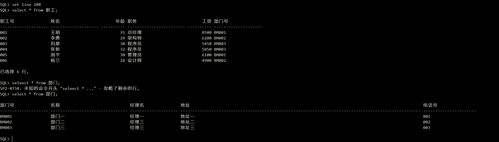

# 数据库安全性

> 挖坑

------

## 作业（

有以下两个关系模式：

> 职工（职工号，姓名，年龄，职务，工资，部门号）
>
> 部门（部门号，名称，经理名，地址，电话号）

请用SQL的GRANT语句和REVOKE语句（加上视图机制）实现以下授权定义或存取控制功能：

首先建表：

```sql
drop table 职工;
drop table 部门;

create table 职工(
	职工号 VARCHAR(10) PRIMARY KEY,
	姓名 VARCHAR(10),
    年龄 SMALLINT,
    职务 VARCHAR(12),
    工资 NUMERIC(8, 2),
    部门号 VARCHAR(10)
);
create table 部门(
    部门号 VARCHAR(10) PRIMARY KEY,
    名称 VARCHAR(16),
    经理名 VARCHAR(10),
    地址 VARCHAR(50),
    电话号 VARCHAR(11)
);
insert into 职工 values('001', '王明', 35, '总经理', 8500, 'BM001');
insert into 职工 values('002', '李勇', 29, '架构师', 6200, 'BM002');
insert into 职工 values('003', '刘星', 30, '程序员', 5450, 'BM003');
insert into 职工 values('004', '张新', 32, '程序员', 5850, 'BM003');
insert into 职工 values('005', '周平', 30, '管理员', 6100, 'BM001');
insert into 职工 values('006', '杨兰', 24, '设计师', 4900, 'BM002');

insert into 部门 values('BM001', '部门一', '经理一', '地址一', '001');
insert into 部门 values('BM002', '部门二', '经理三', '地址二', '002');
insert into 部门 values('BM003', '部门三', '经理三', '地址三', '003');
```



创建用户：

```sql
create user c##wangming identified by 114514;
create user c##liyong identified by 114514;
create user c##liuxing identified by 114514;
create user c##zhangxin identified by 114514;
create user c##zhoupin identified by 114514;
create user c##yanglan identified by 114514;

grant connect, resource to c##wangming, c##liyong;
grant connect, resource to c##liuxing, c##zhangxin;
grant connect, resource to c##zhoupin, c##yanglan;
```

（1）用户王明对两个表有select权限。

```sql
grant select on 职工 to c##wangming;
grant select on 部门 to c##wangming;
```

（2）用户李勇对两个表有insert和delete权限。

```sql
grant insert, delete on 职工 to c##liyong;
grant insert, delete on 部门 to c##liyong;
```

（3）每个职工只对自己的记录有select权限。

```sql
create view view_wangming as select * from 职工 where 姓名 = '王明';
grant select on view_wangming to c##wangming;

create view view_liyong as select * from 职工 where 姓名 = '李勇';
grant select on view_liyong to c##liyong;

create view view_liuxing as select * from 职工 where 姓名 = '刘星';
grant select on view_liuxing to c##liuxing;

create view view_zhangxin as select * from 职工 where 姓名 = '张新';
grant select on view_zhangxin to c##zhangxin;

create view view_zhoupin as select * from 职工 where 姓名 = '周平';
grant select on view_zhoupin to c##zhoupin;

create view view_yanglan as select * from 职工 where 姓名 = '杨兰';
grant select on view_yanglan to c##yanglan;
```

（4）用户刘星对职工表有select权限，对工资字段有更新权限。

```sql
grant select on 职工 to c##liuxing;
grant update(工资) on 职工 to c##liuxing;
```

（5）用户张新具有修改这两个表的结构的权限。

```sql
grant alter on 职工 to c##zhangxin;
grant alter on 部门 to c##zhangxin;
```

（6）用户周平具有对两个表的所有权限，并具有给其他用户授权的权限。

```sql
grant all privileges on 职工 to c##zhoupin with grant option;
grant all privileges on 部门 to c##zhoupin with grant option;
```

（7）用户杨兰具有从每个部门职工中select最高、最低、平均工资的权限，但不能查看每个人的工资：

```sql
create view emp_sal as
select 部门号, max(工资) "最高工资", min(工资) "最低工资", avg(工资) "平均工资"
from 职工
group by 部门号;

grant select on emp_val to c##yanglan;
```

