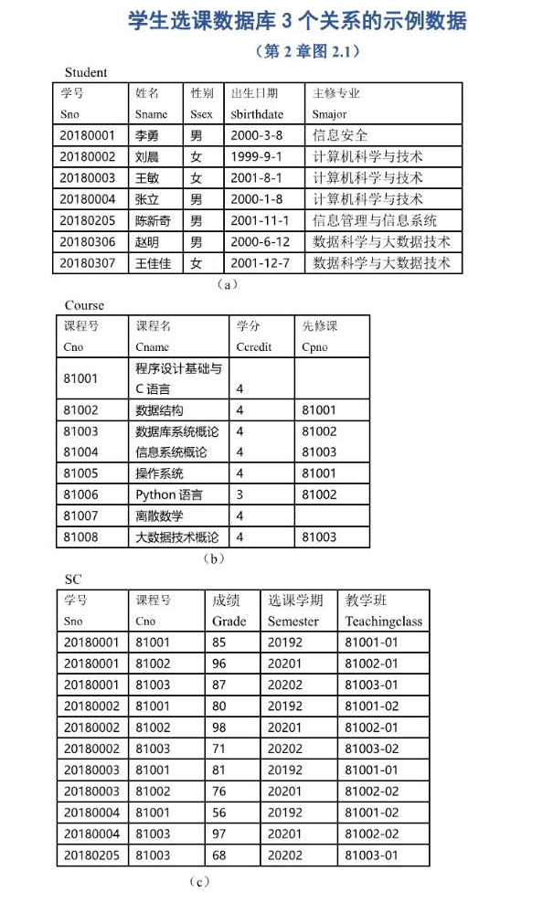
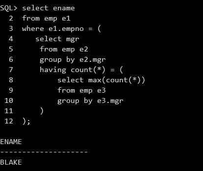

> 来自《数据库系统概论（第6版）》第三章
>
> 基于Oracle 19数据库

# SQL

## 模式的定义与删除

> 在数据库中，一个模式下通常包括多个表、视图和索引等数据库对象。一个数据库中可以建立多个模式。
>
> 在Oracle数据库中，模式的概念即**用户**。

创建模式：

```sql
create user c##atri identified by xxxxxxxxx;
```

> 需在用户名前添加前缀C##

切换模式：

```sql
alter session set current_schema = c##atri;
```

删除模式：

```sql
DROP USER username CASCADE;
```

> 模式下包含的东西也被删除了。

## 基本表的建立

> 为了方便后续重点语句的展示，我这里按照书上的二维码，准备几个表。

`sc.sql`：

```sql
DROP TABLE SC;
DROP TABLE Course;
DROP TABLE Student;
PURGE  RECYCLEBIN;

CREATE TABLE Student
(
    Sno CHAR(8) PRIMARY KEY,
    Sname VARCHAR(20) UNIQUE,
    Ssex CHAR(6),
    Sbirthdate Date,
    Smajor VARCHAR(40)
);

CREATE TABLE Course
(
    Cno CHAR(5) PRIMARY KEY,
    Cname VARCHAR(40) NOT NULL,
    Ccredit SMALLINT,
    Cpno CHAR(5),
    FOREIGN KEY (Cpno) REFERENCES Course(Cno)
);

CREATE TABLE SC
(
    Sno CHAR(8),
    Cno CHAR(5),
    Grade SMALLINT,
    Semester CHAR(5),
    Teachingclass CHAR(8),
    PRIMARY KEY(Sno, Cno),
    FOREIGN KEY(Sno) REFERENCES Student (Sno),
    FOREIGN KEY(Cno) REFERENCES Course (Cno)
);

INSERT INTO Student values('20180001', '李勇', '男', DATE '2000-03-08', '信息安全');
INSERT INTO Student values('20180002', '刘晨', '女', DATE '1999-09-01', '计算机科学与技术');
INSERT INTO Student values('20180003', '王敏', '女', DATE '2001-08-01', '计算机科学与技术');
INSERT INTO Student values('20180004', '张立', '男', DATE '2000-01-08', '计算机科学与技术');
INSERT INTO Student values('20180205', '陈新奇', '男', DATE '2001-11-01', '信息管理与信息系统');
INSERT INTO Student values('20180306', '赵明', '男', DATE '2000-06-12', '数据科学与大数据技术');
INSERT INTO Student values('20180307', '王佳佳', '女', DATE '2001-12-07', '数据科学与大数据技术');

INSERT INTO Course values('81001', '程序设计基础与C语言', 4, NULL);
INSERT INTO Course values('81002', '数据结构', 4, '81001');
INSERT INTO Course values('81003', '数据库系统概论', 4, '81002');
INSERT INTO Course values('81004', '信息系统概论', 4, '81003');
INSERT INTO Course values('81005', '操作系统', 4, '81001');
INSERT INTO Course values('81006', 'Python语言', 3, '81002');
INSERT INTO Course values('81007', '离散数学', 4, NULL);
INSERT INTO Course values('81008', '大数据技术概论', 4, '81003');

INSERT INTO SC values('20180001', '81001', 85, '20192', '81001-01');
INSERT INTO SC values('20180001', '81002', 96, '20201', '81002-01');
INSERT INTO SC values('20180001', '81003', 87, '20202', '81003-01');
INSERT INTO SC values('20180002', '81001', 80, '20192', '81001-02');
INSERT INTO SC values('20180002', '81002', 98, '20201', '81002-01');
INSERT INTO SC values('20180002', '81003', 71, '20202', '81003-02');
INSERT INTO SC values('20180003', '81001', 81, '20192', '81001-01');
INSERT INTO SC values('20180003', '81002', 76, '20201', '81002-02');
INSERT INTO SC values('20180004', '81001', 56, '20192', '81001-02');
INSERT INTO SC values('20180004', '81003', 97, '20201', '81002-02');
INSERT INTO SC values('20180205', '81003', 68, '20202', '81003-01');

COMMIT;
```

表长这样：



> 关于修改表、删除表什么的，这里就摆了hh

## 索引的建立与删除

> 也摆了，Coming soon(???)

# 数据查询

## 单表查询

> 例子学习法，学习之前请先导入上面的sql文件
>
> ```sql
> sql> @ $path_to_sc.sql
> ```
>
> **重点**

（1）查询指定列

查询全体学生的学号与姓名

```sql
select sno, sname
from student;
```

（2）查询全部列

查询全体学生的详细记录

```sql
select * from student;
```

（3）查询经过计算的值

> select子句的**目标列表达式**可以是**算术表达式、字符串常量、函数**等

查询全体学生的年龄

```sql
select sname, (extract(year from current_date) - extract(year from sbirthdate)) "年龄"
from student;
```

查询全体学生的姓名、出生日期和主修专业

```sql
select sname, 'Date of birth:', sbirthdate, smajor
from student;
```


（4）消除取值重复的行

查询选修了课程的学生学号

```sql
select distinct sno from sc;
```

（5）查询满足条件的元组

> 比较：=,>,<,.>=,<=,!=,<>,!>,!<,NOT+

查询主修计算机科学与技术专业全体学生的姓名

```sql
select sname
from student
where smajor = '计算机科学与技术';
```

查询所有2000年后（包括2000年）出生的学生姓名及其性别

```sql
select sname, ssex
from student
where extract(year from sbirthdate) >= 2000;
```

查询考试成绩不及格的学生的学号

```sql
select distinct sno
from sc
where grade < 60;
```

> 确定范围：(not) between ... and ...

查询年龄在20~23岁（包括20岁和23岁）之间的学生的学生的姓名、出生年月和主修专业

```sql
select sname, sbirthdate, smajor
from student
where extract(year from current_date) - extract(year from sbirthdate) between 20 and 23;
```

查询年龄不在20~23岁（包括20岁和23岁）之间的学生的学生的姓名、出生年月和主修专业

```sql
select sname, sbirthdate, smajor
from student
where extract(year from current_date) - extract(year from sbirthdate) not between 20 and 23;
```

> 确定集合
>
> 谓词：in <值表>, not in <值表>

查询计算机科学与技术专业和信息安全专业学生的姓名和性别

```sql
select sname, ssex
from student
where smajor in ('计算机科学与技术', '信息安全');
```

> 字符匹配
>
> [not] like '<匹配串>' [escape '<换码字符>']
>
> %：任意长度（可以为0）的字符串
>
> _：任意单个字符

查询学号为20180003的学生的详细情况

```sql
select *
from student
where sno like '20180003';
```

查询所有姓刘学生的姓名、学号和性别

```sql
select sname, sno, ssex
from student
where sname like '刘%';
```

查询2018级学生的学号和姓名

```sql
select sno, sname
from student
where sno like '2018%';
```

查询课程号为81开头，最后一位是6的课程名称和课程号

```sql
select cname, cno
from course
where cno like '81__6';
```

查询DB_Design课程的课程号和学分

```sql
select cno, ccredit
from course
where cname like 'DB\_Design' escape '\';
```

> 涉及空值的查询：is [not] NULL
>
> is 不能用 = 代替

某些学生选修课程后没有参加考试，有选课记录，但没有考试成绩。查询缺少成绩的学生的学号和相应的课程号。

```sql
select sno, cno
from sc
where grade is null;
```

> 多重条件查询：and or，and优先级高于or

查询主修计算机科学与技术专业2000年（包括2000年）以后出生的学生学号、姓名和性别。

```sql
select sno, sname, ssex
from student
where smajor = '计算机科学与技术'
and extract(year from sbirthdate) >= 2000;
```

> order by: 按一个或多个属性值升序（降序）排列，对于**空值的实现依具体系统实现决定**

查询选修了81003号课程的学生的学号及其成绩，查询结果按分数的降序排列

```sql
select sno, grade
from sc
where cno = '81003'
order by grade desc;
```

查询全体学生选修课程情况，查询结果先按照课程号升序排列，同一课程中按成绩降序排列。

```sql
select * from sc
order by cno, grade desc;
```

> **聚集函数**
>
> 统计元组个数：count(*)
>
> 统计一列中值的个数：count([distinct|all] 列名)
>
> 计算一列值的总和（此列必须为数值型）：sum([distinct|all] 列名)
>
> 计算一列值的平均值（此列必须为数值型）：avg([distinct|all] 列名)
>
> 求一列中的最大值和最小值：max/min([distinct|all] 列名)

查询选修了课程的学生人数

```sql
select count(distinct sno)
from sc;
```

计算选修81001号课程的学生平均成绩

```sql
select avg(grade)
from sc
where cno = '81001';
```

查询选修1号课程的学生最高分数

```sql
select max(grade)
from sc
where cno = '81001';
```

查询学号为20180003学生选修课程的总学分数

```sql
select sum(ccredit)
from sc, course
where sno = '20180003' and sc.cno = course.cno;
```

> group by子句分组：
>
> - 按指定的一列或多列值分组，**值相等的为一组**
> - 如果未对查询结果分组，聚集函数将作用于整个查询结果
> - **分组后，聚集函数将作用于每一个组**

求各个课程号及选修该课程的人数

```sql
select cno, count(sno)
from sc
group by cno;
```

查询2019年第2学期选修了10门以上课程的学生学号

```sql
select sno
from sc
where semester = '20192'
group by sno
having count(*) > 10;
```

> having 和 where 的区别：
>
> - where子句作用于基表或视图，从中选择满足条件的**元组**
> - having短语作用于组，从中选择满足条件的**组**

> limit：限制元组数量

查询选修了数据库系统概论课程的成绩排名前10名的学生学号

```sql
select sno
from sc, course
where course.cname = '数据库系统概论'
and sc.cno = course.cno
order by grade desc
limit 10;
```

> limit关键字在oracle数据库是不支持的，需要用rownum来实现相同功能：

```sql
select * 
from(
    select sno, grade
    from sc, course
    where course.cname = '数据库系统概论'
    and sc.cno = course.cno
    order by grade desc
)
where rownum <= 10;
```

## 连接查询

即同时涉及两个以上的表的查询

（1）等值与非等值连接查询

查询每个学生及其选修课程的情况

```sql
select student.*, sc.*
from student, sc
where student.sno = sc.sno;
```

（2）自然连接查询

查询每个学生的学号、姓名、性别、出生日期、主修专业及该学生选修课程的课程号与成绩

```sql
select student.sno, sname, ssex, sbirthdate, smajor, cno, grade
from student, sc
where student.sno = sc.sno;
```

（3）复合条件连接查询

> 在连接谓词的基础上增加选择谓词，组成复合条件

查询选修81002号课程且成绩在90分以上的所有学生的学号和姓名

```sql
select student.sno, sname
from student, sc
where student.sno = sc.sno
and sc.cno = '81002'
and sc.grade > 90;
```

（4）自身连接查询

查询每一门课的间接先修课（即先修课的先修课）

```sql
select first.cno, second.cpno
from course first, course second
where first.cpno = second.cno and second.cpno is not null;
```

（5）外连接查询

> 外连接操作以指定表为连接主体，将主体表中不满足连接条件的元组一并输出。

以Student表为主体列出每个学生的基本情况及其选课情况，若某个学生没有选课，则只输出其基本情况的数据，而把选课信息填为空值NULL

```sql
select student.sno, sname, ssex, sbirthdate, smajor, cno, grade
from student left outer join sc on(student.sno = sc.sno);
```

（6）多表连接查询

两个以上的表的连接。

## 嵌套查询

- 一个select-from-where语句称为一个**查询块**
- 将一个查询块嵌套到另一个查询块的where子句或having短语的条件中的查询称为**嵌套查询**

- 不相关子查询

> 子查询的查询条件不依赖于父查询，可以**由里向外**逐层处理。

- 相关子查询

> 首先取**外层**查询表的第一个元组，根据它与内层查询相关的属性值处理内层查询，若where返回真，则加入结果表。然后重复这一过程。

（1）IN谓词

查询与“刘晨”在同一个主修专业的学生学号、姓名和主修专业

```sql
select sno, sname, smajor
from student
where smajor in(
	select smajor
	from student
	where sname = '刘晨'
);
```

查询选修了课程名为“信息系统概论”的学生的学号和姓名

```sql
select sno, sname
from student
where sno in(
	select sno
	from sc
	where cno in(
		select sno
		from course
		where cname = '信息系统概论'
	)
);
```

（2）带有比较运算符的子查询

> 当能确切知道内层查询返回**单值**时，可用比较运算符。

找出每个学生超过他选修课程平均成绩的课程号

```sql
select sno, cno
from sc x
where grade >= (
	select avg(grade)
	from sc y
	where x.sno = y.sno
);
```

> 先从外层的元组中取出x.sno，然后再内层中寻找y.sno=x.sno的元组，求avg(grade)，用该值代替内层查询，重新得到外层查询。

（3）带有ANY(SOME)或ALL谓词

> 必须同时使用比较运算符

查询非计算机科学技术专业中比计算机科学技术专业任意一个学生年龄小（出生日期晚）的学生的姓名、出生日期和主修专业

```sql
select sname, sbirthdate, smajor
from student
where sbirthdate > any(
	select sbirthdate
	from student
	where smajor = '计算机科学与技术'
)
and smajor <> '计算机科学与技术';
```

> 可以和一些聚集函数进行等价转换。


（4）EXISTS谓词

带有EXISTS谓词的子查询只产生逻辑真值 `true` 或 `false` ，取决于内层查询是否非空。

查询没有选修81001号课程的学生姓名

```sql
select sname
from student
where not exists(
	select *
	from sc
	where sno = student.sno and cno = '81001'
);
```

可用 exists/not exists 实现全称量词（难点）：
$$
(\forall x)P = \neg (\exists x(\neg P)).
$$
查询选修了全部课程的学生姓名

```sql
select sname
from student
where not exists(
	select *
	from course
	where not exists(
		select *
		from sc
		where sno = student.sno and cno = course.cno
	)
);
```

> 转换，不存在没有被该学生选修的课程，双重否定。

可用exists/not exists实现逻辑蕴涵（难点）
$$
p \rightarrow q = \neg p \lor q.
$$
查询至少选修了学生20180002选修的全部课程的学生的学号

> 用逻辑蕴含来表达：查询学号为x的学生，对所有的课程y，只要20180002号学生选修了课程y，那么x也选修了y。
>
> 用p表示谓词“学生20180002选修了课程y”
>
> 用q表示谓词“学生x选修了课程y”
>
> 则上述查询为 $(\forall y) p \rightarrow q $.
>
> 可等价转换为 $\neg \exists y(p \land \neg q)$.
>
> 语义为：不存在（第一个not exists）这样的课程y，它即被20180002选修，但不被（第二个not exists）x选修。

```sql
select sno
from student
where not exists(
	select *
	from sc scx
	where scx.sno = '20180002' and
	not exists(
		select *
		from sc scy
		where scy.sno = student.sno and scy.cno = scx.cno
	)
);
```

> 其实我也不是很理解，这真的很抽象。

## 集合查询

> UNION、INTERSECT、EXCEPT

查询计算机科学与技术专业的学生及年龄不大于19岁（包括等于19岁）的学生

```sql
select * from student where smajor = '计算机科学与技术'
union
select * from student
where (extract(year from current_date) - extract(year from sbirthdate)) <= 19;
```

查询计算机科学与技术专业的学生与年龄不大于19岁的学生的交集

```sql
select * from student where smajor = '计算机科学与技术'
intersect
select * from student
where (extract(year from current_date) - extract(year from sbirthdate)) <= 19;
```

## 基于派生表的查询

子查询不止可以出现在where子句中，还可以出现在from子句中。

找出每个学生超过他自己选修课程平均成绩的课程号

```sql
select sno, cno
from sc, (select sno as avg_sno, avg(grade) as avg_grade from sc group by sno) avg_sc
where sc.sno = avg_sc.avg_sno and sc.grade >= avg_sc.avg_grade;
```

# 数据更新

------

# sql语言练习

首先运行该 `emp.sql` 文件：

```sql
//在SQL*PLUS里用@命令执行
//例如：假设此程序保存在D盘根目录下，.sql后缀可省略
// SQL> @D:\demo

DROP TABLE EMP;
DROP TABLE DEPT;
DROP TABLE BONUS;
DROP TABLE SALGRADE;


CREATE TABLE DEPT
       (DEPTNO NUMBER(2),
        DNAME VARCHAR2(14),
        LOC VARCHAR2(13),
        CONSTRAINT dept_dname_uk UNIQUE (dname),
        CONSTRAINT dept_deptno_pk PRIMARY KEY (deptno) );

INSERT INTO DEPT VALUES (10, 'ACCOUNTING', 'NEW YORK');
INSERT INTO DEPT VALUES (20, 'RESEARCH',   'DALLAS');
INSERT INTO DEPT VALUES (30, 'SALES',      'CHICAGO');
INSERT INTO DEPT VALUES (40, 'OPERATIONS', 'BOSTON');

CREATE TABLE EMP
       (EMPNO NUMBER(4) NOT NULL,
        ENAME VARCHAR2(10),
        JOB VARCHAR2(9),
        MGR NUMBER(4),
        HIREDATE DATE,
        SAL NUMBER(7, 2),
        COMM NUMBER(7, 2),
        DEPTNO NUMBER(2),
        CONSTRAINT emp_empno_pk PRIMARY KEY (empno)
        );

INSERT INTO EMP VALUES
        (7369, 'SMITH',  'CLERK',     7902,
        TO_DATE('17-12月-1980', 'DD-MON-YYYY'),  800, NULL, 20);
INSERT INTO EMP VALUES
        (7499, 'ALLEN',  'SALESMAN',  7698,
        TO_DATE('20-2月-1981', 'DD-MON-YYYY'), 1600,  300, 30);
INSERT INTO EMP VALUES
        (7521, 'WARD',   'SALESMAN',  7698,
        TO_DATE('22-2月-1981', 'DD-MON-YYYY'), 1250,  500, 30);
INSERT INTO EMP VALUES
        (7566, 'JONES',  'MANAGER',   7839,
        TO_DATE('2-4月-1981', 'DD-MON-YYYY'),  2975, NULL, 20);
INSERT INTO EMP VALUES
        (7654, 'MARTIN', 'SALESMAN',  7698,
        TO_DATE('28-9月-1981', 'DD-MON-YYYY'), 1250, 1400, 30);
INSERT INTO EMP VALUES
        (7698, 'BLAKE',  'MANAGER',   7839,
        TO_DATE('1-5月-1981', 'DD-MON-YYYY'),  2850, NULL, 30);
INSERT INTO EMP VALUES
        (7782, 'CLARK',  'MANAGER',   7839,
        TO_DATE('9-6月-1981', 'DD-MON-YYYY'),  2450, NULL, 10);
INSERT INTO EMP VALUES
        (7788, 'SCOTT',  'ANALYST',   7566,
        TO_DATE('09-12月-1982', 'DD-MON-YYYY'), 3000, NULL, 20);
INSERT INTO EMP VALUES
        (7839, 'KING',   'PRESIDENT', NULL,
        TO_DATE('17-11月-1981', 'DD-MON-YYYY'), 5000, NULL, 10);
INSERT INTO EMP VALUES
        (7844, 'TURNER', 'SALESMAN',  7698,
        TO_DATE('8-9月-1981', 'DD-MON-YYYY'),  1500,    0, 30);
INSERT INTO EMP VALUES
        (7876, 'ADAMS',  'CLERK',     7788,
        TO_DATE('12-1月-1983', 'DD-MON-YYYY'), 1100, NULL, 20);
INSERT INTO EMP VALUES
        (7900, 'JAMES',  'CLERK',     7698,
        TO_DATE('3-12月-1981', 'DD-MON-YYYY'),   950, NULL, 30);
INSERT INTO EMP VALUES
        (7902, 'FORD',   'ANALYST',   7566,
        TO_DATE('3-12月-1981', 'DD-MON-YYYY'),  3000, NULL, 20);
INSERT INTO EMP VALUES
        (7934, 'MILLER', 'CLERK',     7782,
        TO_DATE('23-1月-1982', 'DD-MON-YYYY'), 1300, NULL, 10);

CREATE TABLE BONUS
        (ENAME VARCHAR2(10),
         JOB   VARCHAR2(9),
         SAL   NUMBER,
         COMM  NUMBER);

CREATE TABLE SALGRADE
        (GRADE NUMBER,
         LOSAL NUMBER,
         HISAL NUMBER);

INSERT INTO SALGRADE VALUES (1,  700, 1200);
INSERT INTO SALGRADE VALUES (2, 1201, 1400);
INSERT INTO SALGRADE VALUES (3, 1401, 2000);
INSERT INTO SALGRADE VALUES (4, 2001, 3000);
INSERT INTO SALGRADE VALUES (5, 3001, 9999);


COMMIT;
```


（1）在emp表上添加如下约束：入职时间不得晚于2021年7月8日，工资不能为负值，deptno为emp的外码。

```sql
alter table emp add constraint hiredate_chk check(hiredate <= DATE '2021-07-08');
alter table emp add constraint salary_chk check(sal >= 0);
alter table emp add constraint deptno_forkey foreign key(deptno) references dept(deptno);
```

> 查询数据字典，可查看EMP表（需大写）所有约束。


（2）查询比他/她的经理工资高且雇佣时间长的雇员的雇员号、雇员名以及工资。

```sql
select a.empno, a.ename, a.sal
from emp a, emp b
where a.mgr = b.empno
and a.sal > b.sal
and a.hiredate < b.hiredate;
```


（3）查询雇佣人数最多的经理名。

```sql
select ename
from emp e1
where e1.empno = (
	select mgr
    from emp e2
    group by e2.mgr
    having count(*) = (
        select max(count(*))
        from emp e3
        group by e3.mgr
    )
);
```



（4）创建CS部门工资在4000~9000元间的姓“张”的雇员视图empv(eid, ename, salary)。

```sql
create view empv(eid, ename, salary) as
select empno, ename, sal
from emp, dept
where sal between 4000 and 9000
and ename like '张%'
and emp.deptno = dept.deptno
and dept.dname = 'CS';
```


（5）查询所有部门没有雇员的工资大于3000元的部门名。

```sql
select dname
from dept
where not exists(
	select *
	from emp
	where emp.deptno = dept.deptno
	and emp.sal > 3000
);
```


（6）查询与雇员“SMITH”同一职业的雇员号和雇员名。

```sql
select empno, ename
from emp
where job = (
	select job
	from emp e
	where e.ename = 'SMITH'
);
```


（7）查询雇员工资最高的雇员号、雇员名和工资。

```sql
select empno, ename, sal
from emp e1
where e1.sal = (
	select max(sal)
	from emp e2
);
```


（8）删除“sales"部门的雇员信息。

```sql
delete from emp
where deptno = (
	select deptno from dept
	where dept.dname = 'SALES'
);
```


（9）修改7782号雇员的职业和部门号与7788号雇员相同。

```sql
update emp
set(job, deptno) = (
	select job, deptno
	from emp
	where empno = 7788
)
where empno = '7782';
```


（10）创建一个函数，给定一个雇员号，返回该雇员所在部门比他/她工资高的雇员数目。

```sql
create or replace function get_higher_sal_cnt(p_empno in number)
return number
is
	v_deptno emp.deptno%type;
	v_sal emp.sal%type;
	v_cnt number;
begin
	select deptno, sal
	into v_deptno, v_sal
	from emp
	where empno = p_empno;
	
	select count(*)
	into v_cnt
	from emp
	where deptno = v_deptno
	and sal > v_sal;
	
	return v_cnt;
end;
/
```

调用函数：

```sql
declare
	v_empno number := 7782;
	v_cnt number;
begin
	v_cnt := get_higher_sal_cnt(v_empno);
	DBMS_OUTPUT.PUT_LINE('number of higher-sal employees:' || v_cnt);
end;
/
```


