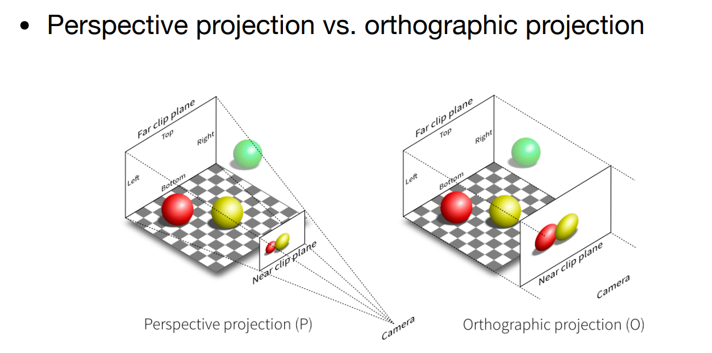
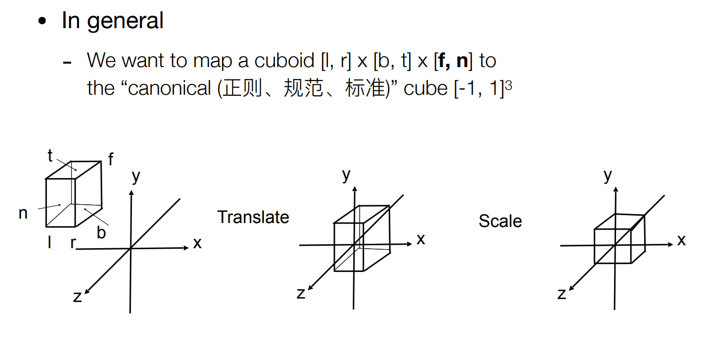
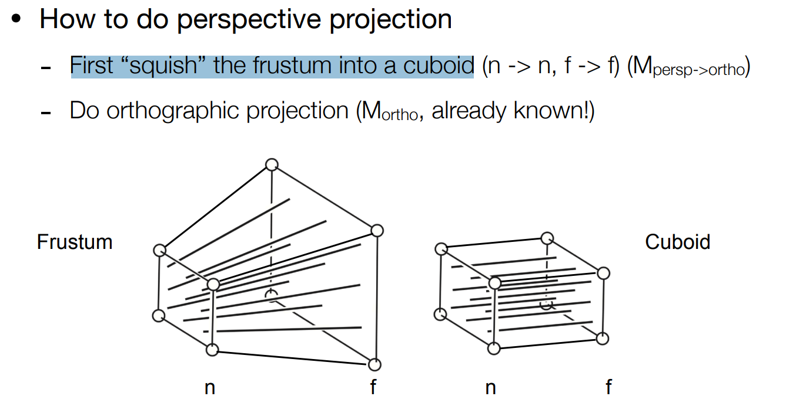

# Games101学习笔记

## 1. 线性代数
### 1.1. 线性变换

> 我们首先举个二维平面下的例子。

二维线性变换可以写为：

$$
\begin{aligned}
x' = ax + by. \\
y' = cx + dy.
\end{aligned}
$$

可以用矩阵 $M$ 来表示：
$$
\begin{bmatrix} x^{'}\\y^{'} \end{bmatrix}= \begin{bmatrix} a & b\\c & d \end{bmatrix} \begin{bmatrix} x\\y \end{bmatrix}.
$$

这里有一个小技巧，就是将两个基向量 $(1,0),(0,1)$ 分别代入，得到 $(a,c),(b,d)$ 就是这两个基向量经过变换后的向量，从而快速得到矩阵 $M$。

### 1.2. 齐次坐标（Homogeneous Coordinates）

> 在线性变换的基础上添加平移变换。

线性变换不能表示平移：
$$
\begin{bmatrix} x^{'}\\y^{'} \end{bmatrix}= \begin{bmatrix} a & b\\c & d \end{bmatrix} \begin{bmatrix} x\\y \end{bmatrix}+ \begin{bmatrix} t_x\\t_y \end{bmatrix}.
$$

为了将平移也加入一般的变换形式，提出齐次坐标，即在原有的坐标上添加一维 $w$。依旧是采用二维情况进行举例：

- 2D点：$(x,y,1)^T$
- 2D向量：$(x,y,0)^T$

这样就可以只用矩阵乘法来表示线性变换+平移（先变换后平移）：
$$
\begin{bmatrix} x^{'}\\y^{'}\\1 \end{bmatrix}= \begin{bmatrix} a & b & t_x\\c & d & t_y \\ 0 & 0 & 1 \end{bmatrix} \begin{bmatrix} x\\y\\1 \end{bmatrix}.
$$

对于变换矩阵 $M$，求逆可得还原矩阵 $M^{-1}$。

### 1.3. 复合变换

在三维情况下，由于采用右手坐标系，因此变换为矩阵左乘，变换顺序由右往左：
$$
A_n(...A_2(A_1(x))) = A_n\cdots A_2 \cdot A_1 \cdot \begin{pmatrix} x\\y\\1 \end{pmatrix}
$$

> 注：为什么右手坐标系要用矩阵左乘？由于这是笔者补档一年前的笔记，因此现在有点记不住了，问了大模型后说这是“**约定俗成**”的用法，在右手坐标系的图形库（如OpenGL）就是这么采用。相反，在左手坐标系的图形库（如DirectX）则反之。二者在数学上并无强制关联。

### 1.4. 三维变换

三维旋转矩阵（非齐次坐标），绕轴 $n$ 转 $\alpha$ ：
$$
R(n,\alpha)=\cos(\alpha)I+(1-\cos(\alpha))nn^T+\sin(\alpha) \begin{pmatrix} 0&-n_z&n_y\\ n_z&0&-n_x\\ -n_y&n_x&0 \end{pmatrix}.
$$

### 1.5. 视图变换

> MVP变换的V，或者MV。

想象你拿着相机进行拍照，需要哪些步骤？首先设置相机：

- 选择位置 $e$
- 选择观察方向 $g$
- 选择相机朝上的方向 $t$

为了方便，我们将相机移动到原点（场景的物体也随之移动），观察 $-z$，上方向为 $y$。这可以采用复合变换实现：

- 将相机移动到原点
- 将 $g$ 旋转到 $-z$
- 将 $t$ 旋转到 $y$
- 将 $g \times t$ 旋转到 $x$ (事实上不需要这步，只不过方便后续数学推导表示)

上述变换除了第一步，后面旋转用矩阵难以实现，考虑逆复合变换。

假设矩阵为 $M_{view}=R_{view}T_{view}$，其中平移矩阵很简单：
$$
T_{view} = \begin{bmatrix} 1 & 0 & 0 & -x_e\\ 0 & 1 & 0 & -y_e\\ 0 & 0 & 1 & -z_e\\ 0 & 0 & 0 & 1 \end{bmatrix}.
$$

对于旋转矩阵，考虑其逆变换：$x$ 旋转至 $g \times t$，$y$ 旋转至 $t$，$z$ 旋转至 $-g$：
$$
R_{view}^{-1} = \begin{bmatrix} x_{g\times t} & x_t & x_{-g} & 0\\ y_{g\times t} & y_t & y_{-g} & 0\\ z_{g\times t} & z_t & z_{-g} & 0\\ 0 & 0 & 0 & 1 \end{bmatrix}.
$$

不难发现这是个正交矩阵（废话，旋转矩阵都是正交矩阵，即便是齐次表示），因此可以直接转置得到 $R_{view}$：
$$
R_{view} = \begin{bmatrix} x_{g\times t} & y_{g\times t} & z_{g\times t} & 0\\ x_t & y_t & z_t & 0\\ x_{-g} & y_{-g} & z_{-g} & 0\\ 0 & 0 & 0 & 1 \end{bmatrix}.
$$

### 1.6. 投影变换

> MVP中的P，将3D转换为2D。分为正交投影和透视投影。

二者区别如下，直接截图了：

#### 1.6.1. 正交投影

这是一种简单的投影方式：

- 首先用视图变换，让相机移动到原点，观察 $-z$，上方向为 $y$
- 然后直接去掉 $z$ 轴
- 缩放至平面 $[-1,1]^2$

其对应的变换矩阵为：
$$
M_{ortho}= \begin{bmatrix} \frac{2}{r-l} & 0 & 0 & 0\\ 0 & \frac{2}{t-b} & 0 & 0\\ 0 & 0 & \frac{2}{n-f} & 0\\ 0 & 0 & 0 & 1\\ \end{bmatrix} \begin{bmatrix} 1 & 0 & 0 & -\frac{r+l}{2}\\ 0 & 1 & 0 & -\frac{t+b}{2}\\ 0 & 0 & 1 & -\frac{n+f}{2}\\ 0 & 0 & 0 & 1\\ \end{bmatrix}.
$$

#### 1.6.2. 透视投影

> 远的物体更小，平行线不再不行。

首先将这个视锥体压缩成长方体 $M_{persp\rightarrow ortho}$，然后可以使用上述正交投影 $M_{ortho}$。

> 思考：在视锥体外面的物体如何考虑？在具体工程实现中可能会有这个问题，这里先挖坑。

主要的idea是上述提到过的“找出向量经过线性变换后在原坐标系的坐标值”。

首先考虑 $y$，这个很简单，根据相似三角形直接求出 $y^{'}=\frac{n}{z}y$：

$x$ 也一样：$x^{'}=\frac{n}{z}x$。

根据目前的信息，用齐次坐标表示变换前后的坐标：
$$
\begin{pmatrix} x\\y\\z\\1 \end{pmatrix} \Rightarrow \begin{pmatrix} nx/z\\ny/z\\unknown\\1 \end{pmatrix} == \begin{pmatrix} nx\\ny\\unknown\\z \end{pmatrix}.
$$

考虑根据变换前后，推出矩阵 $M_{persp\rightarrow ortho}^{4\times 4}$：

$$ M_{persp\rightarrow ortho}^{4\times 4} \begin{pmatrix} x\\y\\z\\1 \end{pmatrix}= \begin{pmatrix} nx\\ny\\unknown\\z \end{pmatrix}.
$$

注意到 $x,y,z$ 都是变量，矩阵内部不能有这些变量，因此可以直接推出一些元素：
$$
M_{persp\rightarrow ortho} = \begin{pmatrix} n & 0 & 0 & 0\\ 0 & n & 0 & 0\\ ? & ? & ? & ?\\ 0 & 0 & 1 & 0 \end{pmatrix}.
$$

> 可以发现这个不是仿射变换矩阵的形式（最后一行前面都是0最后一个是1）。因此学到这里的时候，我知道，至少对于 $z$，它的变换肯定不是线性的。因此我有个疑问，就是明知道变换前后不是线性的，但为什么还能假定可以用**矩阵**来表示呢？矩阵可以表示齐次坐标的任意变换吗？

如何求出这些未知元素呢？这里我们考虑将坐标的 $z$ 代入一些特殊值。

首先令 $z=n$：
$$
\begin{pmatrix} x\\y\\n\\1 \end{pmatrix} \Rightarrow \begin{pmatrix} nx\\ny\\n^2\\n \end{pmatrix}.
$$

可以得出矩阵第三行为：
$$
\begin{pmatrix} 0&0&A&B \end{pmatrix} \begin{pmatrix} x\\y\\n\\1 \end{pmatrix} =n^2
$$

且可以得出：$An+B=n^2$。

然后我们需要再来一个方程。我们知道所有在 $f$ 面（即最后面的那一面）上的 $z$ 是不会变的，因此有
$$
\begin{pmatrix} 0\\0\\f\\1 \end{pmatrix} \Rightarrow \begin{pmatrix} 0\\0\\f^2\\f \end{pmatrix}.
$$

因此得到第二个方程 $Af+B=f^2$。可以解得 $A=n+f, B=-nf$。

> 对于一般的 $z$，变换前后是变大还是变小了？（换句话说，更近还是更远了呢）
> 根据上述求解可以得知 $z^{'}=n+f-\dfrac{nf}{z}$，直接算 $z-z{'}$ ，乘 $z$ 后可以求得 $z^2-(n+f)z+nf<0(f<z<n)$。
> 但因为 $z<0$，所以 $z > z^{'}$，变换后的 $z$ 更小，即更远了。

