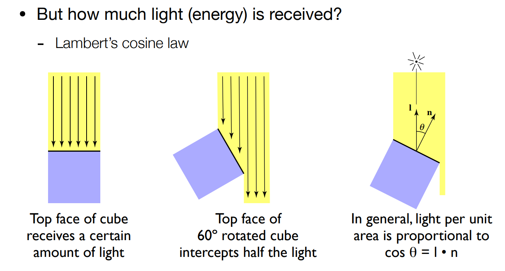
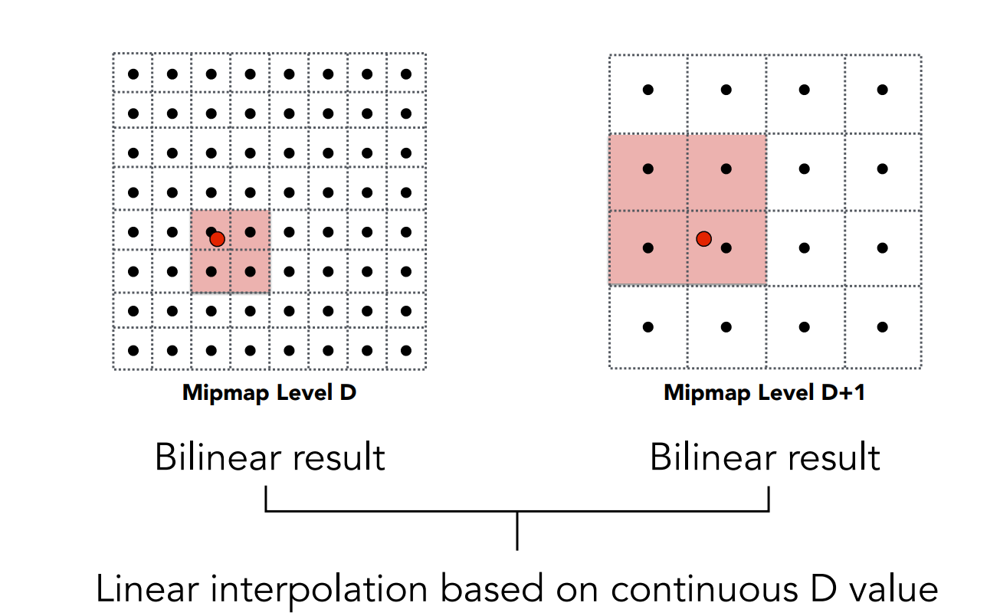

# games101学习笔记

## 1. 线性代数

### 1.1. 线性变换

> 二维举例

二维线性变换可以写为：
$$
x^{'}=ax+by\\
y^{'}=cx+dy\\
$$
可以用矩阵 $M$ 来表示：
$$
\begin{bmatrix}
x^{'}\\y^{'}
\end{bmatrix}=
\begin{bmatrix}
a & b\\c & d
\end{bmatrix}
\begin{bmatrix}
x\\y
\end{bmatrix}
$$
可以带入两个基向量 $(1,0),(0,1)$，得知 $(a,c)$ 和 $(b,d)$ 分别是这两个向量经过线性变换后在原坐标系的坐标值。可以用这个结论很快地得出矩阵 $M$ 。

### 1.2. 齐次坐标（Homogeneous Coordinates）

> 在线性变换的基础上添加平移变换

线性变换不能表示平移：
$$
\begin{bmatrix}
x^{'}\\y^{'}
\end{bmatrix}=
\begin{bmatrix}
a & b\\c & d
\end{bmatrix}
\begin{bmatrix}
x\\y
\end{bmatrix}+
\begin{bmatrix}
t_x\\t_y
\end{bmatrix}
$$
为了将平移也加入一般的变换形式，提出齐次坐标，即在原有的坐标上添加一维 $w$（二维举例）：

- 2D点：$(x, y, 1)^T$
- 2D向量：$(x, y, 0)^T$

这样就可以只用矩阵乘法来表示线性变换+平移（先变换后平移）：
$$
\begin{bmatrix}
x^{'}\\y^{'}\\1
\end{bmatrix}=
\begin{bmatrix}
a & b & t_x\\c & d & t_y \\ 0 & 0 & 1
\end{bmatrix}
\begin{bmatrix}
x\\y\\1
\end{bmatrix}
$$
对于矩阵 $M$ 求逆可得还原矩阵 $M^{-1}$。

### 1.3. 复合变换

由于采用右手坐标系，因此变换为矩阵左乘，变换顺序由右往左：
$$
A_n(...A_2(A_1(x))) = A_n\cdots A_2 \cdot A_1 \cdot  
\begin{pmatrix}
x\\y\\1
\end{pmatrix}
$$

### 1.4. 三维变换

三维旋转矩阵（非齐次坐标），绕轴 $n$ 转 $\alpha$：
$$
R(n,\alpha)=\cos(\alpha)I+(1-\cos(\alpha))nn^T+\sin(\alpha)
\begin{pmatrix}
0&-n_z&n_y\\
n_z&0&-n_x\\
-n_y&n_x&0
\end{pmatrix}
$$

### 1.5. 视图变换

> MVP变换的V。或者MV。
>
> 想象你拿着相机进行拍照，需要哪些步骤

首先设置相机：

- 选择位置 $e$
- 选择观察方向 $g$
- 选择相机朝上的方向 $t$

为了方便，我们将相机移动到原点，观察 $-z$，上方向为 $y$。这可以采用复合变换实现：

- 将 $e$ 平移至原点
- 将 $g$ 旋转至 $-z$ 
- 将 $t$ 旋转至 $y$
- 将 $(g \times t)$ 旋转至 $x$ (事实上不需要这步，只不过方便后续数学推导表示)

上述变换除了第一步，后面旋转用矩阵难以实现，考虑逆复合变换。

假设矩阵为 $M_{view}=R_{view}T_{view}$，其中平移矩阵很简单：
$$
T_{view} = 
\begin{bmatrix}
1 & 0 & 0 & -x_e\\
0 & 1 & 0 & -y_e\\
0 & 0 & 1 & -z_e\\
0 & 0 & 0 & 1
\end{bmatrix}
$$
对于旋转矩阵，考虑其逆变换：$x$ 旋转至 $(g \times t)$，$y$ 旋转至 $t$ ，$z$ 旋转至 $-g$：
$$
R_{view}^{-1} =
\begin{bmatrix}
x_{g\times t} & x_t & x_{-g} & 0\\
y_{g\times t} & y_t & y_{-g} & 0\\
z_{g\times t} & z_t & z_{-g} & 0\\
0 & 0 & 0 & 1
\end{bmatrix}
$$
不难发现这是个正交矩阵，因此可以直接转置得到 $R_{view}$：
$$
R_{view} =
\begin{bmatrix}
x_{g\times t} & y_{g\times t} & z_{g\times t} & 0\\
x_t & y_t & z_t & 0\\
x_{-g} & y_{-g} & z_{-g} & 0\\
0 & 0 & 0 & 1
\end{bmatrix}
$$

### 1.6. 投影变换

> MVP中的P，将3D转换为2D
>
> 分为正交投影和透视投影

二者区别如下，直接截图了：


#### 1.6.1. 正交投影

一种简单的方式：

- 首先用视图变换，让相机移动到原点，观察 $-z$，上方向为 $y$。
- 然后去掉 $z$ 轴
- 缩放至 $[-1,1]^2$（讲真我不是很理解这步）

一般方式，在原来的基础上多了个平移变换：


其对应的变换矩阵为：
$$
M_{ortho}=
\begin{bmatrix}
\frac{2}{r-l} & 0 & 0 & 0\\
0 & \frac{2}{t-b} & 0 & 0\\
0 & 0 & \frac{2}{n-f} & 0\\
0 & 0 & 0 & 1\\
\end{bmatrix}
\begin{bmatrix}
1 & 0 & 0 & -\frac{r+l}{2}\\
0 & 1 & 0 & -\frac{t+b}{2}\\
0 & 0 & 1 & -\frac{n+f}{2}\\
0 & 0 & 0 & 1\\
\end{bmatrix}
$$

#### 1.6.2. 透视投影

> 远的物体更小，平行线不再不行。

首先将锉面压缩成长方体 $M_{persp\rightarrow ortho}$，然后可以使用上述正交投影 $M_{ortho}$。


> 这里应该假设这个锉面是通过视线形成的，即中心轴为 $-z$，因此不需要先作平移变换。

主要的idea是上述提到过的“找出向量经过线性变换后在原坐标系的坐标值”。

首先考虑 $y$ ，这个很简单，根据相似三角形直接求出 $y^{'}=\frac{n}{z}y$：


将坐标系绕 $z$ 轴旋转90度，可以发现对于 $x$ 也一样：$x^{'}=\frac{n}{z}x$。

根据目前的信息，用齐次坐标表示变换前后的坐标：
$$
\begin{pmatrix}
x\\y\\z\\1
\end{pmatrix}
\Rightarrow
\begin{pmatrix}
nx/z\\ny/z\\unknown\\1
\end{pmatrix}
==
\begin{pmatrix}
nx\\ny\\unknown\\z
\end{pmatrix}
$$
考虑根据变换前后，推出矩阵 $M_{persp\rightarrow ortho}^{4\times 4}$：
$$
M_{persp\rightarrow ortho}^{4\times 4}
\begin{pmatrix}
x\\y\\z\\1
\end{pmatrix}=
\begin{pmatrix}
nx\\ny\\unknown\\z
\end{pmatrix}
$$
注意到 $x,y,z$ 都是变量，矩阵内部不能有这些变量，因此可以直接推出一些元素：
$$
M_{persp\rightarrow ortho} = 
\begin{pmatrix}
n & 0 & 0 & 0\\
0 & n & 0 & 0\\
? & ? & ? & ?\\
0 & 0 & 1 & 0
\end{pmatrix}
$$

> 可以发现这个似乎不是仿射变换矩阵的形式（最后一行前面都是0最后一个是1）。因此学到这里的时候，我知道，至少对于 $z$ ，它的变换肯定不是线性的。
>
> 因此我有个疑问，就是明知道变换前后不是线性的，但为什么还能假定可以用**矩阵**来表示呢？矩阵可以表示齐次坐标的任意变换吗？

如何求出这些未知元素呢？这里我们考虑将坐标的 $z$ 代入一些特殊值。

首先令 $z=n$ ：
$$
\begin{pmatrix}
x\\y\\n\\1
\end{pmatrix}
\Rightarrow
\begin{pmatrix}
nx\\ny\\n^2\\n
\end{pmatrix}
$$
可以得出矩阵第三行为：
$$
\begin{pmatrix}
0&0&A&B
\end{pmatrix}
\begin{pmatrix}
x\\y\\n\\1
\end{pmatrix}
=n^2
$$
且可以得出：
$$
An+B=n^2
$$
然后我们需要再来一个方程。我们知道所有在 $f$ 面（即最后面的那一面）上的 $z$ 前后是不会变的，因此有
$$
\begin{pmatrix}
0\\0\\f\\1
\end{pmatrix}
\Rightarrow
\begin{pmatrix}
0\\0\\f^2\\f
\end{pmatrix}
$$
因此得到第二个方程：
$$
Af+B=f^2
$$
可以解得
$$
A=n+f\\B=-nf
$$
因此成功求出了 $M_{persp\rightarrow ortho}$。

> 对于一般的 $z$ ，变换前后是变大还是变小了？（换句话说，更近还是更远了呢）
>
> 根据上述求解可以得知 $z^{'}=n+f-\dfrac{nf}{z}$，直接算 $z-z{'}$，乘 $z$ 后可以求得 $z^2-(n+f)z+nf<0\space(f<z<n)$。
>
> 但因为 $z<0$ ，所以 $z > z^{'}$，变换后的 $z$ 更小，即更远了。

## 2. 光栅化

> 根据上面的MVP变换，我们得到了一个 $[-1,1]^3$ 的正方体。光栅化就是把这个正方体映射到二维屏幕上。

假设我们的屏幕为 $[0,width] \times [0, height]$。每一个方格代表一个像素，这里假设每个像素都是纯色。

一种可以直接想到的简单方法是，不管 $z$ 坐标，先变换 $xy$ 平面，可以直接写出变换矩阵：
$$
M_{viewport} = 
\begin{pmatrix}
\frac{width}{2} & 0 & 0 & \frac{width}{2}\\
0 & \frac{height}{2} & 0 & \frac{height}{2}\\
0 & 0 & 1 & 0\\
0 & 0 & 0 & 1
\end{pmatrix}
$$

### 2.1. 三角形的离散化

为什么选择三角形：

- 最简单的多边形，可以组合成其它多边形
- 是2D的
- 是凸的
- 方便重心插值

对于像素 $(x, y)$，我们通过采样的方式决定是否填充：
$$
inside(t,x,y) = 
\begin{cases}
1 & (x,y)在三角形t内\\
0 & otherwise
\end{cases}
$$
而像素的中心实际上为 $(x+0.5,y+0.5)$，我们只需要判断这个中心是否在三角形内部即可，这可以用**叉积**实现，判断该点是否都在三个方向一致的边向量的左边/右边。

### 2.2. 走样、信号与滤波

只通过上述对像素中心进行采样的光栅化方式，会产生锯齿（走样）。

**采样**在计算机图形学中是个十分常用的概念，但其往往却会产生一系列问题，称之为artifacts：


经典的走样包括锯齿、摩尔纹、车轮效应，前两者是空间上采用的问题，后者是时间上采样的问题。究其本质，是**采样的速度跟不上信号变化的速度**。

**傅里叶级数展开**：任何周期函数都可以展开为不同频率的正余弦函数的线性组合加上一个常数。

**傅里叶（逆）变换**：可以将时域信号与频域信号相互转换。


对于低频率的信号，采用低频率的采样方式，我们可以根据采用点重建原信号。

而对于高频率的信号，采用低频率的采样方式，我们可能会错误地重建一个低频率信号。（这事实上就是摩尔纹出现的原理，对原图片进行降采样，可能会得到一个变化较少的纹路）


**滤波**：删除原信号在某些频率上的内容。

滤掉低频，原图片剩下高频的内容，对应的大概率是边界部分。

滤掉高频，原图片显眼的部分被去除，产生类似于模糊的效果。

**卷积**：~~这个学过CNN的多少都有点印象，在图形学中也是一样，~~拿个卷积核在那对每个像素作加权平均。

**卷积定理**：空间域的卷积等于频域的乘积，反之亦然。

因此在原图片上进行卷积，相当于先用傅里叶变换将图片变为频谱，然后和卷积核的频谱形式进行相乘，最后用傅里叶逆变换变化回来。


> 值得注意的是，这里的均值滤波器经过傅里叶变换后得到的是一个低通滤波器。
>
> 而滤波器尺寸越大，所得到的低通滤波器越集中于低频率。

### 2.3. 抗锯齿（反走样）

前面提到，我们产生走样的原因是**采样频率低于信号频率**。

用上述信号的原理来解释，可以理解为下图：


这里(a)是我们的采样函数，(c)是我们的采样点（冲激函数），(e)是我们最终采样得到的函数。右边是它们经过傅里叶变换后的频谱形式。

可以看出，对一个函数进行采样，在频率上**相当于重复原函数的频谱内容**。

而走样在频率上，是重复频谱之间的混合交叉：


> tip：采样频率越高（冲激函数频率越高），在频谱形式中频率越低，越不容易产生交叉。

所以我们想要反走样，可以从两步考虑：

- 提升采样频率，这毫无意义
- 降低采样函数频率（这样会让函数在频谱上显得更"窄"）


上面也提到了，降低频率相当于在空间域上使用滤波，因此这里的抗锯齿方案是：

> 对进行光栅化的三角形提前**模糊**，然后再采样。

具体实现是针对每个像素而言的（相当于1x1滤波器），本质为二值平均。


当然要计算三角形在每个像素中覆盖的比例是件很耗性能的工作，因此有了一种近似的模糊方法MSAA。

#### 2.3.1. MSAA 超采样

原理很简单，对每个像素，不再是只对中心进行采样，而是取若干坐标，进行混合平均。


事实上MSAA在拟合模糊的时候已经把采样也给做了，因此就省了一个步骤。

MSAA的问题也很明显，就是超采样方式带来的性能损耗。因此还有其它的方式，例如FXAA、TAA以及你最喜欢的DLSS。

### 2.4. 深度测试

> 如果我们要光栅化多个三角形，那么就需要使用各三角形的深度信息。
>
> 为了方便，我们与上面光栅化的步骤不同，这里的深度（即 $z$ 坐标）采用正值。

#### 2.4.1. Z-Buffer

关键idea是以像素为单位进行考虑。

算法思想很简单，对于同一个像素，如果被多个三角形给覆盖，取深度值最低的那个。

在实现的过程中，我们维护两个 `buffer` ：一个是最终的结果，一个是深度图：


伪代码如下：

```
for(each triangle T)
	for(each sample (x, y, z) in T)
		if(z < zbuffer[x][y])
			framebuffer[x, y] = rgb;
			zbuffer[x][y] = z;
		else
			;
```

假设每个三角形占用的像素数量是常数，那么该算法是 $O(n)$ 的。

Tip：深度测试不适用于透明物体。

### 2.5. 光栅化的阴影

算法：Shadow Mapping

Idea：对于没有被阴影的点，它应该同时被相机和点光源照到。

因此我们可以考虑对点光源设置深度图。然后考虑相机看到的点，将其映射到点光源的深度图上，对比深度值是否与深度图记录上的一致。


这种方法产生的阴影会有走样。阴影质量取决于shadow map分辨率。

对于点光源，其生成的阴影是硬阴影（hard shadow），因为阴影里的任何地方都接触不到光。

然而对于有体积的光源，则会有软阴影部分（soft shadow）


## 3. 着色

> 着色的定义：对物品施加**材质**。

### 3.1. Blinn-Phong反射模型

该模型将光照分为三个部分：镜面高光、漫反射、环境光（间接光照）


#### 3.1.1. 着色是局部行为

对于着色这一步，我们只考虑在一个点上的操作（称之为着色点）。

对于一个着色点，我们可以有以下输入：

- 观察者视角 $v$
- 着色表面（近似为平面）法向量 $n$
- 光照方向 $l$ （对每个光都有一个）
- 表面参数（颜色、光泽度（与光照无关）等）


着色是局部的，代表某个着色点不受外部环境影响，因此着色并不产生**阴影**。（shading $\neq$ shadow）

#### 3.1.2. 漫反射

> 漫反射的性质是，光照经过一个表面后向各个方向均匀散射。
>
> 因此在任意视角观察同一个着色点，产生的结果是相同的。

我们首先明确，在给定上述的输入后，我们要的输出是漫反射光。具体而言应该是RGB形式的三维向量。

首先上面提到，我们的输出和观察方向无关。

其次，对于光照的方向，有 Lambert 余弦定理，即**光照强度与光照和法线的夹角的余弦值成正比**。



再者，我们考虑到物体离光源越远，所吸收的能量会越少。（这里应该是指点光源）


根据能量守恒定律，以光源为中心的任何半径 $r$ 形成的球面所拥有的能量是恒定的。假设 $r=1$ 时能量为 $I$，那么对于任意的 $r$ ，能量为 $\frac{I}{r^2}$。

最后我们得到的输出也与着色点本身有关，假设着色点本身的颜色会产生一个向量 $k_d$，那么得到的漫反射光为：
$$
L_d=k_d(I/r^2)\max(0, n\cdot l)
$$


#### 3.1.3. 镜面反射

镜面反射的强度与漫反射不同，它将与我们的观察视角有关。

根据实际经验来讲，如果观察视角和反射光很接近，那么就能看到镜面反射的高光，如下图：


> 事实上对于朴素的Phong反射模型，它确实采用了 $v$ 和反射方向 $R$ 之间的夹角作为参数。但事实上这个 $R$ 是比较难算的，所以Blinn-Phong模型采取了一些简化措施：


诶🤓👆，这里模型先计算入射方向和视角的半程向量（俗称角平分线）$h$，然后用 $h$ 和法向量 $n$ 之间的夹角来代替 $v$ 和 $R$ 之间的角（实际上是大小为一半的关系）。

至于夹角项上的指数 $p$ ，是为了控制高光更加集中。


可见，对于相同的角，如果指数 $p$ 越高，其所得到的强度越低。

> 对于常项 $k_s$，一般指定高光为白光，所以应该是个很大的值。
>
> 另外这里模型进行了简化，略掉了漫反射中光照方向和法向量夹角的一项。


#### 3.1.4. 环境光

非常简单，这里Blinn-Phong做了简化：环境光照强度为常数 $I_a$


主要的作用是保证任何地方都能有光照，即都不是黑的。（下图是环境光+漫反射+镜面反射=BP反射）


### 3.2. 着色频率

对于同一个模型，我们可以以不同的单位进行着色（例如三角形平面、三角形顶点、像素等），这就是着色频率。

显然着色频率影响最终效果质量，但其也与性能有关。

- Flat shading：即以三角形为单位进行着色，同一个三角形上的颜色是一样的。
- Gouraud shading：以顶点为单位进行着色（至于顶点的法向量后面会说），顶点内部三角形用插值着色。
- Phone shading：以像素为单位进行着色（与Blinn-Phone反射模型无关），像素的法向量用插值算出来。


对于三角形顶点的法向量，可以对顶点周围的所有三角形的法向量求平均：
$$
N_v=\dfrac{\sum_i N_i}{\|\sum_i N_i\|}
$$
对于像素的法向量，采用重心插值法（后面介绍）。

### 3.3. 图形管线（实时渲染管线）

> 我觉得管线就是流水线（pipeline），或者说步骤，不知道谁发明的这个说法，很别扭

我们现在掌握了光栅化和部分着色的知识，现在总结一下如何将一个3D物体渲染到屏幕上：

1. 首先，我们的输入是三维空间的点（当然还有点之间维护的三角形的关系）
2. 然后我们开始顶点处理（Vertex Processing）：采用MVP变换，将摄像机移植原点，上方向旋转至 $y$ 轴，视角朝向 $-z$。然后将整个点变换至 $[-1,1]^3$的正方体上。（我没理解错的话）
3. 然后进行三角形处理（Triangle Processing）：没啥好处理的，点的变换并不影响其联通关系。
4. 然后进行光栅化（Rasterization）：将三维压到二维屏幕空间。
5. 然后进行片段处理（Fragment Processing）：可以理解为对每个像素进行处理（反走样、深度测试、着色等），当然这里的Fragment并不一定指像素，对于MSAA它可能会指超采样点。
6. 然后进行Framebuffer Operations，这里我还不知道这是什么东西，课件也没说。
7. 最后就可以渲染到屏幕上了。

对于图形管线的具体内容参见课件。注意对于某个特定的步骤，例如着色的时候，它的操作可能是对每个像素进行着色（片段处理），但是在着色的过程中我们事实上需要运用到点的三维信息，因此它可能也包含了图形管线的顶点处理。后面的Texture Mapping也是一样。

对于现代gpu，其内部高度并行化（非常多的core，想象一下可以并行地对不同像素进行渲染），且大部分都实现了特定的一套图形管线。当然内部有用户可定义的部分（可编程的部分），其中有一个叫做shader。

#### 3.3.1. shader

shader指的是一段特定编程语言的程序，专门关注对**一个**顶点（或者片段）的着色操作。

> **https://www.shadertoy.com/view/ld3Gz2**

### 3.4. 纹理映射（Texture Mapping）

> 我们之前可能会关注到Blinn-Phong反射模型中漫反射项的 $k_d$。我理解为它包含了着色点的颜色信息，而这个颜色信息是需要通过纹理映射得到的。

首先我们需要确认一个观点，就是任意的三维物体都可以展开成一个二维的矩形（俗称uv变换）：

> 那个展示的图太掉san了，自己去看课件（
>
> 主要的思想是，三维空间中的顶点与二维展开后的纹理有一一对应关系。

具体如何转换的不在本课程讨论范围内

### 3.5. 重心坐标法

> 通过三角形三个顶点的属性，对内部任意点的属性进行插值。

我们可以插值得到的属性有：纹理坐标、颜色、法向量等。

**重心坐标**：以三个顶点的坐标为基准进行线性组合，所得到的系数即重心坐标。


注意三个系数之和为1，且非负。

可以通过计算三个点的对顶三角形的面积比来得到系数：


> 这里的重心坐标对于3D的三角形和光栅化后的2D三角形并不是不变的。对于同一个点，变换前后的重心坐标可能有变，这表明对于一些三维的属性（例如作业二对深度的插值），我们需要将二维的点进行**逆变换**后得到的三维点在三维三角形的情况下计算它的重心坐标，然后进行插值。
>
> 具体的插值方式是用系数进行属性的线性组合：

$$
V = \alpha V_A + \beta V_B + \gamma V_C
$$

因此我们可以通过重心坐标对每个像素中心插值出它在纹理上的坐标。

> 对于纹理，它也是一个由许多像素构成的二维图像，不是连续的东西。因此我们假设它是一堆离散的整型坐标形成的二维空间。

如果得到的纹理坐标不是整数，我们这里朴素的将其round到最近的纹理像素区域，并根据该像素设置渲染的像素的颜色（漫反射项的 $K_d$），但事实上这么做会有问题。

### 3.6. 纹理过小

> 解释一下过小是什么意思，我们知道纹理也是一张图片，也有属于自己的像素，这里叫做texel（纹理元素）。
>
> 我对于纹理过小的理解是，纹理相比于屏幕的**分辨率**过小，因此用上述朴素方法（对重心坐标插值纹理坐标然后round）进行采色的时候会出现一片区域都映射到同一个texel的情况，这时候会导致渲染效果很差：


> Nearest情况

为了不造成同一片像素映射到同一个texel的情况，我们采用双线性插值，即考虑最近的4个texel，然后根据这4个texel的颜色与纹理坐标位置之间的关系进行插值，具体实现很简单：


> 双线性插值=三次单线性插值

### 3.7. 纹理过大

> 纹理过小指的是多个屏幕像素映射到单个texel，那么纹理过大就是单个屏幕像素**包含**多个texel（或者反过来说，多个texel对应单个pixel）
>
> 会有什么情况呢？


这里我们观察到了之前光栅化一样的走样问题。

我们之前反走样采取的措施是MSAA，即针对一个屏幕像素设置多个超采样点，来解决“采样速度跟不上信号变化速度”的问题。

这里我们照样可以这么干，对于一个屏幕像素，设置512个超采样点，都映射到texel上，求平均，可得到较好的效果：


但是超采样的想法特别耗性能。

从信号的角度上进行分析，由于我们采样的速度需要与信号变化速度一致，因此不可避免地会需要提高采样频率。因此我们直接放弃采样的想法，使用ACM大法！


我们所要解决的就是这种“范围查询”的问题，将一定范围内的texel进行求平均。

对于纹理过小采用的双线性插值，事实上是一种点查询问题。

### 3.8. mipmap


这里提出了level的概念，每一个level是上一个level的1/4。

首先我们要清楚，mipmap的输入必须是一个正方形，因此对于一个屏幕像素，我们需要用某些方式求出其对应在纹理上的正方形。

开始可以先找周围像素中心的映射点：


然后用一种很神秘的方式得到正方形边长 $L$：


假设我们得到的边长 $L=4$，那么我们可以在 $level=\log4=2$ 的mipmap上进行采样。（Round to the nearest level）

由于可能会有边长对齐问题，这里同样可以使用双线性插值得到最终结果。

但是考虑到 $L$ 大概率不是2的幂，即深度可能是小数，因此可以采用三线性插值，在深度上再来一次线性插值：



> 这里你可能会觉得，这个方法在很多地方用了近似。首先是三线性插值本身就是种近似（感觉线性方法效果都不是很好？），其次是我们这里的输入限制了为与坐标轴平行的正方形，这可能和像素实际覆盖的范围的形状有很大出入。
>
> 实际上确实，对于上面的一个例子，采用朴素的mipmap和三线性插值得到的效果：
>
> 
>
> 可以发现有很明显的模糊，这就是因为形状之间的出入：
>
> 
>
> 一种缓解这种形状出入的方式是用长方形来代替正方形，这个叫各向异性过滤（Anisotropic Filtering）
>
> 当然还有种更好的方法叫EWA filtering，可以去课件了解一下。

### 3.9. 纹理映射的其它应用

> 纹理不一定只映射颜色

一种应用是让纹理包含深度信息：


这种深度信息让渲染出来的物体具有凹凸不平的视觉视角。然而它只是一种欺骗视觉的手段，几何形体本身还是没变。

具体欺骗视觉的方式是修改了每个渲染点的**法向量**：


> 就是将原本的 $p$ 转换为 $n$。至于为什么通过改变法向量就能有凹凸不平的效果，首先肯定和阴影无关（着色是局部行为）。我认为单纯就是它改变了Blinn-Phone模型中法向量和光线与视觉的角度，影响了亮不亮而已。


这个是2D情况，我们重点看看3D：


## 4. 几何

### 4.1. 表示

隐式（Implicit）表示：用方程 $f(x,y,z)=0$ 来表示一个几何形体。


可以通过对方程代入点坐标来判断点是否在几何体内。

显示表示：直接给出点的形式（可能通过参数映射）


二者在不同的任务上各有优劣。

### 4.2. 曲线和曲面

> 这里主要介绍贝塞尔曲线和曲面。

对于 $n$ 阶贝塞尔曲线，它由 $n+1$ 个控制点决定。通过对这 $n+1$ 个控制点从前往后每两个做时间维度 $t$ 上的线性插值，可得到 $n$ 个插值出来的点。然后递归进行这个过程，直到剩下一个点，那么这个点就是在时间 $t$ 上贝塞尔曲线的位置。$t \in [0,1]$。


如果用代数形式推导时间 $t$ 时贝塞尔曲线的坐标，可以发现其等于 $n+1$ 控制点的线性组合，其权重为伯恩斯坦多项式（Bernstein polynomial），和为1.


具体而言，可以写成：
$$
b(t) = \sum_{i=0}^nC_n^i t^i(1-t)^{n-i} \mathbf{b}_i.
$$
关于贝塞尔曲线，有以下性质：

- 两个端点为首尾控制点。

- 求两个端点的切线，相当于对上式求导：
  $$
  b^{'}(t) = \sum_{i=0}^nC_n^i (it^{i-1}(1-t)^{n-i}-t^i(n-i)(1-t)^{n-i-1}) \mathbf{b}_i.
  $$
  可得到 $b^{'}(0) = n(\mathbf{b}_1-\mathbf{b}_0), b^{'}(n) = n(\mathbf{b}_n-\mathbf{b}_{n-1})$

- 仿射不变性：显然，对所有控制点作相同的平移，不改变贝塞尔曲线的形状。
- 贝塞尔曲线被包含在控制点形成的凸包内。

实际应用中，一般会采用三阶贝塞尔曲线，并将其拼接（钢笔工具）：


如果首尾相连，则定义为 $C^0$ 连续。

如果首尾之间一阶导相同，则为 $C^1$ 连续：


首先需要保证两条切线方向相同，其次保证长度相同。

贝塞尔曲面：一般采用16个控制点


输入二维信息 $(u,v)$，首先在一维上对 $u$ 做4次贝塞尔曲线对时间 $u$ 的计算，在得到的额外4个点的基础上计算时间 $v$ 的坐标，得到输出。


### 4.3. 网格细分

> 这里首先介绍Loop subdivision，只适用于三角形网格


首先是分出更多的三角形，其次移动三角形顶点的位置。

分出三角形：取各边中点相连。

更新顶点位置，分为新的顶点和旧的顶点：


> 然后介绍Catmull-Clark Subdivision，适用于各种网格


每次细分，对每个网格中心添加点，再对每条边添加中点，相邻的新点进行相连。


经过一次细分，便只剩下了四边形网格。而奇异点的数量等于初始奇异点的数量加上初始非四边形网格的数量。

而顶点位置的更新较为复杂：


### 4.4. 网格简化

### 初始idea：通过坍缩一条边，可以减少一个网格：


因此我们需要有一个方法可以得知一条边值不值得被探索。这里采用二次误差度量的方法：我们希望将一条边坍缩后得到的新点的位置与坍缩之前对应的边的距离的平方和最小：


对于二次误差最小的边，我们优先坍缩。

## 5. 光线追踪

### 5.1. 基础

关于光线的三个idea：

- 光线沿直线传播
- 不同光线之间不会碰撞
- 光线从光源传播到眼睛（这个过程可以逆向）

个人理解：光追尝试追踪从光源射到眼睛的路径，然而这样的路径本身可能非常复杂，而且不止一条（对于每个像素（终点），每个光源（起点）都有对应的路径）。因此光追则从相机（终点）出发，尽可能恢复光线路径。

这里介绍的是Whitted风格的光线追踪，它本身是一种递归算法：


### 5.2. 光线—平面相交

光线可以用 $r(t) = o+td(t \ge 0)$ 来表示。

对于一般的**隐式平面** $p: f(p)=0$，将二者联立得到 $f(o+td)=0$。

我们需要解出这个方程的正实数根。

其次是研究光线和**三角形**的交点。首先我们可以先尝试求出光线和三角形所在平面的交点（如果这都没有交点，和三角形本身更不可能有交点）。

对于一个三维平面，可以使用点法式表示：$p: (p-p^{'})\cdot N=0$，代入 $p=r(t)$ 可直接求出 $t = \dfrac{(p^{'}-o)\cdot N}{d \cdot N}$ （$ t \ge 0$）。然后检测对应的点是否在三角形内部即可。

当然有一个更简单的算法：


### 5.3. 加速结构

上面的算法贼慢，我们需要优化。

这里我们假设一个说法：对于三角形（或者说object）求交是慢的，而对于平面求交是快的。

因此就有了**轴对齐**包围盒的概念：


包围盒对每条轴都有两个相互平行的平面，对于这两个平面我们能求出相交的两个 $t$，由大小分为 $t_{\max}, t_{\min}$。


对三个轴对应的 $t_{\max}, t_{\min}$ 形成的区间进行求交，即 $t_{enter} = \max\{t_{\min}\}, t_{exit} = \min\{t_{\max}\}$。如果光线与包围盒有交，则当且仅当

- $t_{enter} < t_{exit}$
- $t_{exit} \ge 0$

#### 5.3.1. 空间划分

可以用树的结构进行：


KDTree用的最多。


对于KDTree结构，有：

- 空间划分需要按照x,y,z轴方向划分（这样好算）
- 中间节点存子节点指针
- 只有叶子节点存物体信息

对于光线与包围盒的求交，本质是递归遍历KDTree的过程。但是这么做会有一个问题，就是同一个物体可能会出现在不同的叶子节点中。因此有一个更好的方法BVH。

KDTree方式是直接考虑整体空间的划分，而BVH则考虑了物体本身在空间的分布。


这样可以保证每个三角形只会对应一个叶子节点，但是包围盒之间可能存在交集（然而老师说这个没什么关系）

对于一个包围盒如何划分成两个子包围盒，很有讲究，一般有以下两个idea：

- 优先选择轴最长的方向划分
- 按照轴方向，取median的点作为划分点

### 5.4. 辐射度量学

辐射度量学是一种以物理层面让光线追踪渲染出来的结果更加真实的东西。首先需要知道一些概念：

- Radiant energy：顾名思义，是一种度量电磁能量的物理量 $Q[J=Joule]$
- Radiant flux(power)：**单位时间**的能量 $\Phi = \dfrac{dQ}{dt}[W=Watt][lm=lumen]$
- Radiant Intensity：**单位立体角**的Radiant flux $I(\omega) = \dfrac{d\Phi}{d\omega}$

> 立体角：空间的物体往单位球连线所形成的立体角度

- Irradiance：**单位面积**的Radiant flux $E(x)=\dfrac{d\Phi}{dA}$

> 这里指的单位面积应当是**垂直**于光线方向的单位面积，在Blinn-Phone模型计算漫反射项的时候提到过类似的东西：


对于Blinn-Phone模型，我们之前提到过能量损失，这个实际上是irradiance的损失：


- Radiance：**单位立体角、单位面积**的radiant flux：

  

两种角度看待radiance：

- 单位立体角的irradiance
- 单位面积的intensity

irradiance是不同方向对应的radiance的积分：$E(p) = \int_{H^2}L_i(p,\omega)\cos \theta d\omega$

> 个人理解：每个方向对应一个单位立体角，因此对方向积分相当于对单位立体角积分。

接下来我们考虑reflection。从方向 $\omega_i$ 照射到照射点（这个点是个单位面积）会让该点的irradiance增加其对应的radiance(乘上余弦？？？)：$dE(\omega_i) = L(\omega_i)\cos \theta_i d\omega_i$

对于反射后的能量散步，我们需要一个函数来描述，即**BRDF**：
$$
f_r(\omega_i \rightarrow \omega_r) = \dfrac{d L_r(\omega_r)}{d E_i(\omega_i)} = \dfrac{d L_r(\omega_r)}{L_i(\omega_i)\cos \theta_i d\omega_i}
$$
它的含义是指出射方向 $\omega_r$ 对应的radiance占入射方向 $\omega_i$ 对应的增加的irradiance的占比。如果对一个反射点定义了对应的BRDF，则可以写出对应的**反射方程**：
$$
L_r(p, \omega_r) = \int_{H^2} f_r(p, \omega_i \rightarrow \omega_r) L_i(\omega_i)\cos\theta_i d\omega_i.
$$
即对于所有的入射方向对应的微小irradiance增加量乘上BRDF后的东西进行积分。

我们发现方程两边都有radiance，因此求反射方程本质上是递归的。

当然有些物体本身就是会发光的，加上这一项可以得到**渲染方程**：
$$
L_o(p, \omega_o) = L_e(p, \omega_o) + \int_{\Omega^+} f_r(p, \omega_i \rightarrow \omega_o) L_i(p, \omega_i)(n \cdot \omega_i) d\omega_i.
$$
接下来细致地了解一下渲染方程。首先假设只有一个点光源，则渲染方程只有一个项：


如果有多个点光源，求和即可：


如果有面光源，则可以将其微分成点光源，然后积分，也就是上面我们的形式：


注意这里的 $L_r$ 和 $L_i$ 分别对应反射出去和照入进来的radiance，它们是不一样的，因为 $L_i$ 包含了光源本身和其它被反射的光。

因此将 $L_i$ 分解，让积分内部只有 $L_r$ 相关项，光源本身放到外面。可以得到较为一致的形式：


后面开始玄学了。可以进一步简化上面式子：$l(u)=e(u)+\int l(v) K(u,v)dv$

然后进一步玄学，写成算子形式并推导：


考虑最后一行式子对应的意义，其 $E+KE$ 其实是我们光栅化覆盖到的东西，而后面则是**全局光照**对应的东西。

### 5.5. 蒙特卡罗积分

Monte Carlo积分是一种基于随机化的求定积分的方式。

假设我们要求下面这么一个积分：
$$
\int_a^b f(x) dx
$$
可以用蒙特卡罗近似：
$$
F_N = \dfrac{1}{N}\sum_{i=1}^N \dfrac{f(X_i)}{p(X_i)}, X_i \sim p(x).
$$

### 5.6. 路径追踪（Path Tracing）

前面介绍的Whitted-Style ray tracing在物理层面上是解释不通的，因此我们需要一个符合一般物理规律的光线追踪方式。路径追踪就是一种基于上述提到的渲染方程的符合物理规律的光线追踪方式。

我们重新看一下渲染方程：
$$
L_o(p, \omega_o) = L_e(p, \omega_o) + \int_{\Omega^+}L_i(p, \omega_i)f_r(p, \omega_i, \omega_o)(n\cdot \omega_i) d\omega_i.
$$
它涉及到：

- 对半球积分
- 递归求解

考虑套用Monte Carlo，我们假设对半球进行等概率采样，那么有：
$$
\begin{aligned}
L_o(p, \omega_o) &= \int_{\Omega^+}L_i(p, \omega_i)f_r(p, \omega_i, \omega_o)(n\cdot \omega_i) d\omega_i\\
&\approx \dfrac{1}{N}\sum_{i=1}^N\dfrac{L_i(p, \omega_i)f_r(p, \omega_i, \omega_o)(n\cdot \omega_i)}{p(\omega_i)}.
\end{aligned}
$$
假设我们的 $\omega_i$ 是由光源产生，那么可以终止递归。如果是碰撞到另一个物体，那么递归下去：

```cpp
auto shade(p, wo):
    Randomly choose N directions wi~pdf
    Lo = 0.0
    For each wi
    Trace a ray r(p, wi)
    If ray r hit the light
    Lo += (1 / N) * L_i * f_r * cosine / pdf(wi)
    Else If ray r hit an object at q
    Lo += (1 / N) * shade(q, -wi) * f_r * cosine
    / pdf(wi)
    Return Lo
```

这么做肯定有很多问题，首先就是爆栈：


当前仅当当 $N=1$ 的时候，递归不会爆炸。（这就是路径追踪，因为只有一条路径）

但这相当于用一个点的函数值来整体近似积分，是非常noisy的。因此我们可以考虑对每个像素点进行随机，通过对像素点发出不同的光线，然后进行平均：


还有一种情况，就是有可能一条路径会对物体产生无数次碰撞，导致递归不会停止。因此我们需要一个递归停止的条件。

课程给出的解决方法是一种类似于俄罗斯轮盘赌的idea，我用一句话概括，就是用概率的方法来判断是否递归停止。

以前的方法，我们希望函数 `shade` 总是能返回radiance。

而现在，我们考虑有概率 $p$ 可以返回radiance，而概率 $1-p$ 停止递归（即返回0）。

和之前在学dl时遇到的dropout类似，我们发现，由于0的存在会导致最后期望的radiance会降低。因此我们需要对有值的radiance除以比例 $p$ 来使总期望的radiance不变：


伪代码如下：


现在我们已经有了一个较为正确的路径追踪算法，但是它依然有点问题。因为我们mento carlo的 $N=1$，所以当光源比较小的时候，我们可能对某个像素发出的路径，都不会追踪到该光源。然而根据现实情况，光源肯定是要照到物体的，因此我们考虑再做一次 $N=1$  的mento carlo，它只在光源的方向上进行随机取样。

我们知道，对于面光源，它对于某个点形成的单位球存在对应的立体角。因此我们考虑用微小面积来换元渲染方程的微小立体角：


因此对于光源的渲染方程可以写为：


还有一个小问题，在处理面光源的贡献时，我们还得需要判断当前采样的方向是否能够接触到面光源（不被其它物体遮挡）。判断该项之后，路径追踪算法就算大致完成了！

## 6. 材质

> Material == BRDF

### 6.1. 漫反射、镜面反射、折射材质
