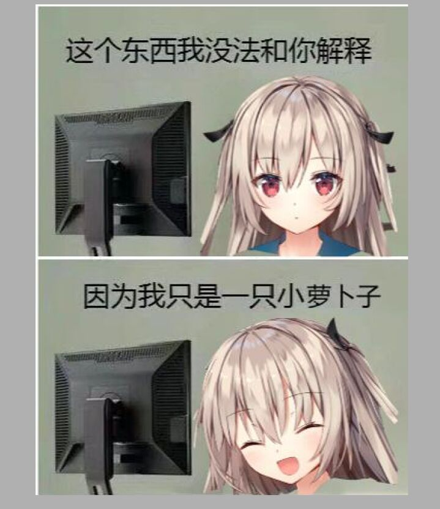

# 寒假学习计划

1、自学 [CMU 15-213](https://www.cs.cmu.edu/afs/cs/academic/class/15213-f15/www/schedule.html) 课程，并完成课程要求的相关lab

2、自学[计网](https://www.bilibili.com/video/BV1JV411t7ow/)

3、初步掌握java

4、[力扣](https://leetcode.cn/)Hot 100，争取用java实现

5、[洛谷题单](https://www.luogu.com.cn/training/9391)

# 第六学期学习计划(初步)

1、继续学[计网](https://www.bilibili.com/video/BV1JV411t7ow/)

2、[操作系统](https://pdos.csail.mit.edu/6.828/2021/schedule.html)

3、[数据库](https://15445.courses.cs.cmu.edu/fall2022/schedule.html)

4、大创，nlp




# 代码块测试

C++

```c++
#include<bits/stdc++.h>
typedef long long ll;
using namespace std;
const int _ = 2333;
int n, K;
int f[_], a[_];
bool check(ll mid){
	int cnt = n;
	for(int i = 2; i <= n; ++i){
		f[i] = i - 1;
		for(int j = 1; j < i; ++j){
			if(abs(a[i]-a[j]) <= (i - j) * mid)
				f[i] = min(f[i], f[j] + i - j - 1);
		}
		cnt = min(cnt, f[i] + n - i);
	}
	return cnt <= K;
}
int main(){
	ios::sync_with_stdio(0);
	cin.tie();
	cin >> n >> K;
	for(int i = 1; i <= n; ++i)
		cin >> a[i];
	ll l = 0, r = 2e9;
	ll ans=2e9;
	while(l <= r){
		ll mid = l + r >> 1;
		if(check(mid)) ans = mid, r = mid - 1;
		else l = mid + 1;
	}
	cout << ans;
	return 0;
}
```

java

```java
package com.goodnuaa;

import org.springframework.stereotype.Controller;
import org.springframework.web.bind.annotation.RequestMapping;
import org.springframework.web.bind.annotation.ResponseBody;

@Controller
public class MyController {

    @RequestMapping("/resp")
    @ResponseBody
    String resp(){
        return "Atri Kawaii";
    }
}
```

python

```python
from sklearn.preprocessing import StandardScaler, MinMaxScaler
from sklearn.model_selection import KFold, train_test_split
import numpy as np
from libsvm.svmutil import *

import read

def classify(param_str="-t 2 -c 1", scaler=None):
    # 读入、划分数据集
    X_array, y_array = read.getdata()
    X_train, X_val, y_train, y_val = train_test_split(X_array, y_array, test_size=0.3, random_state=42)

    # 标准化
    if scaler is not None:
        X_train = scaler.fit_transform(X_train)
        X_val = scaler.fit_transform(X_val)
    
    prob = svm_problem(y_train.tolist(), X_train.tolist())

    # 设置超参数
    param = svm_parameter(param_str)

    # SMO训练SVM
    model = svm_train(prob, param)

    print("\nvalid acc: ")
    labels, acc, vals = svm_predict(y_val.tolist(), X_val.tolist(), model)

    # print(acc)
    print("train acc: ")
    labels, acc, vals = svm_predict(y_train.tolist(), X_train.tolist(), model)

    # print(acc)

if __name__ == "__main__":

    # 选择归一化方式
    # scaler = MinMaxScaler()
    scaler = StandardScaler()
    # scaler = None

    classify(scaler=scaler)

```

