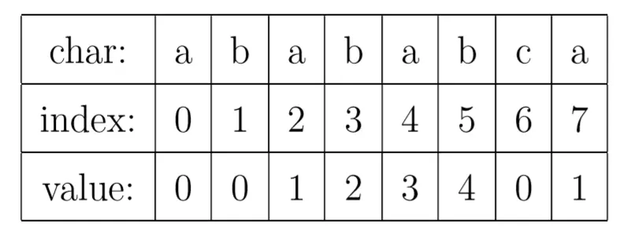

# kmp

kmp算法的核心是它可以求出一个字符串的部分匹配表数组（PMT）

$PMT_i$代表 $S_{0,i}$ 的最长公共前缀后缀的长度



例如字符串ababab，它的最长公共前缀后缀是abab，因此 $PMT_5=4$

kmp一个最常用的场景是字符串匹配，我们来看看PMT是怎么加速匹配的。

当匹配到模式串的第i位时，发现不匹配了，这时候我们可以令 i = PMT[i-1]继续匹配。可以证明这样跳是最优的，且不会遗漏情况。

为了方便编程，一般将PMT表向右移动一位，得到nxt数组。这样以后失配了就可以直接令i = nxt[i]就行了。

特别地，令nxt[0]=-1，这是为了编程方便：

```cpp
void kmp(string &s, string &t){
	int i = 0, j = 0;
	while(i < s.length()){
		if(j == -1 || s[i] == t[j]){
			++i; ++j;
			if(j == t.length()) printf("%d\n", i-j+1);
		}else j = nxt[j];
	}
}
```

j=-1的时候，++j就为0，代表最长前缀后缀为0

然后对于求nxt数组，可以认为是自己和自己作匹配。

只不过得从第一位开始匹配：

```cpp
void getNext(string &str){
	nxt[0] = -1;
	int i = 0, j = -1;
	while(i < str.length()){
		if(j == -1 || str[i] == str[j]){
			++i; ++j;
			nxt[i] = j;
		}else j = nxt[j];
	}
}
```

例题：https://www.luogu.com.cn/problem/P3375
