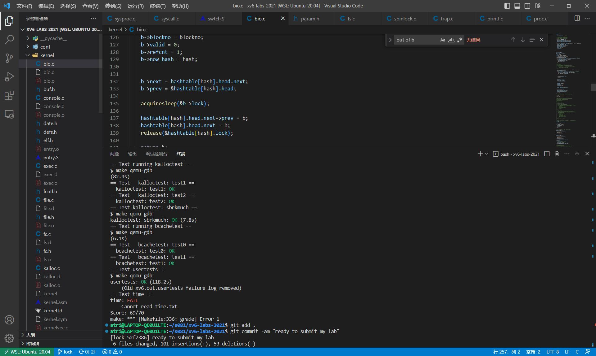

# xv6 lock lab

> 链接：https://pdos.csail.mit.edu/6.828/2021/labs/lock.html
>
> 2021和2020是一样的

xv6支持多线程并发。为了保证共享内存中数据的不变性（invariant），需要采用lock机制进行序列化。

但是xv6的内核内部中的一些机制中对lock的使用过于粗粒（coarse-grained），这会导致线程会浪费较多时间在spinlock的自旋上，因此该lab的任务就是细粒化一些功能中的lock机制。

## Memory allocator

xv6的内核维护了一个全局的page链表，内部存着尚未被分配的page的物理地址。对于请求/释放内存，xv6为整个链表维护了一个lock。

考虑到可能多个线程会同时请求/释放内存，而链表整体的lock则会序列化这些过程，无法发挥并发优势。因此该任务需要你来细粒化 `kalloc.c` 中的lock机制。

至于怎么细粒化，其实lab的提示已经给出：为每个CPU分配一个单独的链表，及其对应的lock。

所以直接把 `kmem` 改成数组：

```c
struct {
  struct spinlock lock;
  struct run *freelist;
} kmem[NCPU];
```

然后同时修改初始化函数 `kinit` ，该函数只在xv6启动的时候被一个CPU调用：

```c
void
kinit()
{
  for(int i = 0; i < NCPU; i++)
    initlock(&kmem[i].lock, "kmem");
  freerange(end, (void*)PHYSTOP);
}
```

我们考虑一下分配内存的过程。对于每个CPU对应的链表，如果链表为空，则需要从其它CPU的链表中偷取。

具体实现如下：

```c
void *
kalloc(void)
{
  struct run *r;
  uint cid;
  push_off();
  cid = cpuid();
  pop_off();

  acquire(&kmem[cid].lock);
  r = kmem[cid].freelist;
  if(r){
    kmem[cid].freelist = r->next;
    release(&kmem[cid].lock);
  }
  else{
    release(&kmem[cid].lock);
    for(int i = 0; i < NCPU; i++){
      if(i == cid) continue;
      acquire(&kmem[i].lock);
      r = kmem[i].freelist;
      if(!r){
        release(&kmem[i].lock);
        continue;
      }
      kmem[i].freelist = r->next;
      release(&kmem[i].lock);
      break;
    }
  }
  

  if(r)
    memset((char*)r, 5, PGSIZE); // fill with junk
  return (void*)r;
}
```

这里强调一下，无论是在xv6的lab，还是其它并发编程中（例如C++11内的 `std::mutex` ），我们都需要对每个lock规定其对应的**不变量**（invariant）。这个是很重要的，它关系到在设置获取和释放锁的时机，以及防止死锁。

例如本任务，对于每个CPU对应的链表，都有一个lock。因此我们规定该lock维护的不变量为**其对应的链表结构**。

因此，在发现执行CPU对应的链表为空时，我们就可以释放锁了，因为接下来的工作都对该链表没有任何关系。这种细微的细节应该也算是细粒化工作的重要部分。

然后考虑释放内存，只需要在对应CPU的链表加入元素即可：

```c
void
kfree(void *pa)
{
  struct run *r;
  uint cid;
  push_off();
  cid = cpuid();
  pop_off();

  if(((uint64)pa % PGSIZE) != 0 || (char*)pa < end || (uint64)pa >= PHYSTOP)
    panic("kfree");

  // Fill with junk to catch dangling refs.
  memset(pa, 1, PGSIZE);

  r = (struct run*)pa;

  acquire(&kmem[cid].lock);
  r->next = kmem[cid].freelist;
  kmem[cid].freelist = r;
  release(&kmem[cid].lock);
}
```

## Buffer cache

xv6在读/写硬盘IO时，会先检查内存是否存在对应的缓存（buffer cache）。如果存在则直接在缓存上执行操作，然后写入硬盘。

关于xv6在内存中对buffer cache的组织形式，事实上是一个双链表：

```c
// buf.h
struct buf {
  int valid;   // has data been read from disk?
  int disk;    // does disk "own" buf?
  uint dev;
  uint blockno;
  struct sleeplock lock;
  uint refcnt;
  struct buf *prev; // LRU cache list
  struct buf *next;
  uchar data[BSIZE];
  uint time_stamp; // lru time stamp
  int now_hash;  // hash number
};

// bio.c
struct {
  struct spinlock lock;
  struct buf buf[NBUF];

  // Linked list of all buffers, through prev/next.
  // Sorted by how recently the buffer was used.
  // head.next is most recent, head.prev is least.
  struct buf head;
} bcache;
```

可以发现似乎和上面那个链表似乎很像。但事实上该链表的元素本身也是个结构体 `buf` ，而不是单纯一个物理地址。

那么我们能不能沿用上个任务的idea，对每个CPU维护一个buffer cache link list呢？

根据lab中的提示，是不行的。给出的原因是每一个buffer cache应当被不同CPU的线程共享。

但是实际上是可以的，只不过我们需要换个角度来看。根据lab的提示，我们应当将原有的大链表进行分割，得到一系列小链表，然后在各自的小链表上并行化工作。

实质是一样的，都是**将一个拆分为多个**。

如何将block的编号与小链表对应呢？答案是采用哈希函数。这里根据lab，定义13（素数减少冲突概率）个小链表，然后直接将block编号对13取余得到哈希值。

首先，我们需要初始化：

```c
struct bucket{
  struct spinlock lock;
  struct buf head;
}hashtable[BUCKETCNT]; // 13

void
binit(void)
{
  struct buf *b;
  int i;

  initlock(&bcache.lock, "bcache");

  // // Create linked list of buffers
  // bcache.head.prev = &bcache.head;
  // bcache.head.next = &bcache.head;

  for(i = 0; i < BUCKETCNT; i++){
    initlock(&hashtable[i].lock, "bcache_hash");
    hashtable[i].head.prev = &hashtable[i].head;
    hashtable[i].head.next = &hashtable[i].head;
  }
  
  for(i = 0, b = bcache.buf; b < bcache.buf+NBUF; b++, i = (i + 1) % BUCKETCNT){
    b->next = hashtable[i].head.next;
    b->prev = &hashtable[i].head;
    initsleeplock(&b->lock, "buffer");
    hashtable[i].head.next->prev = b;
    hashtable[i].head.next = b;

    b->time_stamp = 0;
    b->now_hash = i;
  }
  
}
```

这里我将NBUF个buffer cache平均分配了。如果只分配到一个小链表上，则可能会加大冲突概率。

然后考虑我们如何获得buffer cache。我们首先在自己哈希值上的链表上找，如果没有则去其它小链表上轮换查找。

根据lab提示，我们采用lru策略。因此可以看到我上面给出的 `buf` 结构体相比于原有的结构体，多了时间戳 `time_stamp` 字段。

话不多说，直接上code：

```c
static struct buf*
bget(uint dev, uint blockno)
{
  struct buf *b;
  struct buf *lru=0;
  uint hash = blockno % BUCKETCNT;
  uint min_time_stamp = ticks + 114514;
  
  acquire(&hashtable[hash].lock);

  for(b = hashtable[hash].head.next; b != &hashtable[hash].head; b = b->next){
    if(b->dev == dev && b->blockno == blockno){
      b->refcnt++;
      release(&hashtable[hash].lock);
      acquiresleep(&b->lock);
      return b;
    }
  }

  // Not cached.
  // printf("ticks = %d\n", ticks);
  // for(b = bcache.buf; b < bcache.buf+NBUF; b++){
  //   if(b->refcnt == 0 && b->time_stamp <= min_time_stamp) {
  //     lru = b;
  //     min_time_stamp = b->time_stamp;
  //   }
  // }

  for(int i = (hash + 1) % BUCKETCNT; i != hash; i = (i + 1) % BUCKETCNT){
    acquire(&hashtable[i].lock);

    for(b = hashtable[i].head.next; b != &hashtable[i].head; b = b->next){
      if(b->refcnt == 0 && b->time_stamp < min_time_stamp) {
        lru = b;
        min_time_stamp = b->time_stamp;
      }
    }

    if(!lru) {
      release(&hashtable[i].lock);
      continue;
    }

    b = lru;
    b->next->prev = b->prev;
    b->prev->next = b->next;
    release(&hashtable[i].lock);


    b->dev = dev;
    b->blockno = blockno;
    b->valid = 0;
    b->refcnt = 1;
    b->now_hash = hash;


    b->next = hashtable[hash].head.next;
    b->prev = &hashtable[hash].head;

    acquiresleep(&b->lock);

    hashtable[hash].head.next->prev = b;
    hashtable[hash].head.next = b;
    release(&hashtable[hash].lock);

    return b;
  }
  // printf("min_time_stamp = %d\n", min_time_stamp);

  if(!lru)
    panic("bget: no buffers");
  return lru;
}
```

对于每个lock，我们规定它的不变量为：该lock对应双链表的结构，以及**链表内元素的本身结构**。

所以你可以发现，当我们从其余链表偷取一个 `cache` 时，我们先释放了其余链表的锁，然后等把该 `cache` 内部的值设置完成之后再释放当前hash值链表的锁。

在网上看到有些做法，访问全局变量 `ticks` 前需要 `acquire(&tickslock);` 。然而实测是不需要的。

最后考虑一下释放的操作：

```c
void
brelse(struct buf *b)
{
  if(!holdingsleep(&b->lock))
    panic("brelse");

  releasesleep(&b->lock);

  acquire(&hashtable[b->now_hash].lock);
  b->refcnt--;
  if (b->refcnt == 0) {
    // no one is waiting for it.
    b->time_stamp = ticks;
  }
  release(&hashtable[b->now_hash].lock);
}
```

可以发现，由于我们规定了lock的不变量，这里我们上的锁就是哈希值对应的锁。（即lock维护`b->refcnt` 等不变量）

同时，我们需要修改一下其余函数：

```c
void
bpin(struct buf *b) {
  // printf("!!!\n");
  acquire(&hashtable[b->now_hash].lock);
  b->refcnt++;
  release(&hashtable[b->now_hash].lock);
}

void
bunpin(struct buf *b) {
  acquire(&hashtable[b->now_hash].lock);
  b->refcnt--;
  release(&hashtable[b->now_hash].lock);
}
```

虽然该lab并没有指出这些函数，但在usertests中是有调用的。事实上函数 `bpin` 的作用是强制一个buffer cache不被 `brelse` 掉，这在更新 log block 对应的block时有用到。

最后贴一张完成的图：


