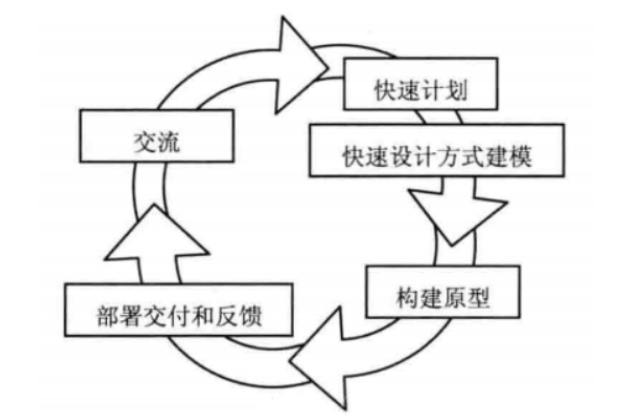
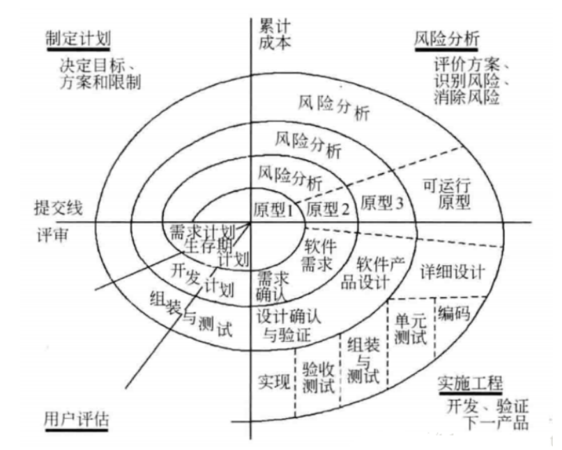
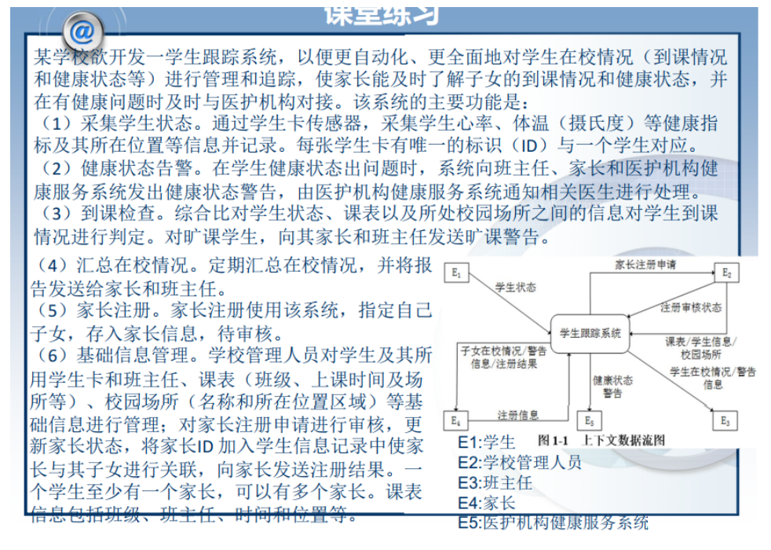
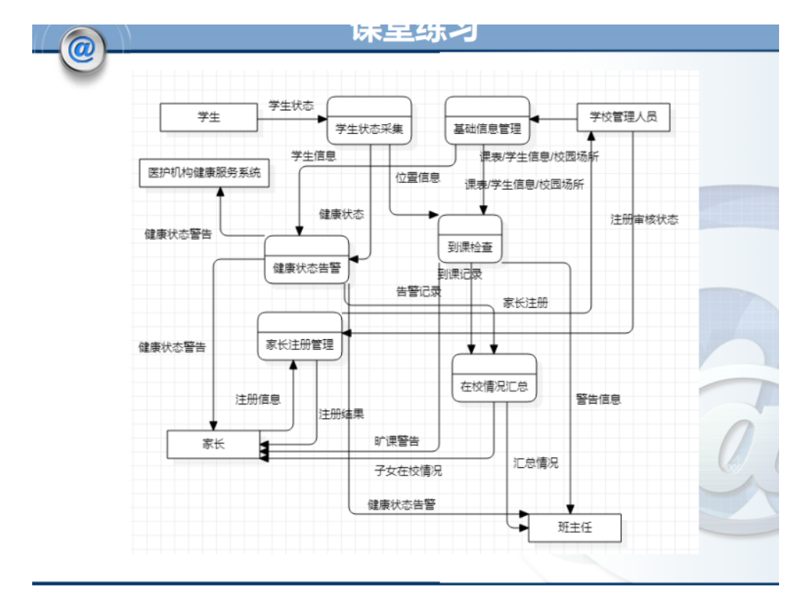

> 前面几章就是文科啦，应该不是重点

## 第一章 软件工程基础

**软件工程的定义**：

1. 应用系统的、规范的、可量化的方法来开发、运行和维护软件，即将工程应用到软件
2. 对1中各种方法的研究

## 第二章 软件工程的发展

1950s-2000s软件工程的特点

1950s：科学计算；以机器为中心进行编程；像生产硬件一样生产软件

1960s：业务应用（批量数据处理和事务计算）；软件不同于硬件；用软件工艺的方式生产软件

1970s：结构化方法；瀑布模型；强调规则和纪律

1980s：追求生产力最大化；现代结构化方法/面向对象编程广泛应用；重视过程的作用

1990s：企业为中心的大规模软件系统开发；追求快速开发、可变更性和用户价值；Web应用出现

2000s：大规模Web应用；大量面向大众的Web产品；追求快速开发、可变更性和用户价值和创新

- 瀑布模型：

将软件生命周期中的各个活动规定为线性连接的模型，包括需求分析、设计、编码、测试、维护等，相邻的步骤之间相互衔接，强调一个阶段结束后对其制品进行验证和检验。优点：容易理解，管理成本低，强调开放的阶段性早期计划和产品测试 缺点：客户必须能够完整、正确和清晰地描述他的需要，开始阶段难以评估项目进度，项目结束后会出现大量集成和测试工作，需求或设计中的错误往往只有到了项目后期才被发现（对风险的控制能力较弱）

- 演化模型：迭代的过程，适用于软件需求缺乏准确认识的情况

  - 原型模型：

  是预期系统的一个可执行版本，反映的是系统性的一个选定子集，一个原型不必满足目标软件的所有约束。

  

  原型模型开始于沟通，其目的是定义软件的总体目标，标识需求，然后快速制定原型开发的计划，确定原型的目标和范围，采用快速设计的方式对其进行建模，并构建原型。

  可将原型分为三种：1、探索性原型：目的是弄清目标的需求，确定所希望的特性，并探讨多种方案的可能性；2、实验性原型：目的是验证方案或算法的合理性，是在大规模开发前，用于考察方案是否可靠的方法；3、演化性原型：将原型作为目标系统的一部分，通过多次改进，逐步演化为最终的目标系统。

  - 螺旋模型：将瀑布模型和演化模型相结合。螺旋模型将开发过程分为几个螺旋周期，每个螺旋周期大致和瀑布模型相符合：

  

  螺旋模型强调风险分析，使得开发人员和用户对每个演化层出现的风险有所了解。

- 敏捷开发：应对快速变化的需求的一种软件开发方法，更强调程序员团队和专家之间的紧密协作、面对面沟通、频繁地交互新的软件版本、紧凑而自我组织型的团队、能够很好地适应需求变化的代码编写和团队组织方法。适用于团队规模较小的队伍。

## 第四章 项目管理基础

### 团队结构

（1）主程序员团队

特点：主程序员负责领导团队，效率较高，最大限度地保证产品不同元素的一致性

局限：主程序员的能力是瓶颈；团队成员无法发挥主动性，积极程度不高

（2）民主团队

特点：每个成员都可以发挥自己的能动性，所有人都可以在自己擅长的领域工作

局限：花费在交流，统一思想上的时间成本太大，效率较低

（3）开放团队

特点：使用黑箱管理方式，团队内部的交流路径是不可见的，所有成员按照自己的方式进行自我管理，最大发挥团队成员的创新能力

局限：项目进展没有可视度

### 团队的建设措施

- 建立团队章程
- 持续成功（项目的整体成功，项目的阶段性成功，也可以是无关的团队活动的成功）
- 和谐沟通
- 避免团队杀手

### 质量保障活动

- 需求评审
- 体系结构评审
- 详细设计评审
- 代码评审
- 需求度量
- 设计度量
- 代码度量
- 测试度量
- 集成测试

**题目**：结合实验，说明一个项目的质量保障包括哪些活动？

### 配置管理活动

- 标识配置项
  - 首先要确定有哪些配置项需要被保存和管理，其次要给配置项确定标识，设置唯一的ID，最后要说明配置项的特征，包括生产者、基线建立时间、使用者等
- 版本管理
  - 为每一个刚纳入配置管理的配置项赋予一个初始的版本号，并在发生变更的时候更新版本号
- 变更控制
  - 已经纳入配置管理中的配置项发生变化时，需要根据变更控制过程进行处理
- 配置审计
  - 目标是确定一个项目满足需求的功能和物理特征的程度，确保软件开发工作按照需求和设计特征进行，验证配置项的完整性、正确性、一致性和可跟踪性
- 状态报告
  - 标识、收集和维持演化中的配置状态信息，也就是对在动态演化着的配置项信息及其度量取快照
- 软件发布管理
  - 将软件配置项发布到开发活动之外，例如发布给客户

## 第五章 软件需求基础

### 需求

（1）用户为了解决问题或达到某种目标所需要的条件和能力

（2）系统或系统部件为了满足合同、标准、规范或其它正式文档所规定的要求而需要具备的条件或能力

（3）对（1）或（2）中的一个条件或一种能力的一种文档化表述

### 需求的层次性

- 业务需求：描述了组织为什么要开发系统（目标）
- 用户需求：描述了系统能够帮用户做些什么（任务）
- 系统级需求：描述了开发人员需要实现什么（系统行为）

### 需求分类

- 功能需求：和系统主要工作相关的需求，即不考虑物理约束的情况下，用户希望系统所能执行的活动
- 性能需求：定义了系统必须多快、多好地去完成专门的功能
- 质量属性：可靠性、可用性、安全性、可维护性、可移植性、易用性
- 对外接口：系统和环境中其它系统之间需要建立的接口（用户界面、硬件接口、软件接口、网络通信接口等）
- 约束：进行系统构造时，需要遵守的约定（编程语言、硬件设施）
- 数据需求（不是标准的需求类别，是功能需求的补充）：通常描述数据库等存储介质

## 第六章 需求分析方法

> 怎么画用例图、概念类图

### 结构化方法

#### 数据流图（DFD）

- 外部实体：待构建软件系统之外的实体，它们不受系统的控制。它们作为软件系统的**数据源**或**数据目的地**。
- 过程：指施加于数据的动作或者行为，它们使得数据发生变化，**必须有输入和输出，且二者应存在差异**。
- 数据流：指数据的运动。DFD的数据流**必须要和过程产生关联**。
- 数据存储：软件系统需要在内部保存供以后使用的数据集合。

练习（谢谢blackbird宝宝！）：

### 面向对象分析方法

> 主要采用统一建模语言（UML）技术。

#### 用例图（P94）

- 用例：用例模型中最重要的元素，使用一个水平的椭圆表示。
- 参与者：一个小人，代表同系统进行交互的角色。

#### 概念类图（P98）

- 对象：对具体问题域事物的抽象。
  - 标识符：使用对象的引用作为标识符，用以唯一地标识和识别对象。
  - 状态：对对象的**特征描述**，包括对象的属性和属性的取值。
  - 行为：对象在其状态改变或者接收到外界消息时所采取的行动。
- 类：对对象分类思想的结果，是共享相同属性和行为的对象的集合，为属于该类的对象提供统一的描述。
- 链接：对象之间互相合作的关系
- 关联：类之间的关系
  - UML使用类（对象）之间的直线来表示关联（链接），它可以是单向的和双向的。
  - 聚合：表示部分与整体之间的关系（如商品列表与商品），在“整体”的关联端使用空心菱形来表示。
  - 组合：更强的聚合，部分相对于其整体无法单独存在，整体对该部分有完全的管理职责。
- 继承：用三角形箭头的实线表示，子类->父类。

建立概念类图：

- 对每个用例文本描述，建立局部的概念类图
  - 识别候选类
  - 确定概念类
  - 识别关联
  - 识别重要属性
- 合并局部概念类图，建立软件系统的整体概念类图
- 识别关联
- 识别重要属性

练习：P100-104 //不是哥们，这玩意太难了

> 有空的话可以画一画课后习题

**题目**：给一段材料，要求建立用例模型，画出各种图

## 第七章 需求文档化与验证

### 为什么要进行需求规格说明

需求规格说明文档是项目交流的最重要内容，众多开发人员都需要以其为基础进行工作。如果软件需求规格说明文档存在错误，那么会给后续开发工作带来很多问题，再修复的代价就会很高。

### 对给定的需求示例，判定并修正其错误

- 使用用户术语
  - 对用户易读，不要使用计算机术语
- 可验性
  - 描述模糊或过于抽象的需求都是不可验证的（如：用户查询的界面应该友好，不可验证；用户完成查询时鼠标点击不超过五次，可验证）
- 可行性
  - 系统必须每周7天，每天24小时可用（显然不可行）

### 对给定的需求示例，设计功能测试用例

> 看书

写输入，写出预期输出，中间再做一些说明

## 第八章 软件设计基础

### 软件设计

是关于整个软件对象的设计。软件设计既指软件对象实现的规格说明，也指产生这个规格说明的过程。

### 软件设计的核心思想

抽象和分解

抽象是在纵向上聚焦各子系统的接口。这里的接口和实现相对，是各子系统之间交流的契约，是整个系统的关键所在。抽象可以分离接口和实现，让人更好地关注系统本身，从而降低复杂度

分解是在横向上将系统分割为几个相对简单的子系统以及各子系统之间的关系。分解之后每次只需要关注经过抽象的相对简单的子系统及其相互间的关系，从而降低复杂度

### 软件设计的分层

高层：基于反映软件高层抽象的构建层次，描述系统的高层结构、关注点和设计决策

中层：更加关注组成构建的模块的划分、导入/导出、过程之间的调用关系或者类之间的协作

低层：深入模块和类的内部，关注具体的数据结构、算法、类型、语句和控制结构等

## 第九章 软件体系结构基础

### 体系结构的概念

软件体系结构 = {部件、连接件、配置}

- 部件是软件体系结构的基本组成单位之一，承载系统的主要功能，包括处理与数据
- 连接件是软件体系结构的另一个基本组成单位，定义了部件的交互，是连接的抽象表示
- 配置是对形式的发展，定义了部件以及连接件之间的关联方式，将它们组织成系统的总体结构

### 体系风格的优缺点

主程序/子程序：

- 优点：
  - 流程清晰，易于理解（符合分解和分治的思想）
  - 强控制性（很容易保证正确性）
- 缺点：
  - 程序调用是一种强耦合的连接方式，非常依赖交互方的接口规格，这会使系统难以修改和复用
  - 程序调用的连接方式限制了各部件之间的数据交互，可能会使不同部件使用隐含的共享数据交流，产生不必要的公共耦合，进而破坏它的“正确性”控制能力

面向对象式：

- 优点：
  - 内部实现的可修改性（隐藏内部实现）
  - 易开发、易理解、易复用的结构组织（契合模块化思想）
- 缺点：
  - 接口的耦合性（由于方法调用机制，接口的耦合性无法消除）
  - 标识的耦合性（一个对象要和其它对象交互，必须知道标识）
  - 副作用（难以实现程序的“正确性”）

分层：

- 优点：
  - 设计机制清晰，易于理解（抽象层次分离，隔离复杂度）
  - 支持并行开发（层次之间遵守成熟稳定的接口）
  - 更好的可复用性和可修改性（接口的稳定性，不同层次的部件能够相互替换）
- 缺点：
  - 交互协议难以修改（可能需要改变所有的层次，接口具有强耦合性）
  - 性能损失（禁止跨层调用）
  - 难以确定层次数量和粒度

MVC：

- 优点：
  - 易开发性（分别抽象了业务逻辑，表现和控制机制清晰，易于开发）
  - 视图和控制的可修改性（一个模型可以同时建立并支持多个视图）
  - 适宜于网络系统开发的特征
- 缺点：
  - 复杂性（不利于理解任务实现）
  - 模型修改困难（视图和控制均依赖于模型）

## 第十章 软件体系结构设计与构建

### 体系结构的设计过程

（1）分析关键需求和项目约束

（2）选择体系结构风格

（3）进行软件体系结构逻辑（抽象）设计

（4）依赖逻辑设计进行软件体系结构物理（实现）设计

（5）完善软件体系结构设计

（6）定义构件接口

（7）迭代过程（3）到（6）

### 包设计原则

- 共同封闭原则（CCP）：一起改的类应该在一起
- 共同重用原则（CRP）：一起重用的包应该放在一起
- 重用发布等价原则（REP）：重用的单元就是发布的单元
- 无环依赖原则（ADP）：包的依赖结构是一个有向无环
- 稳定依赖原则（SDP）：依赖关系应该随着稳定的方向
- 稳定抽象原则（SAP）：稳定包应该是抽象包，不稳定包是具体包

### 体系结构构件之间接口的定义

书P174

能够根据用例写出某层的接口，需求分配的过程

### 体系结构开发集成测试用例

书P177

桩：在软件测试里用来替换某些模块的，模仿下层模块，测试上层

驱动：模仿上层模块，测试下层

## 第十一章 人机交互设计

### 可用性

书上叫易用性（usability）

可用性分为五个维度：

- 易学性：新手用户容易学习，能够很快使用系统
- 易记性：以前使用该软件的用户，能够有效记忆或者快速重新学会使用
- 效率：熟练用户能够高效地完成任务
- 出错率：用户使用系统时，会犯多少错，错误有多严重，以及能够从错误中很容易地恢复
- 主观满意度：让用户有良好的体验

### 人机交互设计原则

- 简洁设计：图片比描述文字更清晰
- 一致性设计：相似的任务，一致的交互机制
- 低出错率：帮助用户避免犯错
- 易记性设计：历史记录

题目：给你几张图，分析体现或违反了哪些人机交互原则，详细解释

### 精神模型、差异性

书P185-186

精神模型：用户在进行人机交互时头脑中的人物模型

差异性：不同的用户群体，差异化的交互机制

### 导航、反馈、协作式设计

导航：目的是为用户提供一个很好的完成任务的入口

反馈：让用户意识到行为的结果（声音、效果）

协作式设计：调整计算机因素以便更好地适应并帮助用户的设计方式

## 第十二章 详细设计的基础

### 详细设计的出发点

以需求开发的结果（需求规格说明和需求分析模型）和软件体系结构的结果（软件体系结构设计方案与原型）为出发点

书P197、建造桥梁

### 协作

抽象对象之间的协作

- 从小到大，将对象的小职责聚合成大职责
- 从大到小，将大职责分配给小对象

上面两种方法一般同时运用，共同来完成对协作的抽象。

### 控制风格

选择合适的控制风格：

- 为了完成某一个大的职责，需要对职责的分配做很多决策，控制风格决定了决策由谁来做和怎么做
- 逻辑层的接口依据需求来创建
- 分散式
- 集中式
- 委托式（授权式）

### 建立设计类图

P203，注意表12-2

### 建立详细顺序图

P206，表12-3

题目：给出用例描述，用集中控制的方式画出设计类图和顺序图

### 协作的测试

Mock Project：类间协作的桩程序

## 第十三章 详细设计中的模块化与信息隐藏

> 重点

### 结构化设计中的耦合 

耦合：描述两个模块间关系的复杂程度

分类（耦合性从高到底）：

- 内容管理：一个模块直接修改或者依赖于另一个模块的内容（goto）
- 公共耦合：模块间共享全局的数据（全局变量）
- 重复耦合：模块间有同样逻辑的代码
- 控制耦合：一个模块给另一个模块传递控制信息
- 印记耦合：共享了一个数据结构，但是却只用了其中一部分（传了整个记录，只需要一个字段）
- 数据耦合：两个模块的所有参数是同类型的数据项（传一个整数给一个计算平方根的函数）

> 前三个耦合是不可接受的。

### 结构化设计中的内聚

内聚：一个模块内部的联系的紧密性

分类（从低到高）：

- 偶然内聚：模块执行多个完全不相关的操作
  - 修车、烤面包、遛狗、看电影
- 逻辑内聚：模块执行一系列相关操作，每个操作的调用由其它模块决定
  - 开车去上撤硕，坐火车上厕所
- 时间内聚：模块执行一系列有关**时间**的操作
  - 起床刷牙洗脸吃南航
- 过程内聚：模块执行一系列与**步骤顺序**有关的操作
  - 返校：院系经办人审核、院系领导审核、校职能部审核
- 通信内聚：模块执行一系列与步骤顺序有关的操作，并且这些操作在相同的数据上进行
  - 查书的名字、查书的作者、查书的出版商
- 功能内聚：模块只执行一个操作或达到单一目的
  - 只计算平方根
- 信息内聚：模块进行许多操作，各有各的入口点，每个操作的代码相对独立，所有操作都是在相同的数据结构上完成
  - 栈（push pop等）

### 信息隐藏的基本思想

每个模块都隐藏着一个重要的设计决策，每个模块都承担一定的职责。对外表现为一份契约，并且在这份契约之下隐藏着只有这个模块知道的设计决策或者秘密，决策实现的细节（特别是容易改变的细节）只有模块自己知道。

### 两种常见的信息隐藏决策

- 根据需求分配的职责
- 内部实现机制

## 第十四章 详细设计中面向对象方法下的模块化

### 模块化设计原则

1. 不要用全局变量
2. 显式（explicit），显示的清楚一点，内容明确（代码写清楚点？？？）
3. 不要有代码重复
4. 针对接口编程
5. 迪米特法则
6. 接口分离原则（ISP）
7. 里氏替换原则
8. 使用组合代替继承
9. 单一职责原则（SRP）

题目：给个例子，找出其违反的原则并进行修正。

### 访问耦合

类A拥有对类B的引用，则A可以访问B，存在耦合

分类（从高到低）：

- 隐式访问：B既没有在A的规格中出现，也没有在实现中出现（连续的方法调用，方法套娃）
- 实现中访问：B的引用是A方法中的局部变量
- 成员变量访问：B的引用是A的成员变量
- 参数变量访问：B的引用是A的方法的参数变量
- 无访问：理论最优，无关联耦合，维护时不需要对方任何信息

降低访问耦合的方法：

- 针对接口编程
- 接口最小化/接口分离原则
- 访问耦合的合理范围/迪米特法则

### 继承耦合

继承里，父类和子类之间存在耦合

类型（从高到低）

- 修改
  - 规格：子类修改继承回来的方法的接口
  - 实现：子类修改继承回来的方法的实现
- 精化：
  - 规格：子类根据定义好的规则来修改父类的方法，且至少有一个方法的接口被改动
  - 实现：子类根据定义好的规则来修改父类的方法，但是只改动了方法的实现
- 扩展：子类只增加新的方法和成员变量，不对从父类继承回来的成员做任何修改
- 无：两个类之间没有继承关系

降低继承耦合的方法：

- 里氏替换原则
- 使用组合代替继承

### 内聚

分类

- 方法内聚：和结构化中的函数内聚一致，体现方法实现时语句之间的内聚性
- 类的内聚：衡量类的成员变量和方法之间的内聚
- 继承内聚：继承树中类之间的内聚

提高内聚的方法：

- 集中信息与行为
- 单一职责原则

## 第十五章 详细设计中面向对象方法下的信息隐藏

### 信息隐藏的含义

- 封装类的职责，隐藏职责的实现
- 预计将会发生的变更，抽象它的接口，隐藏内部实现机制

### 封装

分离接口和实现

含义：

- 将数据和行为同时包含在类中
- 分离对外接口与内部实现

实现细节：

- 封装数据与行为
- 封装内部结构
- 封装其它对象的引用
- 封装类型信息
- 封装潜在变更

### 开闭原则（OCP）

是面向对象设计的一个指导性、方阵性原则

具体内容：

- 好的设计应该对扩展开放
- 好的设计应该对修改关闭

简单来说，发生变更时，好的设计只需要添加新的代码，而不需要修改原有的代码

### 依赖倒置原则（DIP）

内容：

- 抽象不应该依赖于细节，细节应该依赖于抽象。因为抽象是稳定的，细节是不稳定的。
- 高层模块不应该依赖于低层模块，而是双方都依赖于抽象。因为抽象是稳定的，而高层模块和低层模块都可能是不稳定的。

题目：给张类图，问运用了或违反了哪条面向对象设计原则？问某个类是什么内聚？

## 第十六章 详细设计的设计模式

### 如何实现可修改性、可扩展性、灵活性

实现接口和实现分离

- 通过接口和实现该接口的类完成分离
- 通过子类继承父类，将父类的接口与子类的实现分离

> 代码

### 策略模式

减少耦合、依赖倒置

### 抽象工厂模式

职责抽象、接口和重用

### 单例模式

职责抽象

### 迭代器模式

减少耦合、依赖倒置

题目：给定场景，应用设计模式并写出代码；给出代码，要求用设计模式改写

## 第十七章 软件构造

### 构造包含的活动

详细设计、编程、测试、调试、代码评审、集成与构建、构造与管理

### 名词解释

重构、测试驱动开发、结对编程

## 第十八章 代码设计

### 给定代码段示例，对其进行改进或者发现其中的问题

- 简洁性/可维护性
- 使用数据结构消减复杂判定
- 控制结构
- 变量的使用
- 语句处理
- 如何写不可维护的代码
- 防御和错误处理

### 单元测试用例的设计

- 基于规格的测试技术开发测试用例，等价类划分和边界值分析
- 基于代码的测试技术开发测试用例，关键复杂代码：路径覆盖；复杂代码：分支覆盖；简单代码：语句覆盖

### 表驱动编程

if-else —> 一张表

### 契约式设计

断言式设计

基本思想：如果一个函数和方法，在前置条件满足的情况下开始执行，完成后能够满足后置条件，那么这个函数或方法就是正确、可靠的

常见方式：异常和断言（assert）

检查很多外来信息的有效性：

- 输入参数，是否合法
- 用户输入，是否有效
- 外部文件，是否存在
- ...

### 防御式编程

基本思想：在一个地方与其它方法、操作系统、硬件等外界环境交互时，不能确保外界都是正确的，所以要在外界发生错误时，保护内部方法不受损害

## 第十九章 软件测试

单元测试、集成测试、系统测试

### 黑盒测试

基于规格的技术，把测试对象看作一个黑盒子，完全基于输入和输出来判定测试对象的正确性。测试使用测试对象的规格说明来设计输入和输出数据

常见方法：

- 等价类划分（把输入按照等价类划分，包括有效和无效）
- 边界值分析
- 决策表（表驱动）
- 状态转换

### 白盒测试

基于代码的技术，将测试对象看成透明的，不关心测试对象的规格，而是按照测试对象内部的程序结构来设计测试用例进行测试工作

方法：

- 语句覆盖：确保被测试对象的每一行程序代码都至少执行一次
- 条件覆盖：确保程序中每个判断的每个结果都至少满足一次
- 路径覆盖：确保程序中每条独立的执行路径都至少执行一次

题目：

白盒测试和黑盒测试的常见方法，并比较优缺点

能解释并区别白盒测试的三种不同的方法

给出一个场景，判断应该使用哪种测试方法，如何去写

- 给出功能需求——写功能测试用例
- 给出设计图——写集成测试用例、Stub和Driver
- 给出方法描述——写单元测试用例、Mock Project
- JUnit的使用

## 第二十章 软件交付

### 用户文档和系统文档

## 第二十一章 软件维护与演化

### 如何理解软件维护的重要性

修改代价

### 开发可维护软件的方法

- 考虑软件的可变更性
  - 分析需求的易变性
  - 为变更进行设计
- 为降低维护困难而开发
  - 编写详细的技术文档并保持及时更新
  - 保证代码的可读性
  - 维护需求跟踪链
  - 维护回归测试基线

### 软件演化生命周期模型

初步开发、演化、服务、逐步淘汰、停止

### 逆向工程、再工程

## 第二十二章 软件开发过程模型

### 软件生命周期模型

1. 需求工程
2. 软件设计
3. 软件实现
4. 软件测试
5. 软件交付
6. 软件维护

对给定场景，判断适用的开发过程模型（要求、特征描述、优缺点）

> 补充？

### 瀑布模型

对于软件开发活动有明确阶段划分，每个阶段的结果都必须验证，使得该模型是“文档驱动”

优点：对于软件开发活动有明确的阶段划分，有利于开发者以关注点分离的方式更好地进行复杂软件项目的开发

缺点：

- 对文档期望过高
- 对开发活动的线性顺序假设具有局限性
- 客户、用户参与度具有局限性
- 里程碑力度过粗（软件复杂使得每个阶段时间长，无法尽早发现缺陷）

适用性：

- 需求非常成熟、稳定，没有不确定的内容，也不会发生变化
- 所需的技术成熟，可靠，没有不确定的技术难点，也没有开发人员不熟悉的技术问题
- 复杂度适中，不至于产生太大的文档负担和过粗的里程碑

### 螺旋模型

风险驱动

风险：指因为不确定性（对未来知识了解有限）而可能给项目带来损失的情况

基本思想：尽早解决比较高的风险，如果有些问题实在无法解决，那么早发现比项目结束时再发现要更好，至少损失会小很多

优点：降低风险，减少因风险而造成的损失

缺点：

- 使用原型方法，为自身带来风险
- 模型过于复杂，不利于管理者依据其组织软件开发活动

适用性：高风险的大规模软件系统开发

