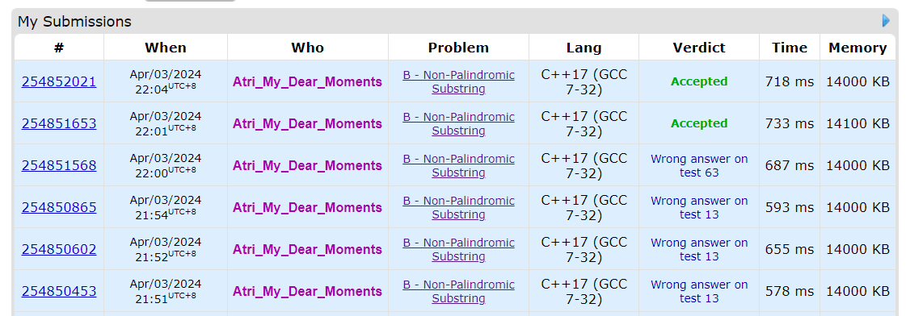

# 字符串哈希

将字符串转换为一个哈希值，从而判断两个字符串是否相同。

模板：

```cpp
#include<bits/stdc++.h>
typedef long long ll;
typedef unsigned long long ull;
using namespace std;
const int P = 131;
const int _ = 1510;
ull p[_], h[_];
int n;
char s[_];
void init(){
	p[0] = 1, h[0] = 0;
	for(int i = 1; i <= n; i++){
		p[i] = p[i-1] * P;
		h[i] = h[i-1] * P + s[i];
	}
}

ull get(int l, int r){
	return h[r] - h[l-1] * p[r-l+1];
}

bool substr(int l1, int r1, int l2, int r2){
	return get(l1, r1) == get(l2, r2);
}
```

上面是P取131或13331，然后模数采用 `unsigned long long` 的自动溢出机制。

练习题：[https://codeforces.com/contest/1943/problem/B](https://codeforces.com/contest/1943/problem/B)。div1的B，难度为2000，中等难度。

这题的重点实际上并不在于字符串哈希，而是在于判 aaa 和 ababa 这种情况。

但是对于整个子串的情况，需要特别判断是否为回文串。

如果你采用上述的哈希方式，你会发现你WA了。原因自然是哈希冲突。

然后我试了很多组 P 和 MOD，最后终于得到了一个不冲突的方案（2333和998244853）：

```cpp
#include<bits/stdc++.h>
typedef long long ll;
typedef unsigned long long ull;
using namespace std;
const int P = 2333;
const int _ = 200010;
const ull mod = 998244853;
ull p[_], h[_], hh[_];
int n, q;
string s;
set<int> even, odd;
void init(){
	p[0] = 1, h[0] = hh[0] = 0; even.clear(); odd.clear();
	for(int i = 1; i <= n; i++){
		p[i] = p[i-1] * P % mod;
		h[i] = h[i-1] * P + s[i-1]; h[i] %= mod;
		hh[i] = hh[i-1] * P + s[n-i]; hh[i] %= mod;
		if(i < n && s[i-1] != s[i]) odd.insert(i);
		if(i < n - 1 && s[i-1] != s[i+1]) even.insert(i);
	}
}

ull geth(int l, int r){
	return (h[r] - h[l-1] * p[r-l+1] % mod + mod) % mod;
}
ull gethh(int l, int r){
	int rr = n - l + 1, ll = n - r + 1;
	return (hh[rr] - hh[ll-1] * p[rr-ll+1] % mod + mod) % mod;
}

int main(){
	ios::sync_with_stdio(0);
	cin.tie();
	int T; cin >> T;
	while(T--){
		cin >> n >> q;
		cin >> s;
		init();
		while(q--){
			int l, r;
			cin >> l >> r;
			int len = r - l + 1;
			ll ans = 0;
			if(geth(l, r) != gethh(l, r)) ans = len;
			auto it = odd.lower_bound(l);
			auto it2 = even.lower_bound(l);
			if(it == odd.end() || (*it) >= r){
				;
			}else{
				if(it2 == even.end() || (*it2) >= r - 1)
					ans += 1ll * (len - 1) / 2 * ((len - 1) / 2 + 1);
				else
					ans += 1ll * (len - 1) * len / 2 - 1;
			}
			cout << ans << '\n';
		}
	}
	return 0;
}
```



事实说明哈希冲突还是很玄学的。因此需要考虑更好的判回文串的方式：Manacher。

有空再写！