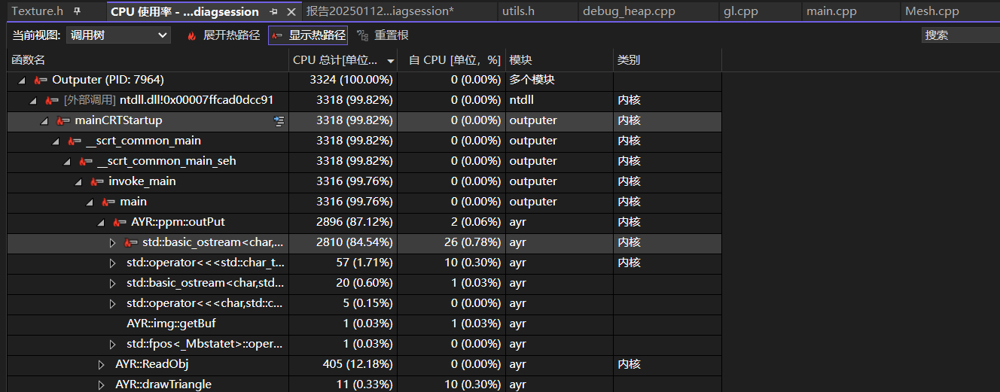

# 每周总结#3

## 游戏引擎

跟了个油管的博主，动手实现自己的game engine。

### premake.lua

一个构建系统，相对cmake简单许多。

`links` ：这个命令是我一开始不太清楚的。因为在我们的解决方案中，我们实际上将游戏引擎和Sandbox作为两个项目，让游戏引擎engine这个项目的最终文件是个动态链接库（windows是.dll），运行时和sandbox生成的.exe文件放在一块。

事实上如果用premake构建vs项目，links其实是对于一个项目创建了另一个项目的引用，而不是链接了一些库。引用是告诉链接器，某些符号是可以使用的，但是它的具体实现在dll文件里（因此有必要运行一些复制dll到指定路径的命令）。

`defines`：定义一些宏，这些宏在对应的项目中可以使用。

例如针对dll的导出导入符号：

```cpp
#ifdef E_PLATFORM_WINDOWS
	#ifdef E_BUILD_DLL
		#define E_API __declspec(dllexport)
	#else
		#define E_API __declspec(dllimport)
	#endif
#else
	#error only windows!
#endif
```

我们可以在构建文件中，针对设备的系统，以及项目，定义一些特定的宏。

### 事件系统

目前的Event System都是Block的，就是对于事件的执行都是立刻的，会阻塞当前线程。

考虑如何设计，首先我们很容易想到用enum或enum class来设置事件的种类，类型。

然后设置Event基类，后续具体的事件继承这个类：

```cpp
class E_API Event
{
	friend class EventDispatcher;
public:
	virtual EventType GetEventType() const = 0;
	virtual const char* GetName() const = 0;
	virtual int GetCategoryFlags() const = 0;
	virtual std::string ToString() const { return GetName(); }

	inline bool IsInCategory(EventCategory category)
	{
		return (GetCategoryFlags() & category);
	}
private:
	bool m_Handled = false;
};
```

由于事件很多，对于每一个子类都要重写方法很累，因此有个比较骚的操作就是将重写的内容用宏替代：

```cpp
#define EVENT_CLASS_CATEGORY(category) virtual int GetCategoryFlags() const override { return category; }

#define EVENT_CLASS_TYPE(type) static EventType GetStaticType() { return EventType::##type; } \
								virtual EventType GetEventType() const override { return GetStaticType(); } \
								virtual const char* GetName() const override { return #type; }
```

> EventType::##type 中的 ## 是预处理操作符，用于将宏参数 type 与 EventType:: 连接起来。例如，如果 type 是 Mouse，那么 EventType::##type 就会被展开为 EventType::Mouse。 return #type; 中的 # 是字符串化操作符，将宏参数转换为字符串。如果 type 是 Mouse，那么 #type 就会被展开为 "Mouse"。

然后在类里面根据具体事件类型进行宏展开。

事件分发器，这个东西负责将其对应的事件传到某个函数进行执行：

```cpp
class EventDispatcher
{
	template<typename T>
	using EventFn = std::function<bool(T&)>;
public:
	EventDispatcher(Event& event)
		: m_Event(event)
	{
	}

	template<typename T>
	bool Dispatch(EventFn<T> func)
	{
		if (m_Event.GetEventType() == T::GetStaticType())
		{
			m_Event.m_Handled = func(*(T*)&m_Event);
			return true;
		}
		return false;
	}
private:
	Event& m_Event;
};
```

`std::function` 我并不是很熟悉（虽然见过好多次了），暂且将其理解为函数指针。然后对于这里强制转换：`func(*(T*)&m_Event)`，个人认为没有什么必要？

由于还没使用到事件分发器，这里先略过。

## 软光栅

使用类似engine的设计思路，将渲染器的主体封装成dll，给具体的系统（前端233）作为运行时库调用。我目前希望能够跨平台（虽然现在只知道在windows下是用dll进行符号传递），所以采用了premake作为构建系统，然后不调win32。

目前完成了：

- I/O
  - obj导入
  - 贴图导入
  - ppm形式输出
- gl
  - 画线
  - 画三角形
  - Z-buffer

> 大部分时间都在调bug吧，今天调了一上午bug，发现是重心坐标公式抄错了。然后CursorAI把width和height弄反了，又搞了半天。

因为感觉渲染一张图有点慢了，因此尝试用了vs的性能分析，结果发现：



好家伙，时间全浪费在输出流上了。这个后续实现实时渲染的时候再考虑吧，看看能不能和QT对接（outputer使用特定平台开发，跨平台只针对我的AYR项目），然后去掉这个流。

## UE

这个嘛，因为我更偏向做游戏客户端（引擎感觉太难了，可能要paper，然而我已经没时间走学术了），所以目前有空就熟悉一下UE的使用。后续找实习的时候肯定是需要一个具体游戏项目放在简历的。

## 毕设

懒得搞。

## TODO

得处理一些学校的破事了。然后继续学习。

最近在考虑做游戏客户端是不是容易被AI替代，但是目前的我应该是没有能力去分析这个的。因为目前我还在图形学这里自娱自乐，整天盯着我那屎山项目。但如果以我几年前玩Unity的经验，我觉得短期容易被替代的是那种只会写简单逻辑的程序员。我相信gameplay会是一个很大的，充满想象力的学问，而AI是不会取代具有想象力的工作的。

所以该做什么就做什么，先把手上的软光栅做了，然后尝试构思自己的玩法，开发一个有意思的FPS游戏。

> ~~一个很不成熟的做题家思维：你一个南大的会被替代，那其他人不是更寄？~~。但是回过来看，光焦虑也没用，反而影响自己的进度。这种做题家思维反而会有效减少一些焦虑。
