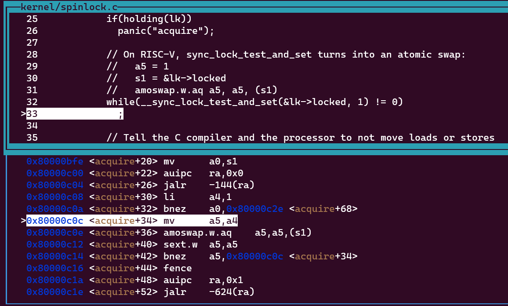

# Xv6 kernel Spinlock

Xv6操作系统内核为我们提供了两类锁：自旋锁（spinlock）和睡眠锁（sleeplock）。它们虽然都有锁的特性，但是它们具有不同的特点，应用场景也不相同。

今天我们先来讨论xv6内部spinlock的实现，首先来看 `spinlock.h` 内对spinlock的声明：

```c
// Mutual exclusion lock.
struct spinlock {
  uint locked;       // Is the lock held?

  // For debugging:
  char *name;        // Name of lock.
  struct cpu *cpu;   // The cpu holding the lock.
};
```

十分简单，不是吗？除去debugging部分，就一个变量 `locked` 记录这个lock是否被某个CPU给占用。

在xv6中，lock的locked字段为0表示该lock没有被占用，字段为1表示该lock被占用了。

这可以通过 `spinlock.c` 中的 `initlock` 方法看出：

```c
void
initlock(struct spinlock *lk, char *name)
{
  lk->name = name;
  lk->locked = 0;
  lk->cpu = 0;
}
```

对于一个给定的 `spinlock` ，我们需要一组函数 `acquire` 和 `release` 来分别获取与释放锁。

对于 `acquire` 方法，我们需要检测当前锁的 `locked` 变量值，若为1则继续循环（这就是自旋这个词的由来），为0则获取锁，将 `locked` 更改为1。

因为 `spinlock` 本身就是**共享资源**（即多个CPU的多个进程共享内存中的同一个资源），任何进程对同一个自旋锁需要互斥地访问。因此以下 `for` 循环体内部的代码需要转换为**原子操作**：

```c
void acquire(struct spinlock *lk)  
{
	for(;;) {
		if(lk->locked == 0) {
			lk->locked = 1;
			break;
		}
	}
}
```

这里的 `for` 就是自旋。

xv6使用了RISCV的 `amoswap` 指令。从字面意义上看，就是原子交换操作。

具体来讲，xv6在acquire内部使用了指令 `amoswap.w.aq a5, a5, (s1)` 。这段指令的含义是从内存地址 `(s1)` 中读取一个32位的值（根据`amoswap.w.aq` 中第一个点后的 `w` 看出，实际上内存地址 `(s1)`对应的是 `spinlock` 中 `uint` 类型（刚好32位）的 `locked` 值），与寄存器 `a5` 内部存储的值进行交换。寄存器 `a5` 存的值在执行该指令之前就被设置为1了。也就是说，交换过后的 `locked` 值必然为1，而代码会根据交换过后的寄存器 `a5` 的值是否为0来获取锁。

来看看xv6内部 `acquire` 的实现：

```c
// Acquire the lock.
// Loops (spins) until the lock is acquired.
void
acquire(struct spinlock *lk)
{
  push_off(); // disable interrupts to avoid deadlock.
  if(holding(lk))
    panic("acquire");

  // On RISC-V, sync_lock_test_and_set turns into an atomic swap:
  //   a5 = 1
  //   s1 = &lk->locked
  //   amoswap.w.aq a5, a5, (s1)
  while(__sync_lock_test_and_set(&lk->locked, 1) != 0)
    ;

  // Tell the C compiler and the processor to not move loads or stores
  // past this point, to ensure that the critical section's memory
  // references happen strictly after the lock is acquired.
  // On RISC-V, this emits a fence instruction.
  __sync_synchronize();

  // Record info about lock acquisition for holding() and debugging.
  lk->cpu = mycpu();
}
```

重点在于 `__sync_lock_test_and_set(&lk->locked, 1)` 这个函数。通过 gdb 可以看出其对应的汇编代码：



在这里我们看到了我们熟悉的 `amoswap` 指令。

另外，后面一行的 `__sync_synchronize();` 是一个栅栏指令，它用于告诉编译器不要对指令进行重新排序以进行优化。

例如以下场景：

```c
acquire(&lock);
x = 1;
release(&lock);
```

通过编译器优化，可能会重排指令，把 `x=1` 放到加锁前或者释放锁之后。这显然是不被允许的。

`__sync_synchronize();` 的作用是强制将其前后的 `load/store` 指令进行分隔。因此`acquire` 函数与 `release` 函数内部使用了该指令来保证 `x=1` 不会跑出去。

另外，`acquire` 函数开头调用了 `push_off()` 方法。根据注释说明，它是关闭了中断。

我操？为啥要关闭中断？这个锁跟中断有什么勾八关系？

这个其实是xv6内部实现的问题。因为在xv6内部，有一些设备中断会和内核内部的代码使用同一个 `spinlock` ，例如 xv6 book 提到的 `tickslock` ，用于保护各CPU时钟内部的 `ticks` 时间帧的不变量。

对于计时器中断，会调用下面函数：

```c
void
clockintr()
{
  acquire(&tickslock);
  ticks++;
  wakeup(&ticks);
  release(&tickslock);
}
```

但是xv6的sleep系统调用也使用了该锁：

```c
uint64
sys_sleep(void)
{
  int n;
  uint ticks0;

  argint(0, &n);
  acquire(&tickslock);
  ticks0 = ticks;
  while(ticks - ticks0 < n){
    if(killed(myproc())){
      release(&tickslock);
      return -1;
    }
    sleep(&ticks, &tickslock);
  }
  release(&tickslock);
  return 0;
}
```

这会出现什么问题？

假设 `sys_sleep` 首先获取了 `tickslock` ，然后进入了 `sleep(&ticks, &tickslock)` 进入阻塞状态。

然后对应的CPU的计时器产生中断，想获取锁，但是被阻止，因此进入自旋。

但是只有计时器获取了锁，才能进入临界区，执行 `ticks++;` 来增加时间戳，从而才有 `sys_sleep` 从阻塞状态恢复的可能。

也就是说，产生了死锁。

为了防止这种情况，我们应当防止一个 `spinlock` 在能被中断处理函数获取时，在获取期间允许中断。xv6为了实现方便，直接对所有的 `spinlock` 在被占用时，直接关闭了中断。并在对应的 `release` 函数尾部重新开放中断：

```c
// Release the lock.
void
release(struct spinlock *lk)
{
  if(!holding(lk))
    panic("release");

  lk->cpu = 0;

  // Tell the C compiler and the CPU to not move loads or stores
  // past this point, to ensure that all the stores in the critical
  // section are visible to other CPUs before the lock is released,
  // and that loads in the critical section occur strictly before
  // the lock is released.
  // On RISC-V, this emits a fence instruction.
  __sync_synchronize();

  // Release the lock, equivalent to lk->locked = 0.
  // This code doesn't use a C assignment, since the C standard
  // implies that an assignment might be implemented with
  // multiple store instructions.
  // On RISC-V, sync_lock_release turns into an atomic swap:
  //   s1 = &lk->locked
  //   amoswap.w zero, zero, (s1)
  __sync_lock_release(&lk->locked); 

  pop_off();
}
```

这里的 `pop_off` 方法就是开放中断。

在 `spinlock` 被占用期间关闭中断有以下好处：一个 `spinlock` 不应当被占用太久。因此在处理一个关键的任务时，对其加锁，会阻止时间片轮转，使该进程能享受所有CPU资源来集中处理当前任务，这样的化 `spinlock` 就不会自旋太久。

但是如果我们在某些代码中可能会同时获取多个锁，对应的会释放多个锁。那么我们在释放第一个锁的时候，是不能直接开放中断的，要等所有锁被释放后才能中断。

因此我们对于每个CPU都要有一个计数器，来统计当前CPU获取了多少个锁。关于每个CPU的结构体声明在 `proc.h` 下：

```c
// Per-CPU state.
struct cpu {
  struct proc *proc;          // The process running on this cpu, or null.
  struct context context;     // swtch() here to enter scheduler().
  int noff;                   // Depth of push_off() nesting.
  int intena;                 // Were interrupts enabled before push_off()?
};
```

这里的 `noff` 字段就是我们需要的计数器。而 `intena` 则代表着获取第一个锁之前，CPU的中断状态。

接下来我们来看 `push_off` 和 `pop_off` 方法：

```c
// push_off/pop_off are like intr_off()/intr_on() except that they are matched:
// it takes two pop_off()s to undo two push_off()s.  Also, if interrupts
// are initially off, then push_off, pop_off leaves them off.

void
push_off(void)
{
  int old = intr_get();

  intr_off();
  if(mycpu()->noff == 0)
    mycpu()->intena = old;
  mycpu()->noff += 1;
}

void
pop_off(void)
{
  struct cpu *c = mycpu();
  if(intr_get())
    panic("pop_off - interruptible");
  if(c->noff < 1)
    panic("pop_off");
  c->noff -= 1;
  if(c->noff == 0 && c->intena)
    intr_on();
}
```

可以发现，一切都清晰了很多。在 `push_off` 中，如果第一次获取锁，我们会先记录一下当前的中断状态。方法是调用 `intr_get` ，它在 `riscv.h` 中声明：

```c
// are device interrupts enabled?
static inline int
intr_get()
{
  uint64 x = r_sstatus();
  return (x & SSTATUS_SIE) != 0;
}
```

这里的 SSTATUS 是一个特殊的寄存器，里面有 SIE bit 来记录是否开启中断，有 SPP bit 来记录当前mode是user mode还是 supervisor mode。在这里我们只需要 SIE bit 就行啦。


关于 `spinlock` 在xv6的实现细节，就讲这么多。
