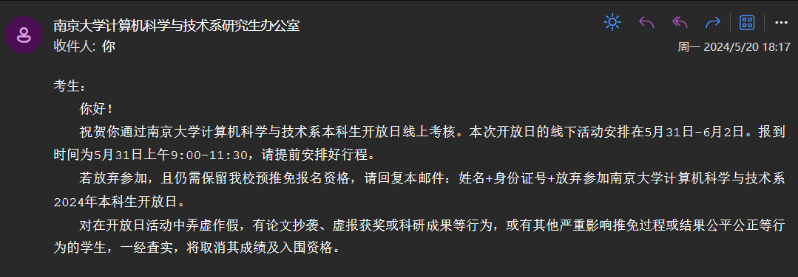
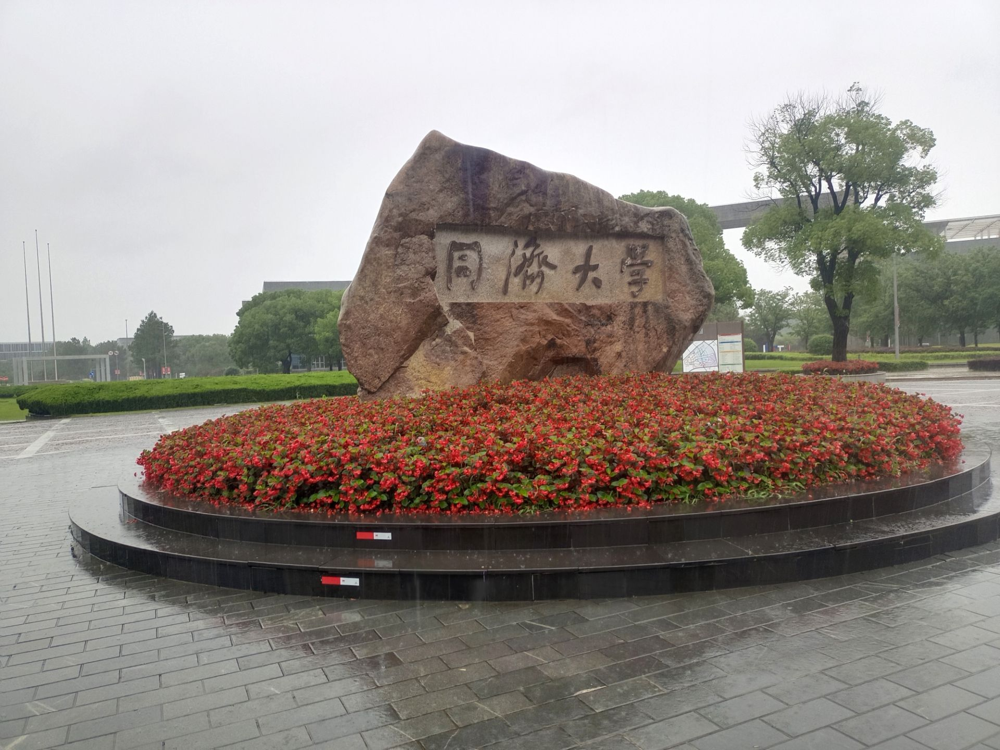
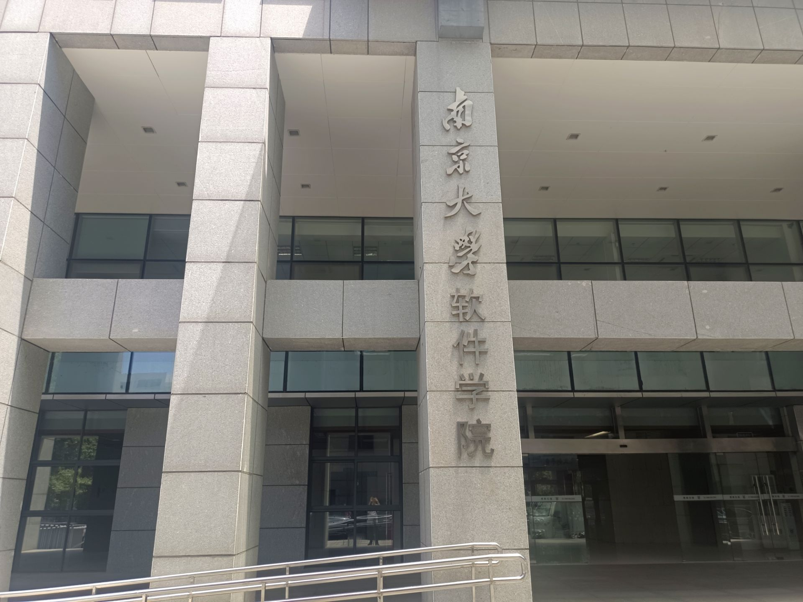
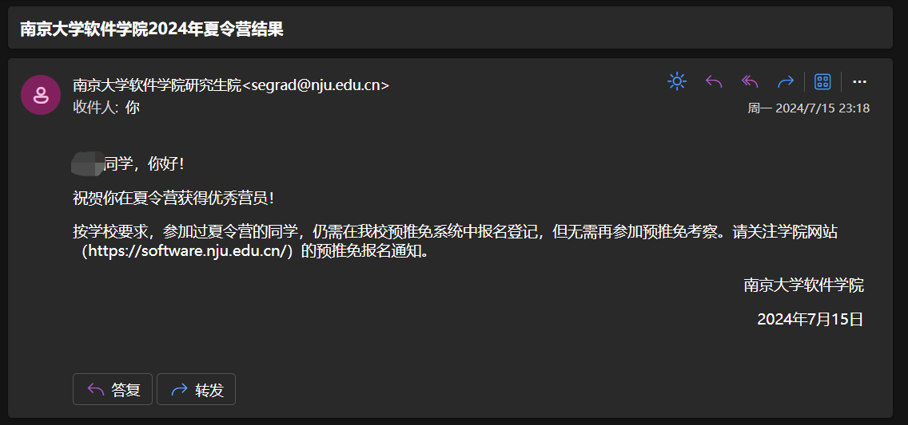

# 保研记录

## 本人情况：

- 本科院校：江苏某top4！
- 本科专业：AI
- 排名：1/87
- 四级：595，六级：538
- 竞赛：ICPC银若干，CCPC铜若干，JSCPC金银，CSP440，cf两紫名号（？）
- 科研：无
- 项目：水项目
- 国奖，CCF优大（这俩感觉基本没用）
- 偏就业向，未来偏向于做引擎开发。因此梦校是软微、南软和人大信专。

总结为A批，而且又菜又爱玩，不仅没拿到金牌，还因为这沟槽的网瘾，没有深入参与过含金量高的项目。不过好在大三因为一个队友去和大一的两位noi✌组队，另一个队友退出了，然后我也选择了退役，转去卷课内，得以保住rk。但就夏令营的情况来看，保rk弃acm是我做的一个非常正确的选择。

## 夏令营之前：

虽然我是AI专业，但是我对AI提不起一点兴趣，尤其是CV、NLP这些（别问我为什么没转专业）。大二ICPC赛季结束的时候被一个学长忽悠去做AI相关的科研，后面还进了某CV组，体会了一下开组会读paper做pre的氛围，也是感到十分不快。

后面大三上的时候考虑做过sys，虽然谈不上非常喜欢，但至少不反感。不过从大三开始入门sys说实话感觉有点晚了，而且AI的培养计划并不注重对计算机系统能力的培养，导致我甚至连CPU指令流水线这种基本概念都不清楚，加上保rk要学讨厌的课程，我没办法分配出太多精力出来，因此学术梦碎。

为什么选择就业向呢？首先我本身是一名ACM选手，非常喜欢coding。其次我也是个造轮子爱好者兼游戏爱好者，对工程较感兴趣，也开发过一些小型3D游戏。不过由于大学期间大部分时间在卷ACM和课内（基本在码python，pytorch那些，当调包侠），没有多少实践的机会（面南大的时候老师也指出了我这个问题，哈哈），因此也希望读研期间能精进自己的engineering能力。

总结来看，作为一名ACM败犬，我在选择读研方向上也是经历了一波三折的过程。期间经历了无数次痛苦，包括误入歧途、自我怀疑、被学长yygq。尤其是大三选择ACM退役的那段时间，感觉自己大学中唯一一件有意义的事情与我断绝了，只剩下一堆不喜欢的AI课程要卷，也不知道自己接下来的路该怎么走，每一步所做出的选择是否是正确的。不过好在就保研而言的结果还是能让我满意的。

## 夏令营情况：

| 学校                   | 学院 | 类型 | 入营 | 结果                                           |
| ---------------------- | ---- | ---- | ---- | ---------------------------------------------- |
| 南京大学               | cs   | 专硕 | √    | 过线上测试，放弃线下                           |
| 复旦大学               | cs   | 专硕 | √    | 撞nju和**两门**期末，放弃                      |
| 南京大学               | ai   | 学硕 | √    | 放弃，不喜欢AI，但是因为是nju就报了，nju梦校   |
| 吉林大学               | se   | 专硕 | √    | 开的早，投着练练手，最后也是直接鸽了           |
| 哈尔滨工业大学（深圳） | cs   | 专硕 | ×    | 正常，清北bar，投着玩                          |
| 同济大学               | cs   | 专硕 | √    | **优营**（第一个优营，感谢同济！）             |
| 上海交通大学           | se   | 学硕 | √    | ipads太难，没sys基础，其余组方向不感兴趣，放弃 |
| 南京大学               | se   | 专硕 | √    | **优营**，梦校                                 |
| 中山大学               | cs   | 专硕 | ×    | ？？？海营我都没入？                           |
| 中国人民大学           | 信院 | 专硕 | √    | 撞nju，加上考虑到往年优营率低，放弃            |

可以看到，多亏了大三上学期选择放弃ACM，得以保住rk1，让我在没有任何科研项目的情况下入了很多营。但是实际上我只完整参加了两个，主要是今年和往年相比，夏令营的时间冲突的太多了，属于是大型车祸现场。特别是六月初得知ruc信院和南软冲突的时候，我真的有点破防。最后由于华五情节与优营率的考虑，选择了南软，鸽了ruc。

### 1. njucs

今年南计开的非常早，好像四月份就开了，然后五月初就截止报名。当时我根本没有做好准备，内心也是非常慌。

由于我夏令营的目标是南软，所以一开始是不想去南计的，因为按往年情况来看，南大cs，se，ai这三个夏令营只能去一个（njusz那里我不太清楚）。但是看绿裙说南大cs线上测不考虑冲突因素，可以放心参加，我就参加了（怎么说也是梦校）。

南计的线上笔试也算是著名的难，往年原题可以参考绿裙的github仓库（虽然很少）。范围大概是408+算法+编译原理+linux+其余杂项，题型是单选+多选，多选漏选超选错选皆不得分。我记得今年的题偏向于编译原理和数据结构。因为我本科AI的，很多课程没学过，因此大多数题都是蒙的，除去几个ACM中接触到的几个算法和数据结构（kmp，背包）。

结果比较出乎意料，过了：

然鹅后续放弃了。

### 2. tongji cs

本来是没想报同济的，但是绿裙里有个同济的宣传大使，说这个学校就业非常好什么的，再加上夏令营时间也比较好，没和其它学校冲突，我就报了。（不是）

然而没想到的是今年同济cs夏令营的bar非常高，整个学院只入了我一个人。最后只能孤身一人前往上海。

同济的考核非常硬核，机考+笔试408+英语笔试+英语口试+面试，五脏俱全。是计分制，满分350.

机考的话非常简单，第一题是给定一个字符串，然后对串的每个字母在其对应的位置（例如a对应第1列，z对应26列）一行一行输出。第二题是找给定数独九宫格的冲突位置。第三题是输出数字三角形。我大概花了十几分钟就做完了，但是后面静查的时候发现了第二题的一个bug，及时改正。

笔试408+英语，非常难，时间也特别赶。我记得大题后两题我都直接空着（分别是计组画什么数据通路，以及计网给定一个802帧分析其内容，ip地址，协议什么的）。英语是一道阅读理解，一篇论文。

可以参考：https://zhuanlan.zhihu.com/p/658346474

面试，有九个老师围着你坐，轮流提问。一开始是让我英语自我介绍两分钟，然后是让我英语说transformer的原理。后面就提问了一些项目和专业课的知识，我记得问了我系统调用和普通函数调用的区别。最后一个问题出乎我意料，一个老师问了我高数题（我记得是分部积分啥的），这我咋会？感觉我这个组比较压力面，然而另一个哥们的组感觉非常友好，问了很多生活问题，还有思政题。

结果没想到是优营，分数还挺高，满分350拿了二百八十几分，应该是稳offer了。

> 面试那天雨非常大，emmm

### 3. njuse

南软是我夏令营的最高目标，毕竟华五+两年制+放实习，太适合我这种就业鼠鼠了。

南软的bar也是很神奇，隔壁江苏top3的rk2+ACM银没入营，我校只入了软工的rk1和我（套磁了一个导师，可能捞了我进去），同院计科的rk1也没入。但是南软同时放了若干双非非rk1的金牌✌入营。现在想想，当初ICPC没拿金的我选择保住rk1，真是太明智了。

南软安排又紧又松。紧是因为我一天半就走完了夏令营流程，松是因为南软通知事项的方式很随意，就建个群，然后有通知了就@全体成员发消息，公告都不带发的，也没有流程pdf，感觉就非常敷衍。

南软考核也比较全，笔试+机试+面试。

笔试的内容有五项，顺序依次为离散数学（群论+图论的证明题）、软件工程（画状态图，软件测试）、操作系统（页式内存，PV操作）、计算机网络（DNS，ALOHA协议，求极限（啊？））和数据库系统（B+树索引，递归查询sql语句，事务undo+redo），各占20分。开卷，但是考的很偏，我很多都没做出来。

机试的话，今年是四道算法题，没有了往年的面向对象题。今年南软的机试题普遍反映非常难，和隔壁南计的机试题（没有算法题）形成鲜明对比，我记得第一题是给定已有的面额值 $a_i$，要求你求出**最少**的需要补充的**额外**面额值的**个数**，在每个面额值的使用次数**小于等于一个给定值** $v$ 的情况下，能够**相加组合**得到范围 $[1, m]$ 内的所有数。第二题是要你用两个平行于坐标轴的不相交矩形来包围给定的二维点集，要求两个矩形的面积和最小。第三题是给定一个坐标轴，坐标轴的第二象限有 $n$ 头牛，每头牛占据一个单位长度，左开右闭，并按照 $v_i$ 的速度（这里的速度是每 $v_i$ 秒**瞬移**一个单位，**注意**）朝着 +x 方向移动。然后你在原点朝着 +y 方向观察，问给定每头牛的坐标，及其速度，问最多有多少头牛经过你的视线。第四题是给定一个二维平面，平面上有字母，空白以及障碍，要求除去障碍，每一个行或每一个列内部的连续块（连续的字母与空，障碍隔开）形成的序列是一个回文串。求你能够确定的最多的空白对应的字母的坐标数量，并给出最终局面。

由于我是ACMer，AK了，全场快300人中有10个AK的。没有签到题，感觉对一般人比较不友好。四道题的难度大概在div1a, b这种。解法分别为数学+贪心，排序+枚举切割的横/纵坐标，离散化+线段树，BFS。

> 我记得笔试交卷的时候，大家动静很大。然后有个监考老师露出了诡异的笑容，说：“诶，你们先别叫，下午再叫，下午才是正菜（早上笔试下午机试），现在只是给你们开开胃。欸，下午你们叫也叫不出来，哈哈哈，那个才叫酸爽。”当时给我们都整懵逼了。

面试的话，虽然拿同济练过手，但是作为i人的我，还是很紧张。不过惊喜的是在面试前半个小时，我收到了同济优营的消息。拿到第一个offer的喜悦瞬间冲刷了我所有的焦虑，后续面试也不再紧张了。

具体面试内容也比较轻松，让你介绍你的项目经历，不问专业课。由于我的项目比较水，老师转而让我陈述大学期间做过的有意义的事情，我直接把我的ACM经历全炸出来，感觉老师也是比较感兴趣。期间问了我最喜欢的算法，我说树状数组，然后老师们似乎并不太清楚这个东西，我就大致介绍了一下它的功能和原理。后面稍微批评了我项目实践能力较为缺乏。最后一个老师问了一些关于实验室横向的问题，也是畅所欲言。

当然面试内容具体情况分组考虑，有的组会压力面，比如作英语自我介绍，翻译英语，问软工那些模型（瀑布、螺旋、敏捷开发）什么的，因此建议充分准备。

最后也因为机试AK，没有悬念地优营了。说实话当初面完南软就觉得自己稳了，以至于过于自信，后续的sjtu软就没去（当然也有懒得读论文的原因）。但说实话不建议大家这么干，有点冒险（

## 预推免情况：

估计不会报名预推免了，主要是除了ruc信院，感觉没有比南软更适合我的去处了。可惜ruc不开预推免，呜呜呜呜。

> 顺带一提，今年软微保研似乎改革，变成纯科研向了，鼠鼠top2梦碎。
