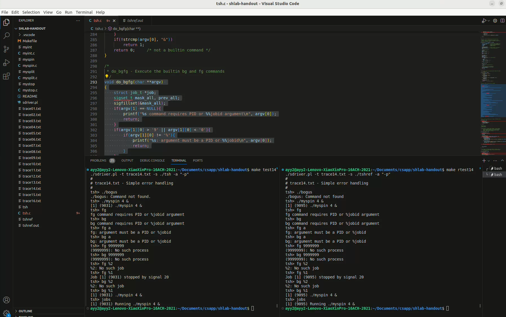

# csapp shell lab

该lab对应于原书第八章异常控制流部分。

链接：http://csapp.cs.cmu.edu/3e/labs.html  文档：http://csapp.cs.cmu.edu/3e/shlab.pdf

## 1. 总体介绍

实验要求你补充 `tsh.c` 内的相关函数，以实现自己的 shell：`tsh`

关于 `tsh` ，需要实现以下**功能**：

1、实现 `tsh` 内置命令。**内置命令立即执行**。lab要求我们实现以下四条命令：

- `quit` 。顾名思义，退出 `tsh` ；
- `jobs` 。了解shell的都知道，我们可以指定一个可执行文件的地址来在shell里面执行该文件。在 `tsh` 里也一样，一般使用作业(job)这个概念来表示为对一条命令行求值而创建的进程。**内置命令不创建进程**。作业分为前台作业和后台作业，前台作业只能存在一个，且只能等作业完毕后才能恢复shell的功能。后台作业可以存在任意多个，且在后台执行，不影响 `tsh` 自身的工作。`jobs` 的功能就是列出 `tsh` 创建的所有存在的作业，这个其实 lab 自己已经实现了，后续会提到。
- `bg <job>` 。将某个中止(stopped)的作业恢复到后台执行。`<job>` 的表示方式可以是 `PID` 或者 `JID` （组号，具体见 WriteUp）
- `fg <job>` 。将某个中止的作业恢复到前台执行。

2、代表用户执行可执行文件。通过 `<path> <args[1], ...>` 来创建前台作业。如果在最后添加符号 `&` 代表创建后台作业。

3、对于正在执行的前台作业， `tsh` 支持 `Ctrl+C` 来终止(作业完全寄了)和 `Ctrl+Z` 来中止(作业还没完全寄，只是暂停了，可以通过 `bg` 和 `fg` 来恢复)。

4、`tsh` 能够正确回收所有僵尸进程。如果有子进程因为被未捕获信号（即没有给出信号处理程序）终止，需要输出相关信息。

为了方便我们编码，lab已经给出了关于作业的处理的函数，直接调用即可：

- `addjob` ，添加作业；
- `deletejob` ，删除作业；
- `fgpid` ，返回前台作业的 `PID`；
- `getjobpid` ，根据 `PID` 获得作业结构体指针；
- `getjobjid` ，根据 `JID` 获得作业结构体指针；
- `pid2jid` ，输入 `PID` ，输出对应的 `JID` ；
- ...

关于 `tsh` ，个人总结需要注意以下几点：

1、信号(signal)阻塞。因为我们需要使用信号来控制子进程（例如上面说的 `Ctrl+C` 来终止前台作业）与接受子进程信息（子进程终止或中止都会向 `tsh` 发出信号），这部分我们是需要自己实现信号处理程序的，在处理过程中需要考虑到**并发**的影响。并发是控制流的一个概念，在这里代表信号处理程序和 `tsh` 源程序的运行时段相重合。这可能会造成某些意想不到的情况，例如 `tsh` 在某处接受了某个信号并调用某个信号处理程序，但在执行程序的过程中又收到了某个信号，转而调用另一个信号对应的程序。这种并发流之间的交替是很危险的，因为它不可预测，特别是并发流之间**共享数据**的情况，它会导致无法预知的结果。

因此书上也给出建议，在信号处理程序内部应当阻塞其它信号的接收，具体是使用 `sigprocmask` 函数来设置阻塞信号。

2、进程组修改。因为 `tsh` 在这里是我们实际的 `bash` 的子进程，它拥有自己的 `PID` 以及进程组号。通过 `tsh` 创建的进程的进程组号默认是和 `tsh` 的进程组号一样的。如果我们需要结束某个作业（这里的作业是一系列子进程，或者包括子进程的子进程），需要通过进程组号来kill掉这个作业，但这样会把 `tsh` 本身给kill掉了。因此通过 `tsh` 创建的子进程的进程组号应该修改：`setpgid(0, 0);`。

3、`tsh` 需要输出很多信息，这些信息的格式通过给出的 `tshref.out` 文件来查看。输出一般都使用 `printf` ，因为它方便输出一些格式化的信息，这在本lab是相当方便的。但由于 `printf` 不是异步安全的，在信号处理程序内部使用可能会有安全问题，因此应当使用安全的 `write` 函数。也可以使用第十章给出的 `RIO` 包。不过为了偷懒，我给出的代码还是使用了 `printf` （

4、关于安全的信号处理，CSAPP给出了一些建议，例如保持程序简单、保护 `errno` 全局变量等，这里不一一赘述。

## 2. 实验

lab需要我们补充以下函数：

- `eval` ：主要的函数，用于执行命令行。函数的框架在书上其实已经给出来了。
- `builtin_cmd`：用于判断命令是否为内置命令（即那四个）。如果是则立即执行。该函数同样在书上有现有的框架。
- `do_bgfg` ：用于执行 `bg` 和 `fg` 命令。
- `waitfg` ：通过调用这个函数来让 `tsh` 挂起，直到当前的前台作业结束。
- `sigchld_handler`：`SIGCHLD` 信号的信号处理程序。通过这个程序来完成僵尸进程回收、作业管理等工作。
- `sigint_handler`：`SIGINT`信号（`Ctrl+C`）的信号处理程序。通过这个程序来让前台作业终止。
- `sigtstp_handler`：`SIGTSTP`信号（`Ctrl+Z`）的信号处理程序。通过这个程序来让前台作业中止。

一开始可能会晕头转向，但其实lab也贴心的给出了我们一系列测试样例 `tracexx.txt` ，可以循序渐进地帮助我们完善 `tsh` 的功能。

也就是说，你应该想去看样例 `trace01.txt` ，并根据它的需求来初步实现某些函数。然后等通过了该样例，就跳到下一个样例 `trace02.txt` ，然后根据它的需求进一步完善程序。

不过这里还是直接给出我的代码吧。

最简单的应该是 `builtin_cmd` 函数，只需要根据命令的值来执行相应的过程即可：

```C
int builtin_cmd(char **argv) 
{
    if(!strcmp(argv[0], "quit")){
        exit(0);
    }
    if(!strcmp(argv[0], "jobs")){
        listjobs(jobs);
        return 1;
    }
    if(!strcmp(argv[0], "bg") || !strcmp(argv[0], "fg")){
        do_bgfg(argv);
        return 1;
    }
    if(!strcmp(argv[0], "&"))
        return 1;
    return 0;     /* not a builtin command */
}
```

然后是主要的 `eval` 函数，这个因为书上已经给了范本，所以实现难度并不大：

```c
void eval(char *cmdline) 
{
    char *argv[MAXARGS];
    char buf[MAXLINE];
    int bg;
    pid_t pid;
    sigset_t mask_one, prev_one, mask_all;

    sigfillset(&mask_all);
    sigemptyset(&mask_one);
    sigaddset(&mask_one, SIGCHLD);
    signal(SIGCHLD, sigchld_handler);

    strcpy(buf, cmdline);
    bg = parseline(buf, argv);


    if(argv[0] == NULL)
        return;

    if(!builtin_cmd(argv)){
        sigprocmask(SIG_BLOCK, &mask_one, &prev_one);
        if((pid = fork()) == 0){
            sigprocmask(SIG_SETMASK, &prev_one, NULL);
            setpgid(0, 0);

            if(execve(argv[0], argv, environ) < 0){
                printf("%s: Command not found.\n", argv[0]);
                exit(0);
            }            
        }
        sigprocmask(SIG_BLOCK, &mask_all, NULL);
        int state = bg ? BG : FG;
        addjob(jobs, pid, state, cmdline);
        sigprocmask(SIG_SETMASK, &prev_one, NULL);

        if(state == FG){
            waitfg(pid);
        }else{
            printf("[%d] (%d) %s", pid2jid(pid), pid, cmdline);
        }
    }
    return;
}
```

注意到在 fork 的时候我们就把 `SIGCHLD` 信号阻塞掉了，这是为了能够顺利调用 `addjob` 来添加作业。不然有可能在添加前，作业就已经结束并且给 `tsh` 发射 `SIGCHLD` 信号，造成在添加作业前就删除作业的局面。

后面需要根据作业是前台作业还是后台作业来分类，如果是前台作业，那么 `tsh` 就需要等待它执行完毕：

```C
void waitfg(pid_t pid)
{
    sigset_t mask;
    sigemptyset(&mask);
    while(pid == fgpid(jobs)){
        sigsuspend(&mask);
    }
    return;
}
```

在实现 `waitfg` 函数的时候，相信大部分人都和我一样想到使用 `waitpid` 函数来实现。事实上这是不推荐的，在官方文档里也提到，因为我们可能 `wait` 到其它进程。这代表我们需要在这个函数内部要额外考虑后台进程终止（或者中止）的情况，而我们希望这些统一在信号处理程序内部处理。

那怎么办呢？我们可以借助于 `fpgid` 函数来检测现在的前台进程是否是我们期待的进程。如果二者不相等，说明前台进程就已经结束了。而如果相等则说明前台作业仍在进行，这时候我们可以使用 `sigsuspend` 函数来挂起 `tsh` 进程。

那么这时候我们应该要考虑信号的事情了，来看看如何处理 `SIGCHLD` ：

```c
void sigchld_handler(int sig) 
{
    int olderrno = errno;
    sigset_t mask_all, prev_all;
    pid_t pid;
    int status;

    sigfillset(&mask_all);
    while((pid = waitpid(-1, &status, WNOHANG | WUNTRACED)) > 0){
        sigprocmask(SIG_BLOCK, &mask_all, &prev_all);
        if(WIFEXITED(status))
            deletejob(jobs, pid);
        if(WIFSIGNALED(status)){
            printf("Job [%d] (%d) terminated by signal %d\n", pid2jid(pid), pid, WTERMSIG(status));
            deletejob(jobs, pid);
        }
        if(WIFSTOPPED(status)){
            printf("Job [%d] (%d) stopped by signal %d\n", pid2jid(pid), pid, WSTOPSIG(status));
            struct job_t *now = getjobpid(jobs, pid);
            now->state = ST;

        }
        sigprocmask(SIG_SETMASK, &prev_all, NULL);
    }

    errno = olderrno;
    return;
}
```

通过使用 `waitpid` 并指定两个选项 `WNOHANG | WUNTRACED` 来立即检测当前的终止或中止进程的状态。如果是正常退出 `WIFEXITED` ，那么正常删除作业即可；如果是通过信号结束的作业，那么需要根据一定格式来输出信息，这里事实上不应该用 `printf` 的；如果是中止的作业，也需要输出相关的信息，同时修改作业的状态。这个状态是一定要修改的，因为 `jobs` 命令会根据这个信息来输出正确的作业信息。

对于其它两个信号，处理程序较为相似：

```C
void sigint_handler(int sig) 
{
    int olderrno = errno;
    sigset_t mask_all, prev_all;
    sigfillset(&mask_all);
    sigprocmask(SIG_BLOCK, &mask_all, &prev_all);
    pid_t pid = fgpid(jobs);
    if(pid){
        kill(-pid, SIGINT);
    }
    sigprocmask(SIG_SETMASK, &prev_all, NULL);
    errno = olderrno;
    return;
}

void sigtstp_handler(int sig) 
{
    int olderrno = errno;
    sigset_t mask_all, prev_all;
    sigfillset(&mask_all);
    sigprocmask(SIG_BLOCK, &mask_all, &prev_all);
    pid_t pid = fgpid(jobs);
    if(pid){
        kill(-pid, SIGTSTP);
    }
    sigprocmask(SIG_SETMASK, &prev_all, NULL);
    errno = olderrno;
    return;
}
```

通过使用 `kill` 函数来向目标作业发射信号。

最后，我们来实现命令 `bg` 和 `fg` 的功能：

```C
void do_bgfg(char **argv) 
{
    struct job_t *job;
    sigset_t mask_all, prev_all;
    sigfillset(&mask_all);
    if(argv[1] == NULL){
        printf("%s command requires PID or %%jobid argument\n", argv[0]);
        return;
    }
    if(argv[1][0] > '9' || argv[1][0] < '0'){
        if(argv[1][0] != '%'){
            printf("%s: argument must be a PID or %%jobid\n", argv[0]);
            return;
        }
    }
    if(!strcmp(argv[0], "bg")){
        sigprocmask(SIG_BLOCK, &mask_all, &prev_all);
        if(argv[1][0] == '%'){
            int jid;
            sscanf(argv[1], "%%%d", &jid);
            job = getjobjid(jobs, jid);
        }else{
            int pid;
            sscanf(argv[1], "%d", &pid);
            job = getjobpid(jobs, pid);
        }
        if(job != NULL){
            kill(-(job->pid), SIGCONT);
            job->state = BG;
            printf("[%d] (%d) %s", pid2jid(job->pid), job->pid, job->cmdline);
        }else{
            if(argv[1][0] == '%'){
                printf("%s: No such job\n", argv[1]);
            }else printf("(%s): No such process\n", argv[1]);
        }
    }else if(!strcmp(argv[0], "fg")){
        // puts("!");
        sigprocmask(SIG_BLOCK, &mask_all, &prev_all);
        if(argv[1][0] == '%'){
            int jid;
            sscanf(argv[1], "%%%d", &jid);
            job = getjobjid(jobs, jid);
        }else{
            int pid;
            sscanf(argv[1], "%d", &pid);
            job = getjobpid(jobs, pid);
        }
        if(job != NULL){
            kill(-(job->pid), SIGCONT);
            job->state = FG;
            waitfg(job->pid);
        }else{
            if(argv[1][0] == '%'){
                printf("%s: No such job\n", argv[1]);
            }else printf("(%s): No such process\n", argv[1]);
        }
    }
    sigprocmask(SIG_SETMASK, &prev_all, NULL);
    return;
}
```

因为代码风格的原因，该部分较为冗长。这里需要将 `bg` 和 `fg` 进行分类，同时考虑是通过 `PID` 还是 `JID` 访问作业的情况来得到相应的作业。

这里我使用了信号阻塞，它的作用是防止在寻找作业的过程中，目标作业被某个信号给终止了，然后 `tsh` 转去调用 `sigchld_handler` 将目标作业删除，导致我们这次的命令执行失败。

## 3. 总结

通过遍历所有16个测试用例，每个测试用例都和标准程序 `tshref` 来比对，来判断 `tsh` 的正确性。本lab是没有自动评分程序的



此次lab主要是通过实现一个自己的shell来更好地了解信号、并发等概念。个人认为目前学习CSAPP下来，异常控制流这章是最难的，但是对应的lab却不难，算是目前完成的五个lab（data、bomb、attack、cache、shell）中用时最少的。